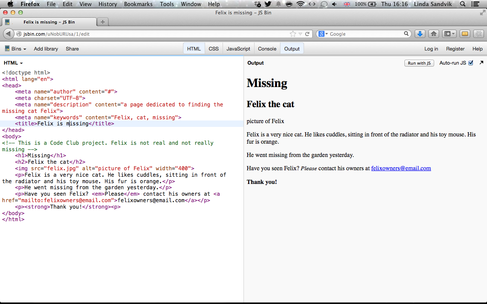

---
title: Forsvunnet katt webside
level: Lesson 3
language: nb_NO
embeds: "*.png"
materials: "kode og bilder"
stylesheet: web
...

## __Oppdraget:__ { .intro}

Katten Felix har forsvunnet. Eieren hans har laget en plakat for å henge opp i nabolaget, men du innser at å lage en webside gjør at mange flere kan se den.


#Steg 1: { .activity}

Lag en ny mappe som du kaller Felix.
Lag et nytt dokument med navnet index.html og lagre det i mappen du kalte Felix.
Nå kan du sette opp dokumentet ditt slik som du lærte i forrige leksjon.

```html
<!doctype html>
<html>
	<head>
	</head>
	<body>
	</body>
</html>
```

Lag en tittel og en overskrift. Husk at tittelen skal plasseres i "head" og overskriften skal plasseres i "body". Prøv å bruke "Katten Felix er forsvunnet" som tittel, og "Forsvunnet" som h1.
Rett under `<h1>` kan vi lage en `<h2>` hvor det står "Katten Felix".

```html
<!doctype html>
<html>
	<head>
		<title> Katten Felix er forsvunnet </title>
	</head>
	<body>
		<h1>Forsvunnet</h1>
		<h2>Katten Felix</h2>
	</body>
</html>
```

#Steg 2: { .activity}

Vi trenger også et bilde av Felix, slik at folk vet hva de skal se etter. Vi har tidligere lært hvordan man legger til et bilde som er lagret et annet sted på Internett, men denne gangen skal vi bruke et bilde på vår egen datamaskin. Vi er nødt til å legge bildet *felix.jpg* i den samme mappen som `index.html` ligger i, mappen du kalte Felix.

Nå kan du skrive `` taggen som du vanligvis ville gjort, men i scr attributten, i stede for å skrive en URL skriver vi bare `felix.jpg`. Ikke glem å legge til en alt-attributt!

```html

```

## Lagre filen din og vis den i nettleseren. { .save}

Bildet er ganske stort, så vi vil gjøre det litt mindre. Vi kan gjøre dette ved å bruke høyde eller bredde-attributter (eller begge). Vi spesifiserer ikke bredden i centimeter eller meter, tommer eller fot, men i noe som kalles *pixler*. Jeg velger å gå for 400 pixler for dette bildet.

```html

```

#Steg 3: { .activity}

Under bildet vil vi skrive en beskrivelse av Felix og gi noen detaljer om når og hvor han forsvant. For dette kan vi skrive noen paragrafer.

```html
<p>Felix er en veldig snill katt. Han liker å kose, sitte foran varmepumpa og lekemusa si. Pelsen hans er oransje. </p>
<p>Han forvant fra hagen i går.</p>
```

Vi trenger også informasjon om hvordan vi kan kontakte eieren hvis noen har sett eller funnet Felix.

```html
<p>Har du sett Felix? Vennligst kontakt eieren hans på eierentilfelix@email.com</p>
```

Dette er bare en leke-epostadresse, men la oss gjøre det sånn at når noen klikker på den, så åpnes epostprogrammet deres. Vi gjør dette på nesten samme måten som vi lager en lenke, men i stede for en __url__ bruker vi `mailto` sånn som dette:

```html
<p>Har du sett Felix? Vennligst kontakt eieren hans på <a href="mailto:eierentilfelix@email.com">eierentilfelix@email.com</a></p>
```

## Lagre dokumentet ditt og se om det fungerer i nettleseren! { .save}

# Step 4: Legge til fet tekst og trykk { .activity}

Vi vil virkelig at folk skal finne Felix, så vi vil legge litt *trykk* på `vennligst`. Dette gjør vi ved å bruke em taggen.

```html
<p>Har du sett Felix? <em>Vennligst</em> kontakt eieren hans på <a href="mailto:eierentilfelix@email.com">eierentilfelix@email.com</a></p>
```
Vi vil også at ´Tusen takk´ skal vises skikkelig, noe vi oppnår ved å bruke strong taggen.

```html
<p><strong>Tusen takk!</strong><p>
```

## Lagre dokumentet ditt og vis det i nettleseren. { .save}
Ser du nå hvordan vennligst vises i *skrå* og Tusen takk i **fet**?

#Step 5: Kommentarer { .activity}

Noen ganger kan det lønne seg å skrive kommentarer i selve html-filen. Med kommentarer mener vi ting som mennesker skal kunne se og lese hvis de åpner filen, men som nettleseren ikke skal lese og vise. Vi gjør dette ved å bruke den spesielle koden:

```html
<!-- skriv hva som helst her -->
```

Alt som skrives mellom pilene er kommentaren.
La oss legge til en kommentar i filen som sier at dette er et Kodeklubb-prosjekt og at Felix ikke er ekte.

```html
<!-- Dette er et Kodeklubb-prosjekt. Felix er ikke ekte og er egentlig ikke forsvunnet. -->
```


#Steg 6: Mer metadata (Det er bare ting som legges i head) { .activity}

La oss legge til hvem som har skrevet websiden til websiden, slik at de som ser filen vet at det er deg.

```html
<meta name="author" content="#">
```

Erstatt # med navnet ditt.

Det er også vanlig å legge til hvilket språk websiden er på. Vi gjør dette ved å legge til en attributt til `<html>` taggen.

```html
<html lang="no">
```

*no* står for norsk.

Det er også god praksis å legge til tegnsettet (eller alfabetet) dokumentet er skrevet med. Vi bruker vanligvis __UTF-8__.

```html
<meta charset="UTF-8">
```

Vi kan også legge til en beskrivelse av websiden.

```html
	<meta name="description" content="En side laget for å finne katten Felix">
```

Og noen nøkkelord, separert med komma

```html
<meta name="keywords" content="Felix, katt, forsvunnet">
```



##Hva kan du gjøre videre?: { .try}

+ Er det noe annet du kan legge til websiden som vil hjelpe folk å finne Felix? Mer informasjon? Hvordan ville du lagt til et kart over hvor han forsvant?

+ Mer gøy med bilder. Legg til et bilde som beveger seg. Prøv å legge til bildet `catswithhats.git` til websiden. Åpne siden i nettleseren og se hva som skjer.

+ Hvis Felix blir funnet. Bruk taggen `<del>` for å streke over informasjon som ikke lenger er sant, som for eksempel forsvunnet. Bruk taggen `<ins>` for å sette inn ny informasjon i stedet, som for eksempel __Funnet__!
