---
title: Happy Birthday
level: HTML & CSS 1
language: pl-PL
embeds: "*.png"
materials: ["Club Leader Resources/*.*","Project Resources/*.*"]
stylesheet: web
...

# Wstęp {.intro}

Wykonując ten projekt poznasz HTML i CSS robiąc swoją własną kartkę urodzinową.


# Krok 1: Co to HTML? {.activity}

HTML to hipertekstowy język znaczników (po angielsku: __HiperText Markup Language__). To język używany do budowania stron internetowych. Zobaczmy przykład! 

## Zadania do wykonania {.check}

+ Do pisania w HTML-u będziemy używać strony, która nazywa się Trinket. Otwórz ten Trinket: <a href="http://jumpto.cc/web-intro-pl" target="_blank">jumpto.cc/web-intro-pl</a>. Jeśli czytasz to w Internecie, możesz także użyć wersji wyświetlonej poniżej.

<div class="trinket">
    <iframe src="https://trinket.io/embed/html/4f957e888f" width="100%" height="400" frameborder="0" marginwidth="0" marginheight="0" allowfullscreen></iframe>
</div>

+ Kod, który widzisz po lewej stronie tego Trinketu to HTML. Po prawej stronie widać stronę internetową, która powstała z tego kodu HTML.

	W języku HTML używamy __tagów__ do budowania stron internetowych. Spójrz na HTML w 8 linii twojego kodu.

	```
	<p>Cześć! Mam na imię Andrzej.</p>
	```

	`<p>` jest takim tagiem. To skrót od angielskiego słowa __paragraph__, czyli akapit. Nowy akapit zaczynamy od `<p>` a kończymy `</p>`.


+ Widzisz jakieś inne tagi? Kolejny tag, który możesz zauważyć w linii 9 to `<b>`, który oznacza __bold__, czyli pogrubienie:

	```
	<b>biegać</b>
	```

	I jeszcze kilka:

	+ `<html>` i `</html>` oznacza początek i koniec dokumentu HTML;
	+ `<head>` i `</head>` to miejsce, gdzie trafiają takie rzeczy jak CSS (wrócimy do tego później!);
	+ `<body>` i `</body>` to miejsce, gdzie trafia zawartość twojej strony.

	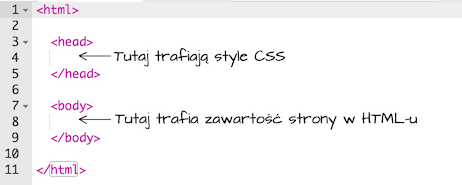

+ Zmień jeden akapit w HTML-u (po lewej). Kliknij 'Run' (uruchom), a zobaczysz zmiany na swojej stronie (po prawej).

	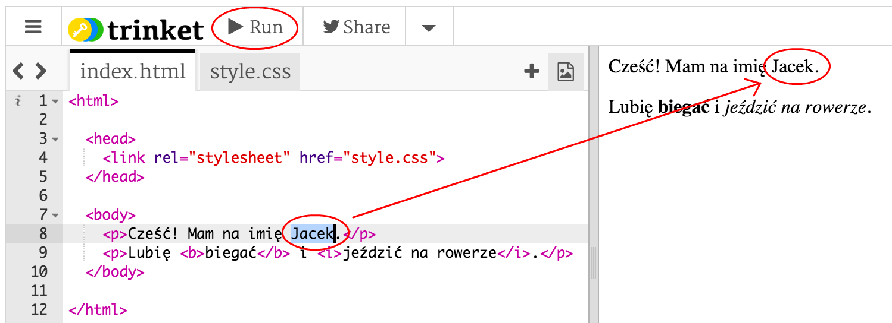

+ Jeśli popełnisz błąd i chcesz cofnąć zmiany możesz kliknąć na przycisk menu a następnie 'Reset'. Spróbuj!

	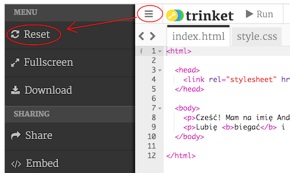

## Zapisz swój projekt {.save}

__Nie potrzebujesz konta w Trinket aby zapisywać swoje projekty!__

Jeśli nie masz konta w Trinket kliknij na strzałkę w dół, a następnie 'Link'. W ten sposób dostaniesz link, który możesz zapisać, by później kontynuować pracę. Pamiętaj, aby robić to za każdym razem, gdy coś zmienisz - link też się wtedy zmienia!

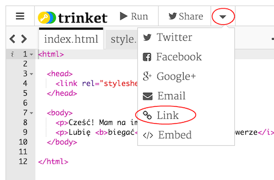

Jeśli masz konto w Trinket najprościej zapiszesz swoją stronę klikając na przycisk 'Remix' na górze Trinketu. W ten sposób zapisujesz kopię Trinketu na swoim koncie.

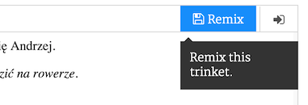

## Wyzwanie: Dodaj kolejny akapit {.challenge}
Czy potrafisz dodać trzeci akapit na swojej stronie pod poprzednimi dwoma? Pamiętaj, że nowy akapit powinien zaczynać się od tagu `<p>`, a kończyć tagiem `</p>`. 

Twoja strona powinna wyglądać mniej więcej tak:

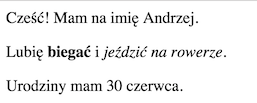

Dodaj też pogrubiony i <u>podkreślony</u> tekst w swoim akapicie. Aby podkreślić tekst użyj tagów `<u>` i `</u>`.

## Zapisz swój projekt {.save}

# Krok 2: Co to CSS? {.activity}

CSS to skrót od __Cascading Style Sheets__, czyli kaskadowe arkusze stylów. To język używany do formowania strony internetowej tak, by ładnie wyglądała. Możesz połączyć swoją stronę z plikiem CSS w części `<head>` swojego dokumentu HTML w taki sposób:


## Zadania do wykonania {.check}

+ CSS zawiera wszystkie __właściwości__ dla poszczególnych tagów. Kliknij w zakładkę 'style.css', a zobaczysz CSS swojej strony.

	

+ Znajdź poniższy kod:

	```
	p {
		color: black;
	}
	```

	Ten kod CSS ma jedną właściwość dla akapitów, która mówi, że kolor tekstu powinien być czarny.

+ Zmień słowo 'black' w CSS-ie na 'blue'. Kolor tekstu we wszystkich akapitach powinien zmienić się na niebieski.

	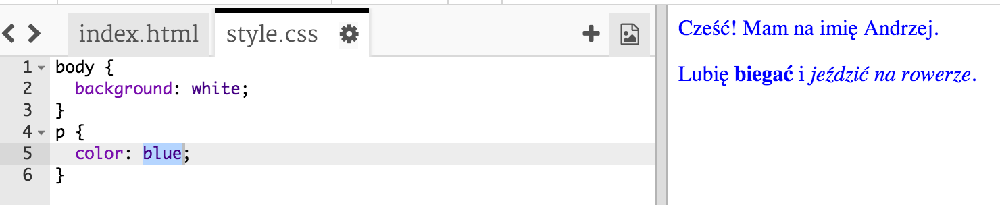

## Zapisz swój projekt {.save}

## Wyzwanie: Dodaj więcej stylów {.challenge}
Czy potrafisz zmienić tekst w akapitach na pomarańczowy (ang. orange)? Albo kolor tła na szary (ang. grey)?

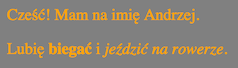

## Zapisz swój projekt {.save}

# Krok 3: Przygotowanie kartki urodzinowej {.activity}

Teraz użyjemy tego, czego dowiedzieliśmy się o HTML i CSS, aby wykonać własną kartkę na urodziny.

## Zadania do wykonania {.check}

+ Otwórz ten Trinket: <a href="http://jumpto.cc/web-card-pl" target="_blank">jumpto.cc/web-card-pl</a> lub użyj poniższej wersji, jeśli czytasz to w Internecie.

<div class="trinket">
	<iframe src="https://trinket.io/embed/html/0220902ffd" width="100%" height="400" frameborder="0" marginwidth="0" marginheight="0" allowfullscreen>
	</iframe>
</div>

Nie przejmuj się jeśli nie rozumiesz całego kodu. Ta kartka na razie jest trochę nudna, więc zaraz wprowadzisz kilka zmian w HTML i CSS.

+ Kliknij w przycisk na kartce. Kartka powinna się otworzyć i pokazać, co jest w środku.

	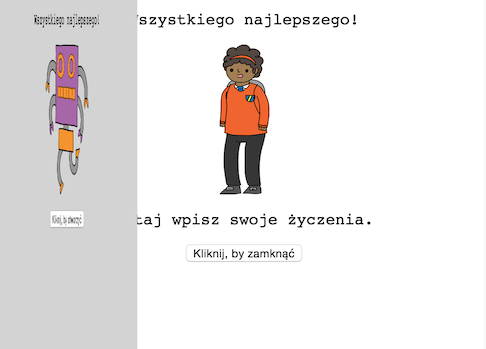

+ Przejdź w kodzie do linii 13. Tak jak na wcześniejszym przykładzie możesz zmieniać każdy tekst w HTML-u, aby dostosować kartkę do swoich pomysłów.

	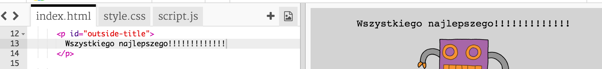

+ Znajdź HTML, w którym jest obrazek z robotem. (Podpowiedź: jest w linii 16!). Zmień słowo `robot` na `sun` (słońce) i sprawdź czy obrazek się zmienił!

	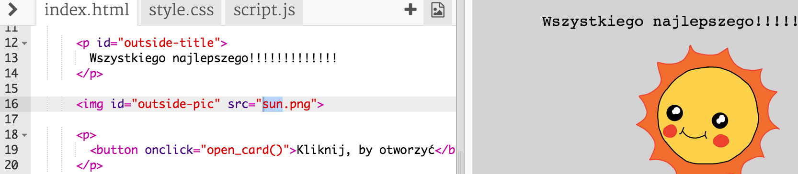

	Możesz użyć dowolnego z tych angielskich słów: `boy`, `diamond`, `dinosaur`, `flowers`, `girl`, `rainbow`, `robot`, `spaceship`, `sun`, `tea`, lub `trophy`.

+ Możesz też zmienić CSS swojej kartki urodzinowej. Kliknij w zakładkę "style.css". Zaczyna się od wszystkich CSS-ów dla zewnętrznej strony (ang. `outside`) kartki. Zmień `background-color` na `lightgreen` (jasnozielony).

	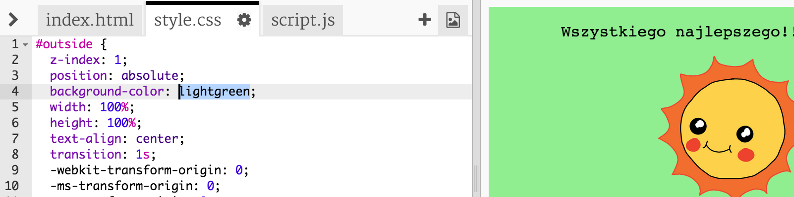

+ Możesz także zmienić rozmiar zdjęcia. Przejść do linii 29 w CSS i zmień `width` (szerokość) i `height` (wysokość) obrazków na `200px` (`px` to skrót od piksel).

	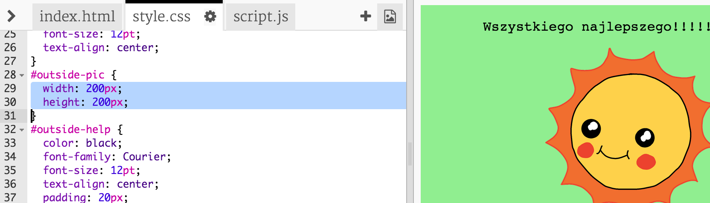	

+ The font can be changed too. Go to line 24 and change the `font-family` to `Comic Sans MS` and the `font-size` to `16pt`.

	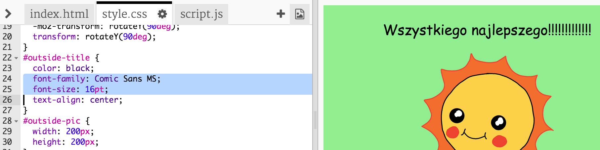

	Możesz użyć też innych fontów <span style="font-family: Arial;">arial</span>, <span style="font-family: impact;">Impact</span> and <span style="font-family: tahoma;">Tahoma</span>.

## Zapisz swój projekt {.save}

## Wyzwanie: Stwórz spersonalizowaną kartkę {.challenge}
Użyj wszystkiego, czego się nauczyłeś o HTML i CSS, aby zrobić spersonalizowaną kartkę. Nie musi to być kartka urodzinowa, możesz wymyślić dowolną okazję!

Przykład:


## Zapisz swój projekt {.save}

Gdy skończysz swoją kartkę możesz ją komuś udostępnić lub wysłać mailem.

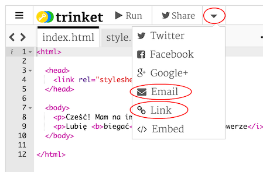
