---
title: Moje Projekty
level: HTML & CSS 1
language: pl-PL
embeds: "*.png"
materials: ["volunteer-resources/*.*","project-resources/*.*"]
stylesheet: web
...

# Wprowadzenie {.activity}

W tym projekcie stworzysz listę swoich projektów HTML, a także nauczysz się jak wstawiać linki i inne obiekty na stronie.   

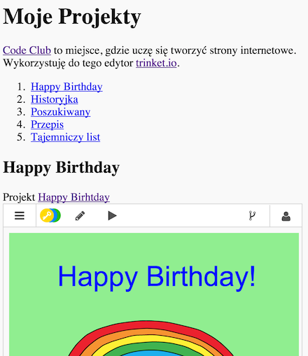

# Krok 1: Dodawanie linków do stron {.activity}

Linki tekstowe pozwalają ci klikać w słowa, by przejść na inną stronę, zazwyczaj są podkreślone.

## Lista zadań {.check}

+ Otwórz edytor: <a href="https://trinket.io/html/9ad31460f0">https://trinket.io/html/9ad31460f0</a>. Jeśli pracujesz online, możesz również posłużyć się wersją wyświetloną poniżej.

    

      <iframe src="https://trinket.io/embed/html/9ad31460f0" width="100%" height="400" frameborder="0" marginwidth="0" marginheight="0" allowfullscreen>
      </iframe>
    

+ HTML używa taga `<a>` do linków.  

    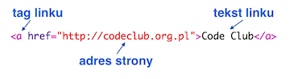

+ Znajdź tag `<a>` w swoim projekcie.

    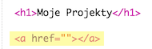

+ Dodaj adres strony Code Clubu <a href="https://www.codeclub.org.uk">`https://www.codeclub.org.uk`</a> i link tekstowy:

    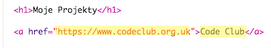

+ Naciśnij "Run", by przetestować swój edytor.

    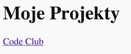

+ Kliknij na link Code Clubu, by przetestować swoją stronę. Twój edytor wyświetli teraz stronę Code Clubu:  	

    

+ Aby powrócić do swojej strony, możesz:

	+ Kliknąć jeszcze raz przycisk "Run",

	+ Wcisnąć backspace na klawiaturze albo,

	+ Nacisnąć prawy przycisk myszy i wybrać "Wstecz".

+ Teraz wstaw link w zdanie wewnętrz akapitu:

    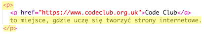

Przetestuj swoją stronę.

## Wyzwanie: dodaj jeszcze jeden link {.challenge}

Dodaj zdanie z linkiem do strony, która przydała ci się przy tworzeniu projektu strony. Na przykład: <a href="https://trinket.io">https://trinket.io</a> lub <a href="http://colours.neilorangepeel.com">http://colours.neilorangepeel.com</a>.

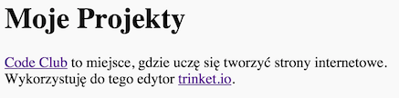

## Zapisz swój projekt {.save}

# Krok 2: Link do projektu {.activity}

Możesz dodać link do strony z projektem.

## Lista zadań {.check}

+ Czy zachowałeś link do swojego projektu Hapy Birthday? Jeśli tak, to otwórz go w innym oknie przeglądarki. A jeśli nie, otwórz skończony przykład stąd: <a href="https://trinket.io/html/e996dc0380">https://trinket.io/html/e996dc0380</a>

+ Kliknij na menu "Share" nad twoim edytorem i wybierz link:

    

    Jeśli otworzyłeś edytor z poziomu swojego konta, poszukaj opcji "Share with others" pod swoim edytorem:

    

+ Wybierz opcję "Only show code or output (let users toggle between them)" i skopiuj link do edytora.

    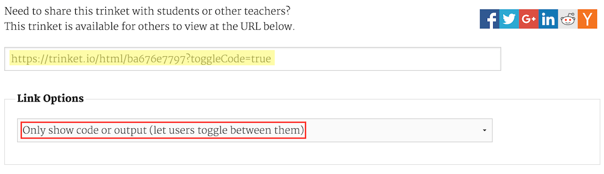

+ Wróc do swojego edytora wizytówki projektów i dodaj nagłówek `<h2>` oraz link do projektu Happy Birthday.

    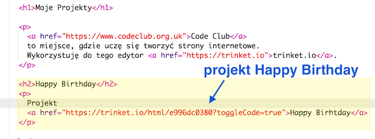

    Przetestuj swoją stronę, powinna wyglądać mniej więcej tak:

    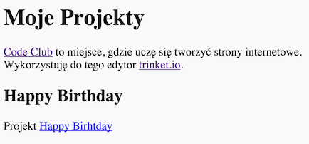

    Kliknij link Happy Birthday, by przekonać się, czy przenosi cię do edytora.

## Zachowaj swój projekt {.save}

## Wyzwanie: Stwórz listę swoich projektów {.challenge}

Dodaj kilka innych projektów HTML i CSS, które stworzyłeś w Code Clubie. Użyj nagłówka `<h2>`, by zorganizować swoją stronę.

Jeśli nie masz linków do projektów, możesz użyć przykładów:

+ Happy Birthday: <a href="https://trinket.io/html/e996dc0380">https://trinket.io/html/e996dc0380</a>

+ Opowiedz historię: <a href="https://trinket.io/html/c8afdef912">https://trinket.io/html/c8afdef912</a>

+ Poszukiwany: <a href="https://trinket.io/html/ebeb56398a">https://trinket.io/html/ebeb56398a</a>

+ Przepis: <a href="https://trinket.io/html/c0fd9b40cd">https://trinket.io/html/c0fd9b40cd</a>

+ Tajemniczy list: <a href="https://trinket.io/html/1d4d4c5ce1">https://trinket.io/html/1d4d4c5ce1</a>

Skończona strona powinna wyglądać mniej więcej tak:

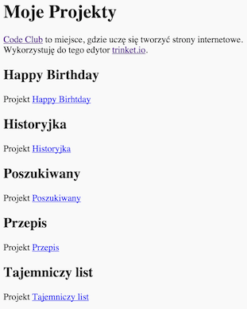

## Zachowaj swój projekt {.save}

# Krok 3: Wstawienie projektów {.activity}

Możemy nie tylko linkować do stron projektów, ale także umieszczać je na stronie.

## Lista zadań {.check}

+ Spróbuj przełączyć się w tryb pełnoekranowy, by mieć więcej przestrzeni:

    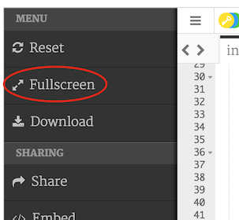

    Aby wyjść z trybu pełnoekranowego możesz nacisnąć "Esc".

+ Uruchom edytor i kliknij w link Happy Birthday.

+ Kliknij na menu edytora i wybierz __embed__. Jeżeli nie jesteś w trybie pełnoekranowym, być może będziesz musiał przewinąć. Użyj przycisku scroll po prawej stronie klawiatury lub strzałki w dół.

    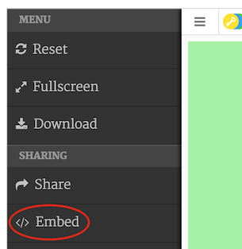

+ Wybierz opcję "Only show code or output (let users toggle between them)" i skopiuj kod do edytora.

    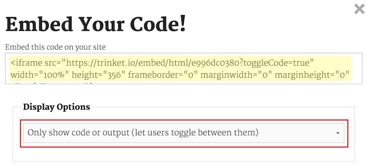

+ Edytor stworzył dla ciebie fragment HTML do wklejenia na twoją stronę. Używa on taga `<iframe>`, który umieści twój projekt na stronie.

+ Teraz wklej kod pod linkiem do projektu Happy Birthday:

    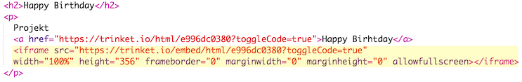

+ Uruchom edytor, by go przetestować. Powinieneś zobaczyć projekt Happy Birthday wbudowany w stronę.

    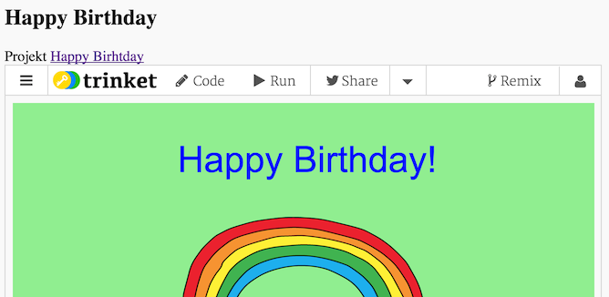

+ Może okazać się, że dół projektu nie pokazuje się. Możesz to naprawić przez zmianę wartości wysokości w `<iframe>`.

    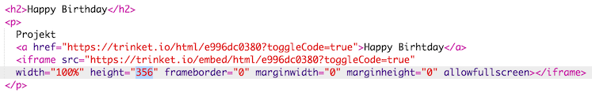

    Ustaw wysokości na __400__. Jeśli dokonywałeś zmian w projekcie Happy Birthday, być może będziesz musiał wprowadzić inną wartość.

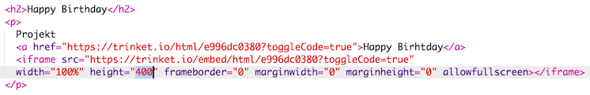

## Zachowaj swój projekt {.save}

## Wyzwanie: wbuduj więcej projektów {.challenge}

Wbuduj kolejne projekty w swoją wizytówkę. Pamiętaj, że z łatwością możesz odnaleźć te projekty klikając w linki na swojej stronie.

# Krok 4: Stwórz tabelę z treścią {.activity}

Dodajmy spis treści, abyśmy łatwo mogli dotrzeć do każdego projektu.

## Lista aktywności {.check}

+ Możemy nie tylko linkować do innych stron, ale także do części stron, o ile opatrzymy je identyfikatorem (id).

    Dodaj identyfikator do nagłówka `<h2>` w projekcie Happy Birthday:

    

+ Dodaj id do każdego z twoich projektów i nazwij je krótko: historyjka, poszukiwany, przepis i list.

+ Możesz linkować do elementu z id poprzez wprowadzenie symbolu "#" (ang. hash) przed nazwą. Na przykład: `#birthday`.

    Stwórz uporządkowaną listę linków do twoich projektów. (Listy uporządkowane wyjaśniono w projekcie Przepis).

    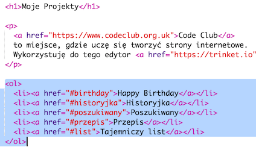

+ Uruchom swój projekt i przetestuj go poprzez kliknięcie na linki, by przenieść się do innych projektów.

    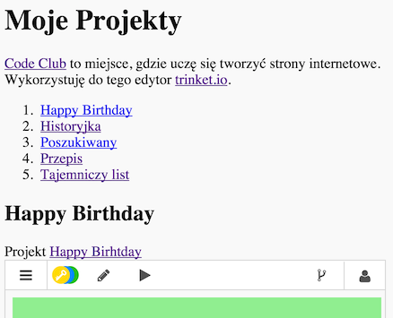

## Zachowaj swój projekt {.save}

# Krok 4: Powrót na górę {.activity}

## Lista zadań {.check}

+ Przydatnie jest mieć możliwość powrotu na górę strony. HTML udostępnia w tym celu `#top`.

+ Dodaj link do `#top` po każdym projekcie wstawionym na twojej stronie:

    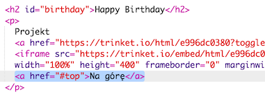

    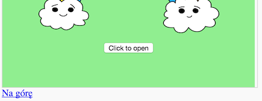

+ Przetestuj linki klikając "Na górę", by dostać się na górę strony.

## Zachowaj swój projekt {.save}

## Wyzwanie: Popraw swoją wizytówkę {.challenge}

Użyj CSS, którego się nauczyłeś, by uczynić wizytówkę bardziej interesującą. Spróbuj zmienić kolor tła lub czcionkę nagłówków.

Możesz też dodać trochę informacji o każdym projekcie i wskazać, co podobało ci się w pracy nad nim.  

## Wyzwanie: stwórz nową wizytówkę {.challenge}

Twoje projekty nie są jedynym elementem, który możesz wstawić na stronie. Możesz wstawiać filmy, widgety (takie jak widget pogodowy) albo projekty w Scratchu.

Otwórz wstawiony przykład ze Scratcha i uruchom go: <a href="https://trinket.io/html/9f7212b8fe">https://trinket.io/html/9f7212b8fe</a>

Przejdź na stronę Scratcha i znajdź projekt, który ci się podoba. Może to być twój własny albo cudzy.

Jeżeli jesteś zalogowany, możesz kliknąć przycisk "Embed" pod projektem, by otrzymać kod HTML do wstawienia.

Jeżeli nie jesteś zalogowany, poszukaj numeru projektu Scratcha w jego adresie internetowym.

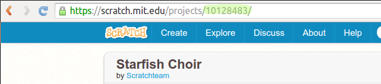

Stwórz kopię kodu `<iframe>` z przykładu Scratch Embed i zmień numer projektu na ten, który odnosi się do projektu, jaki chcesz wstawić:

## Zachowaj swój projekt {.save}
