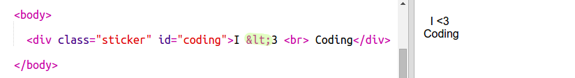
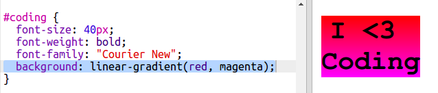
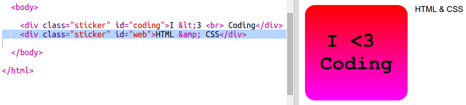
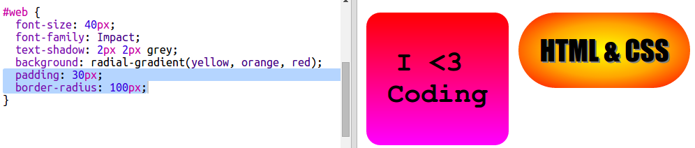
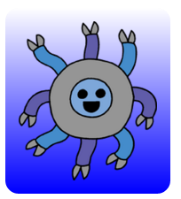
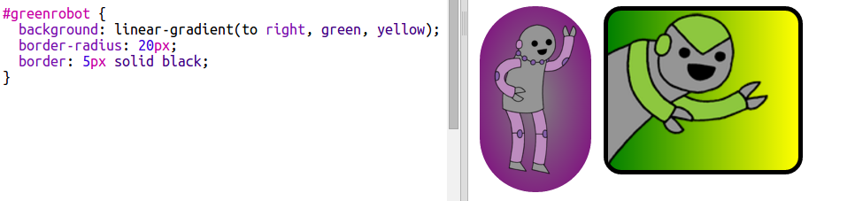
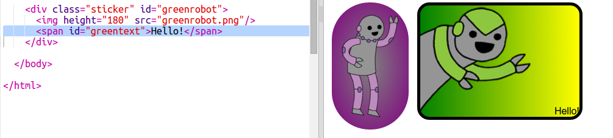
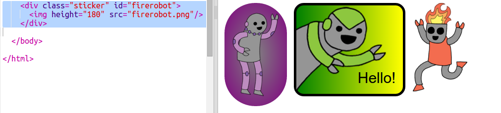
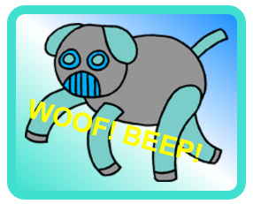

---
title: Naklejki!
level: HTML & CSS 2
language: pl-PL
embeds: "*.png"
materials: ["Club Leader Resources/stickers-finished/*.*", "Project Resources/stickers/*.*", "Project Resources/template/*.*"]
stylesheet: web
...

# Wstęp {.intro}

W czasie tego projektu wykonasz wiele zabawnych naklejek, których możesz użyć do ozdobienia swoich stron internetowych. Nauczysz się, jak używać gradientu, żeby twoje naklejki fajnie wyglądały.

# Krok 1: Naklejka z liniowym gradientem {.activity}

Gradient to stopiowe przejście z jednego koloru w drugi. Gradienty mogą być używane, aby osiągnąć ciekawe efekty. Zaraz użyjesz ich do stworzenia naklejek, któych będzie można użyć na stronach internetowych.

+ Otwórz edytor: <a href="http://jumpto.cc/web-stickers" target="_blank">jumpto.cc/web-stickers</a>. Jeśli pracujesz online, możesz również posłużyć się wersją wyświetloną poniżej.

  <iframe src="https://trinket.io/embed/html/af0ea6fa35" width="100%" height="400" frameborder="0" marginwidth="0" marginheight="0" allowfullscreen>
  </iframe>

+ Zróbmy naklejkę 'I <3 Coding' (ang. "Uwieblbiam kodowanie")

    Użyj `
` z klasą `sticker` i identyfikatorem `coding`, aby później go ostylować:

    

+ Hmm, zauważyłeś, że edytor pokazał błąd? A to dlatego, że "<" to w HTML-u znak specjalny. Zamiast "<" musisz użyć specjalnego kodu `&lt;`.

    Zmień swój kod i użyj `&lt;`, aby pozbyć się tego błędu.

    

    ` ` powoduje przejście do następnej linii.

+ Teraz zmieńmy naklejkę tak, aby była nieco ciekawsza.

    Przełącz się na plik `style.css`. Zauważ, że klasa `.sticker` jest już opisana w taki sposób, aby naklejka wyświetlała się na stronie i miała wyśrodkowaną zawartość.

    Pamiętaj, że do swojej naklejki dodałeś identyfikator `coding`. Na końcu pliku `style.css` dodaj poniższy kod, aby ostylować tekst:

    

+ Teraz możesz dodać gradient jako tło naklejki. Liniowy gradient polega na zmianie koloru z jednego w drugi wzdłuż linii prostej.

    Taki gradient powoduje przejście z czerwonego na górze do purpurowego na dole. Dodaj poniższy kod do stylu `coding`:

    

+ Możesz jeszcze ulepszyć efekt dodając odpowiednie odstępy i zaokrąglone narożniki.

    Dodaj podświetlony kod:

    

    Atrybut `padding` dodaje odstęp wielkości 50px na górze i dole oraz 30px z lewej i prawej strony.

## Zapisz swój projekt {.save}

# Krok 2: Naklejka z promienistym gradientem {.activity}

Gradienty mogą też zmianiać kolor od środka w kierunku krawędzi - nazywamy je gradientami promienistymi.

+ Zróbmy naklejkę z tekstem `HTML & CSS`. `&` to kolejny znak, który musimy zakodować w HTML-u, kod tego znaku to `&amp;`.

    Aby stworzyć nową naklejkę, dodaj podświetlony kod:

    

+ Teraz przejdź do pliku `style.css` i dodaj styl do swojej nowej naklejki:

    

    Atrybut `text-shadow` dodaje cień, który znajduje się 2px niżej i bardziej na prawo od tekstu. W ten sposób dodajemy wrażenie jakby tekst wystawał.

+ Przejdźmy teraz do gradientu. Tym razem użyjemy gradientu promienistego. Kolor będzie zmieniał się od żółtego na środku przez pomarańczowy po czerwony.

    

    Zauważ, że gradienty mogą mieć więcej kolorów, nie tylko dwa.

+ Naklejka będzie wyglądać znacznie lepiej kiedy dodamy do niej odstępy i zaokrągloną ramkę.

    Dopisz podświetlony kod:

    

## Zapisz swój projekt {.save}

## Wyzwanie: Twoja własna naklejka z gradientem {.challenge}

Stwórz swoją naklejkę z gradientem. Spróbuj liniowego i promienistego gradientu używając różnych kolorów.

Aby to zrobić:

+ W pliku `index.html` dodaj `
` z tekstem, jaki ma być na naklejce i nadaj mu klasę `sticker` oraz nowy identyfikator (`id`).
+ W pliku `style.css` dodaj styl korzystając z identyfikatora, jaki nadałeś wcześniej. Możesz skopiować style innej naklejki i zmienić według własnego uznania.

Tutaj znajdziesz listę ze wszystkimi nazwami kolorów, których możesz użyć: [jumpto.cc/web-colours](http://jumpto.cc/web-colours) (np. `tomato`, `firebrick`, `peachpuff`).

Jeśli chcesz zmienić kolor tekstu możesz użyć `color:`.

Oto co można zrobić używając różnych kolorów w gradiencie liniowym:

## Zapisz swój projekt {.save}

# Krok 3: Naklejka z gradientem i obrazkiem {.activity}

Możesz zrobić też naklejkę z gradientem używając obrazka. Gradient będzie widoczny, jeśli użyjesz obrazka z przezroczystym tłem.

+ Najpierw zrobimy naklejkę z obrazkiem w środku.

    Projekt, na którym pracujesz ma już dołączony obrazek o nazwie `purplerobot.png`.

    Dodaj podświetlony kod do pliku `index.html`:

    

    Możesz dopasować wysokość (`height`), aby zmienić rozmiar obrazka. Szerokość zmieni się automatycznie.

+ Teraz dodaj kod ze stylami, aby stworzyć tło z gradientem dla twojej naklejki:

    

## Zapisz swój projekt {.save}

## Wyzwanie: Zrób własną naklejkę z obrazkiem i gradientem {.challenge}

Teraz stwórz swoją naklejkę z obrazkiem i gradientem

Aby to zrobić:

+ Dodaj nową naklejkę z obrazkiem używając `
` w pliku `index.html`.
+ Dodaj klasę `sticker` i nowy identyfikator do tagu `div` z naklejką.
+ Utwórz styl dla identyfikatora używając gradientu i odpowiednich odstępów (`padding`).

Ten projekt ma już dołączony cały zestaw obrazków z robotami. Aby zobaczyć wszystkie dostępne obrazki kliknij na ikonę z obrazkiem.

Oto przykład naklejki z obrazkiem i liniowym gradientem:

## Zapisz swój projekt {.save}

# Krok 4: Gradienty poziome  {.activity}

Gradienty mogą być zarówno poziome jak i pionowe.

+ Zrobimy teraz kolejną naklejkę z obrazkiem.

    Tym razem użyjemy `greenrobot.png`. Dodaj poniższy kod do `index.html`:

    

+ Zazwyczaj liniowy gradient zaczyna się u góry i kończy na dole. Jeśli jednak dodamy `to right` (do prawej), wtedy gradient będzie od lewej do prawej.

    Dodaj podświetlony kod do `style.css`, aby dodać poziomy gradient do naklejki z zielonym robotem.

    

    Zauważ, że gradient zaczyna się od zielonego po lewej stronie, a kończy się na żółtym po prawej stronie.

+ Robot wygląda jakby chciał coś powiedzieć. Dodajmy więc do naklejki także tekst.

    Przejdź do `index.html` i dodaj tekst `Hello!` do naklejki z zielonym robotem. Tekst dodaj wewnątrz tagu `` z wymyślonym identyfikatorem, aby można go było później odpowiednio ostylować:

    

+ Tekst będzie wyglądał lepiej kiedy go powiększysz i ustawisz w odpowiednim miejscu.

    Aby ustawić tekst musisz dodać `position: relative;` do `#greensticker` i `position: absolute;` do `#greentext`. Opisywaliśmy to szczegółowo w projekcie `Zbuduj robota`.

    Dodaj podświetlony kod do `style.css`:

    

    Teraz tekst "Hello!" jest ustawiony w prawym dolnym rogu naklejki.

## Zapisz swój projekt {.save}

# Krok 5: Gradienty skośne  {.activity}

Możesz także zrobić skośne gradienty które idą od jednego narożnika do drugiego.

+ Dodaj naklejkę do `index.html` używając obrazka `firerobot.png`:

    

+ Używając gradientu skośnego musisz podać dwa kierunki. W przykładzie użyto `to bottom left` (do dołu do lewej)

    Dodaj poniższy kod do `style.css`, aby nadać naklejce z robotem skośny gradient i czadową ramkę:

    

    Zauważ, że możesz użyć `outline` aby stworzyć kolejną ramkę na zewnątrz tej zwykłej.
    `outline-offset` określa odległość między ramkami.

+ Dodaj trochę tekstu na naklejce.

    W pliku `index.html` dodaj tag `` zawierający tekst "ROBOTS!" i nadaj mu identyfikator.

    

+ Teraz możesz ustawić tekst dodając poniższy styl:

    

+ A na koniec obróćmy trochę tekst używając `transform: rotate`.

    

    Spróbuj pozmieniać ilość stopni, o jaką obrócony jest tekst.

## Zapisz swój projekt {.save}

## Wyzwanie: Jeszcze więcej naklejek {.challenge}

Teraz spróbuj zrobić więcej naklejek używając gradientów w różnych kierunkach, dodając obrazki i tekst oraz używając obu rodzajów ramek.

Możesz skopiować jeden z przykładów i zmienić go tak, aby utworzyć nową naklejkę.

Oto przykład z użyciem gradientu skośnego:

## Zapisz swój projekt {.save}
