---
title: Pokoje
level: HTML & CSS 1
language: pl-PL
embeds: "*.png"
materials: ["volunteer-resources/*.*","project-resources/*.*"]
stylesheet: web
...

# Wstęp {.intro}

Wykonując ten projekt zbudujemy kilka połączonych pokojów - każdy pokój będzie osobną stroną internetową.

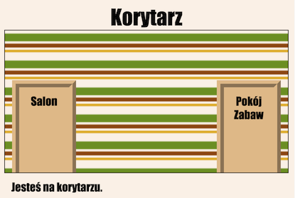

# Krok 1: Linkowanie do innej strony w tym samym projekcie {.activity}

Strony intenetowe mogą być stworzone z wielu plików HTML połączonych ze sobą linkami.

## Lista zadań {.check}

+ Otwórz ten projekt: <a href="https://trinket.io/html/8fd770bec4">https://trinket.io/html/8fd770bec4</a>. Jeśli pracujesz online, możesz również posłużyć się wersją wyświetloną poniżej.

    

      <iframe src="https://trinket.io/embed/html/8fd770bec4" width="100%" height="400" frameborder="0" marginwidth="0" marginheight="0" allowfullscreen>
      </iframe>
    

+ Uruchom projekt - powinieneś znaleźć się na korytarzu:

    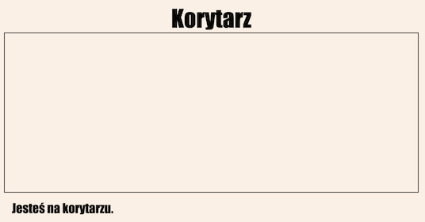

+ Spójrz na zakładki z nazwami plików w tym projekcie. Czy widzisz `salon.html`?

    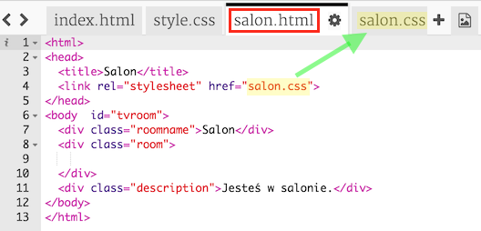

    To jest po prostu inny plik HTML w tym samym projekcie.

    Ten plik korzysta ze swoich stylów, które znajdują się w pliku `salon.css`.

+ Aby wyświetlić `salon.html` musisz dodać link w `index.html`:

    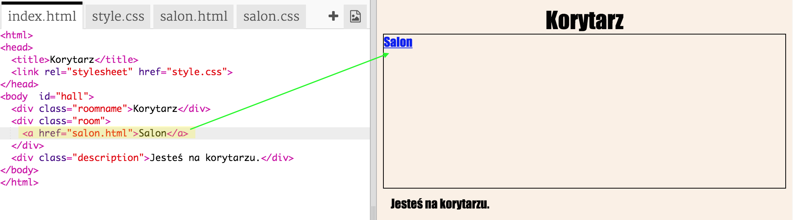

    Przetestuj swój projekt klikając na link __Salon__, by zobaczyć stronę `salon.html`:

    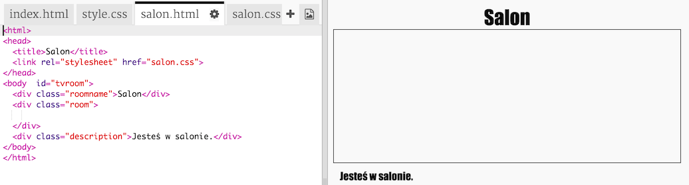

## Wyzwanie: Dodaj kolejny link {.challenge}

Dodaj w link w pliku `salon.html`, który zabierze cię z powrotem na stronę korytarza (`index.html`).

Salon powinien mieć link, który możesz kliknąć:

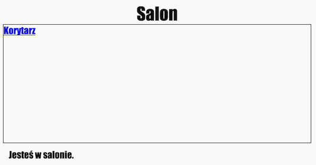

## Zapisz swój projekt {.save}

# Krok 2: Dodaj inny pokój {.activity}

Dodajmy teraz inny pokój - __Pokój Zabaw__.

## Lista zadań {.check}

+ Kliknij na przycisk __+__, który służy do dodawania stron:

    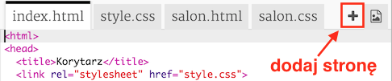

    Jako nazwę strony wpisz `pokojzabaw.html`:

    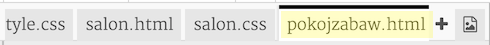

+ Kod HTML dla __Pokoju Zabaw__ jest bardzo podobny do tego z pliku `salon.html`, więc możesz skopiować go i wkleić do pliku `pokojzabaw.html`.

    Zmień podświetlone elementy zamieniając "Salon" na "Pokój Zabaw", a `salon.css` na `pokojzabaw.css`:

    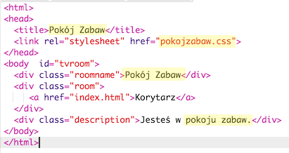

+ Twój plik `pokojzabaw.html` używa teraz `pokojzabaw.css`.

    Stwórz plik `pokojzabaw.css` klikając na przycisk dodawania nowej strony __+__.

    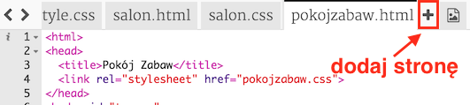

+ Kod CSS dla __pokoju zabaw__ jest bardzo podobny do tego z pliku `salon.css`, więc skopiuj go i wklej do pliku `pokojzabaw.css`.

+ Dodaj link tak, by z korytarza można było przejść do pokoju zabaw:

    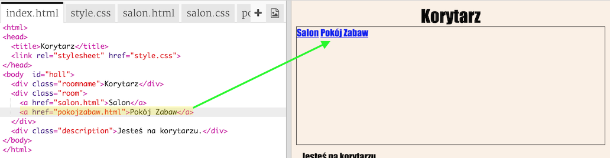

+ Przetestuj swój projekt klikajć na link do pokoju zabaw.

    __Pokój Zabaw__ powinien wyglądać mniej więcej tak:

    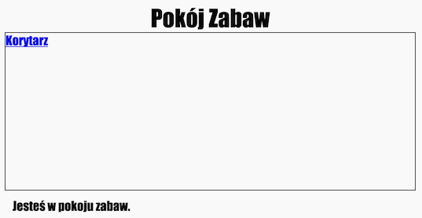

    Niezbyt ekscytująco, ale możesz zmienić to podejmując poniższe wyzwanie.

## Zapisz swój projekt {.save}

## Wyzwanie: Ostyluj i podlinkuj pokój zabaw {.challenge}

Zmień kod HTML i CSS pokoju zabaw w taki sposób, by strona wyglądała tak:

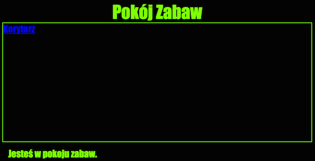

Podpowiedź: Jasnozielony kolor nazywa się `chartreuse`.

## Zapisz swój projekt {.save}

# Krok 3: Linki, które wyglądają jak drzwi {.activity}

Linki nie muszą być zwykłym tekstem. Stwórzmy klikalne drzwi używając tagu `
`.

## Lista zadań {.check}

+ Otwórz `index.html` i dodaj tag `
` wokół tekstu __Salon__. Tag `
` powinien znaleźć się wewnątrz `<a>`, aby cały był klikalny.

    Dodaj do niego `class="drzwi"`, aby za chwilę dodać kod CSS, który sprawi, że będzie wyglądał jak drzwi.

    Dodaj też `id="korytarz-salon"`, aby ustawić go w odpowiednim miejscu.

    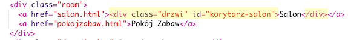  

+ Teraz kliknij na zakładkę `style.css` i dodaj poniższy kod CSS, aby zmienić rozmiar i kolor drzwi:

    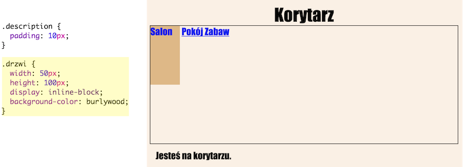

+ Przetestuj swoją stronę klikając drzwi w różnych miejcach, nie tylko w tekst.

+ Zmieńmy je tak, by wyglądały trochę bardziej jak drzwi. W tym celu dodamy ramkę z trzech stron:

    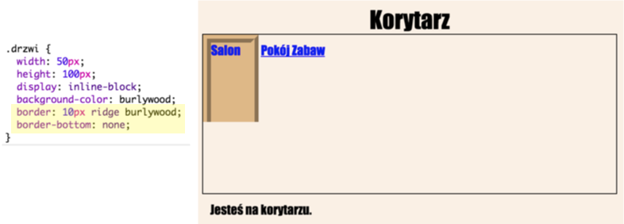

+ Dodajmy też trochę kodu CSS, aby tekst na drzwiach wyglądał nieco lepiej:

    

+ Pewnie zauważyłeś, że drzwi wiszą w powietrzu. Naprawmy to ustawiając je w odpowiednim miejscu. Użyjemy do tego ich identyfikatora (id).

    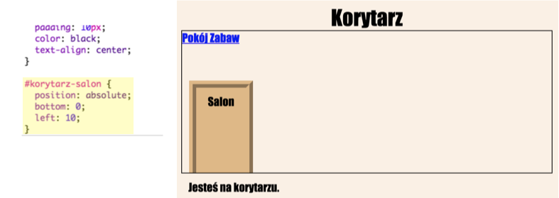

+ Przetestuj stronę klikając w drzwi do __Salonu__.

## Zapisz swój projekt {.save}

## Wyzwanie: Jeszcze więcej drzwi! {.challenge}

Zamień pozostałe linki w projekcie w taki sam sposób - zrób z nich drzwi.

Każdy pokój ma swój własny plik CSS, więc nie zapomnij dodać styl drzwi do każdego z nich.

Salon powinien wyglądać mniej więcej tak:

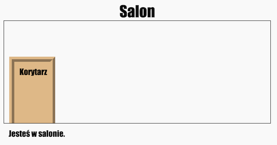

# Krok 4: Dodajemy tło {.activity}

Udekorujemy teraz korytarz dodając obrazek tła.

## Lista zadań {.check}

+ W pliku `style.css` dodaj obrazek tła do korytarza:

    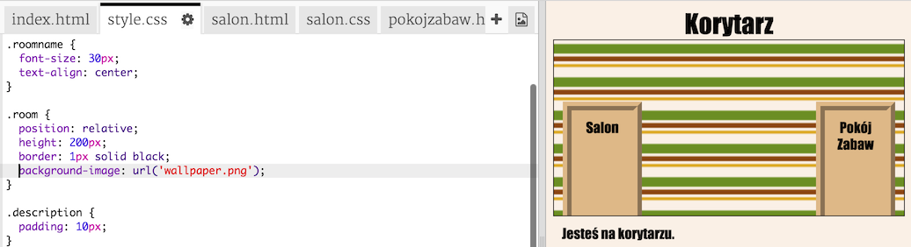

    Obrazek będzie powtarzany, aby wypełnić cały pokój.

+ Przetestuj projekt.

## Zapisz swój projekt {.save}

## Wyzwanie: Dodaj tapetę do pokoju zabaw {.challenge}

Czy potrafisz udekorować pokój zabaw dodając obrazek jako tło?

Możesz użyć tapety z pliku `space-invader.png`.

Udekorowany pokój powinien wyglądać mniej więcej tak:

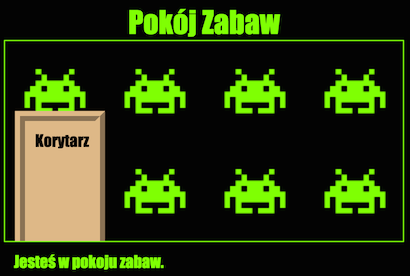

## Zapisz swój projekt {.save}

# Krok 5: Klucz jako wzkaźnik myszy {.activity}

## Lista zadań {.check}

+ Kolejnym fajnym elementem, który zrobimy będzie dodanie obrazka jako wskaźnika myszy (kursora). Otwórz `style.css` i dodaj wybrany kursor do klasy `.drzwi`, aby wskaźnik myszy zamieniał się w klucz, kiedy najedziesz myszką na drzwi.

    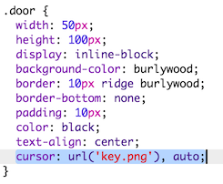

    Obrazek `key.png` jest już wbudowany w twój projekt.

    Kod CSS `, auto` oznacza, że jeśli nie będzie można wyświetlić wybranego obrazka, zamiast niego zostanie użyty zwykły kursor.

+ Dodaj kursor-klucz do plików `salon.css` i `pokojzabaw.css`.

+ Przetestuj projekt. Wskaźnik myszy powinien zamienić się w klucz zawsze, kiedy najedziesz myszką na drzwi. Sprawdź to w każdym pokoju.

## Zapisz swój projekt {.save}

## Wyzwanie: Zrób po swojemu! {.challenge}

Dodaj swoje pokoje do projektu.

Do dekoracji możesz użyć też obraka `tiles.png`.

## Zapisz swój projekt {.save}
