---
title: Przepis
level: HTML & CSS 1
language: pl-PL
embeds: "*.png"
materials: ["volunteer-resources/*.*","project-resources/*.*"]
stylesheet: web
...

# Wstęp { .intro}

W tym projekcie nauczycie się, jak stworzyć stronę internetową ze swoim ulubionym przepisem.

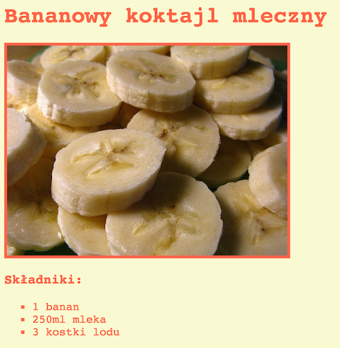

# Krok 1: Wybierz przepis { .activity}

Zanim zabierzesz się do kodowania, będziesz musiał wybrać przepis.

## Lista zadań { .check}

+ Pomyśl o przepisie, którym chciałbyś podzielić się z przyjaciółmi. Może to być:
	+ Przepis odnaleziony w sieci;
	+ Przepis na twoją ulubioną potrawę;
	+ Coś, co wymyśliłeś!

Przykładowy przepis w tym projekcie pokazuje, jak przygotować bananowy koktajl mleczny. Możesz go skopiować, jeśli nie możesz znaleźć własnego.

# Krok 2: Składniki { .activity}

Wypiszmy składniki potrzebne do potrawy z twojego przepisu.

## Lista zadań { .check}

+ Otwórz edytor: [jumpto.cc/trinket-template](http://jumpto.cc/trinket-template). Jeśli pracujesz online, możesz również posłużyć się wersją wyświetloną poniżej.

<div class="trinket">
  <iframe src="https://trinket.io/embed/html/ef4c882ae6" width="100%" height="400" frameborder="0" marginwidth="0" marginheight="0" allowfullscreen>
  </iframe>
</div>

+ Na potrzeby listy składników, skorzystasz z __nieuporządkowanej listy__, używając tag `<ul>`. Przejdź do linii 8. wzoru i dodaj następujący HTML, zastępując tekst tytułu w `<h1>` nazwą twojego własnego przepisu:

```
<h1>Bananowy koktajl mleczny</h1>

<h3>Składniki:</h3>

<ul>

</ul>
```

+ Otwórz swoją stronę - powinieneś zobaczyć dwa nagłówki.

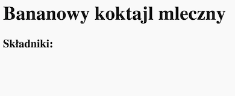

Nie ujrzysz jednak jeszcze swojej listy, ponieważ nie dodałeś do niej żadnych składników!

+ Następny krok polega na dodaniu do listy składników poprzez użycie taga `<li>`. Dodaj następujący kod wewnątrz taga `<ul>`:

```
<li>1 banan</li>
```
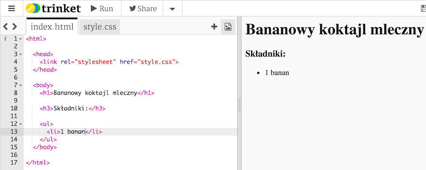

Jako że twoja lista nie jest uporządkowana, nie ma numerów przy elementach listy, a jedynie wypunktowanie.

##Wyzwanie: Więcej składników {.challenge}
Czy możesz dodać wszystkie składniki do twojego przepisu?

Twoja strona powinna wyglądać mniej więcej tak:

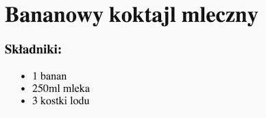

## Zapisz swój projekt {.save}

# Krok 3: Instrukcja { .activity }

Następnie wyjaśnijmy, jak przygotować potrawę.

## Lista zadań { .check}

+ Użyjesz jeszcze jednej listy, by spisać instrukcje, ale tym razem użyjesz __uporządkowanej listy__ poprzez użycie taga `<ol>`.

Lista uporządkowana to lista numerowana - używa się jej, gdy kolejność ma znaczenie.

Dodaj poniższy kod pod listą składników, upewniając się, że wciąż znajduje się on wewnątrz taga `<body>`:

```
<h3>Instrukcja:</h3>

<ol>

</ol>
```

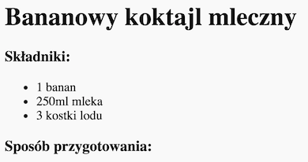

+ Teraz musisz już tylko dodać elementy do uporządkowanej listy:

```
<li>Obierz banana i wrzuć do blendera</li>
```

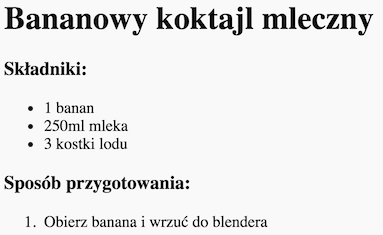

Zauważ, że elementy listy są automatycznie numerowane!

## Wyzwanie: Kolejne kroki {.challenge}
Czy potrafisz dodać wszystkie kroki przygotowania potrawy?

Twoja instrukcja powinna wyglądać mniej więcej tak:

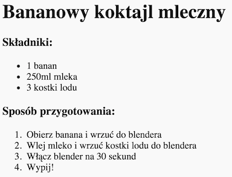

## Zachowaj swój projekt {.save}

# Krok 4: Kolory! { .activity}

Dodajmy więcej kolorów do strony z przepisem.

## Lista zadań { .check}

+ Nauczyłeś się już, jak dodawać do strony kolorowy tekst. Dodaj następujący tekst wewnątrz pliku `style.css`, by pokolorować cały tekst na niebiesko:

```
body {
    color: blue;
}
```

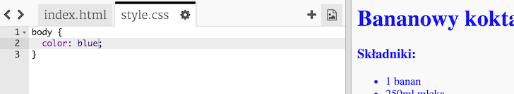

+ Twoja przeglądarka zna kolory takie jak `blue`, `yellow` a nawet `lightgreen`, ale czy wiedziałeś, że przeglądarka zna __nazwy__ ponad 500 różnych kolorów?

Istnieje lista wszystkich nazw kolorów, z której możesz skorzystać: [jumpto.cc/web-colours](http://jumpto.cc/web-colours), która zawiera nazwy kolorów takie jak `tomato`, `firebrick` i `peachpuff`.

Zmień kolor tekstu z `blue` na `tomato`.

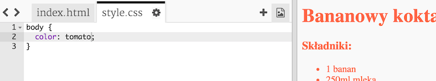

+ Twoja przeglądarka zna nazwy 140 kolorów, ale zna też __wartości kolorów__ dla ponad 16 milionów kolorów!


Jak może wiesz, wszystkie kolory składają się z barw podstawowych: czerwonego, zielonego i niebieskiego. By poinformować przeglądarkę, jakiego koloru ma użyć, musisz tylko dać jej znać, jak wiele kolorów podstawowych należy użyć.

Ilości czerwonego, zielonego i niebieskiego do użycia są napisane jako numer pomiędzy `0` a `255`.


Dodaj następujący kod do CSS, by wprowadzić jasnożółte tło:

```
background: rgb(250,250,210);
```

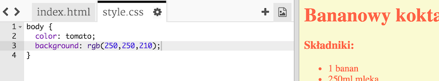

+ Jeśli wolisz, możesz wskazać przeglądarce kolor do wyświetlenia poprzez wybór kodu heksadecymalnego (albo __hex code__). Działa to podobnie jak kod `rgb()` powyżej, z tym zastrzeżeniem, że hex code zawsze zaczyna się od `#` i używa heksadecymalnych ‘numerów’ pomiędzy `00` a `ff` dla ilości czerwonego, zielonego i niebieskiego.


Zamień kod `rgb()` w twoim CSS następującym fragmentem:

```
background: #fafad2;
```


Powinieneś ujrzeć ten sam jasnożółty co wcześniej!

## Zachowaj swój projekt {.save}

# Krok 5: Ostatnie szlify { .activity}

Dodajmy trochę więcej HTML i CSS, by poprawić stronę.

## Lista zadań { .check}

+ Możesz dodać linię poziomą na końcu przepisu poprzez użycie taga <hr>.

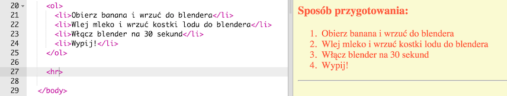

Zauważ, że ten tag nie ma taga końcowego, zupełnie jak tag ``.

+ Linia, którą właśnie dodałeś, nie pasuje stylem do pozostałej zawartości strony. Naprawmy to poprzez dodanie kodu CSS:

```
hr {
    height: 2px;
    border: none;
    background-color: tomato;
}
```

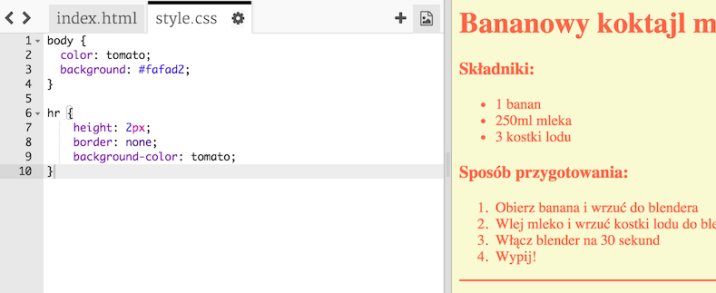

+ Możesz nawet zmienić wygląd wypunktowania następującym kodem CSS:

```
ul {
    list-style-type: square;
}
```

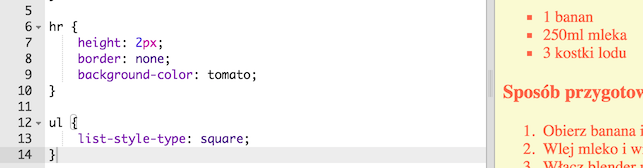

## Wyzwanie: Więcej kolorów! {.challenge}
Zmień kolory w twoim kodzie poprzez użycie nazw kolorów, wartości `rgb()` i hex kodu. Listę całego mnóstwa kolorów znajdziesz tu: <a href="http://jumpto.cc/web-colours" target="_blank">jumpto.cc/web-colours</a>.

Oto kilka przykładów kolorów:

+ Czerwony można zapisać jako:
	+ `red` (no jasne!)
	+ `rgb(255,0,0)` (mnóstwo czerwieni, bez zieleni i niebieskiego)
	+ `#ff0000`

+ Oliwkowy można zapisać jako:
	+ `olive`
	+ `rgb(128, 128, 0)` (odrobina czerwieni i zieleni, bez niebieskiego)
	+ `#808000`

Upewnij się, że użyte kolory pasują do twojego przepisu!

## Zachowaj swój projekt {.save}

## Wyzwanie: Recenzje {.challenge}
Poproś kilku przyjaciół, by zrecenzowali twój przepis. Będziesz w tym celu potrzebował kolejnej listy.

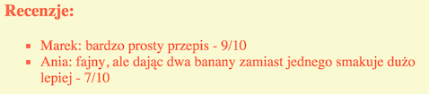

## Zachowaj swój projekt {.save}

## Wyzwanie: Więcej stylizacji {.challenge}
Czy potrafisz dodać obrazek do strony? Lub zmienić czcionkę? Oto, jak może wyglądać twoja strona:


Oto kod, który może ci pomóc:

```
font-family: Arial / Comic Sans MS / Courier / Impact / Tahoma;
font-size: 12pt;
font-weight: bold;


```

## Zachowaj swój projekt {.save}
