---
title: Tajemniczy List
level: HTML & CSS 1
language: pl-PL
embeds: "*.png"
materials: ["volunteer-resources/*.*","project-resources/*.*"]
stylesheet: web
...

# Wstęp {.intro}

W tym projekcie napiszesz tajemniczy list, który wygląda tak, jakby każde słowo było wycięte z innej gazety, magazynu lub czasopisma. 

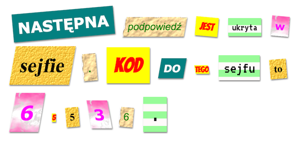

# Krok 1: Wymyśl wiadomość {.activity}

Tajemnicze listy często występują w filmach i książkach do przekazywania sekretnych wiadomości.

## Lista zadań {.check}

+ Wymyśl tajemniczą wiadomość, najlepiej jeśli będzie miała około 12 wyrazów. Jeśli nie możesz nic wymyślić możesz użyć tego przykładu: "Następna podpowiedź jest ukryta w sejfie. Kod do tego sejfu to 65536."

+ Zanotuj lub zapamiętaj dokładnie swoją wiadomość.

# Krok 2: Wprowadzenie wiadomości {.activity}

Wyświetlmy wiadomość na stronie internetowej.

## Lista zadań {.check}

+ Otwórz ten edytor: <a href="http://jumpto.cc/html-list" target="_blank">jumpto.cc/html-list</a>. Jeśli czytasz to w Internecie możesz także użyć edytora znajdującego się poniżej:

    

      <iframe src="https://trinket.io/embed/html/d8baf77b3e" width="100%" height="400" frameborder="0" marginwidth="0" marginheight="0" allowfullscreen>
      </iframe>
    

+ Tag akapitu `
` poznaliśmy już w projekcie "Kartka urodzinowa". Tag `` jest używany do grupowania mniejszych części tekstu wewnątrz akapitu, aby można było je inaczej stylizować.

    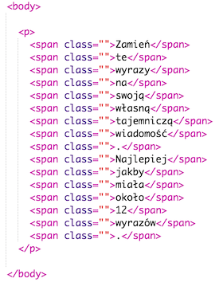

+ Zamień wyrazy, które znajdują się w edytorze wyrazami z twojej wiadomości w taki sposób, by każdy tag `` zawierał jeden wyraz. Jeśli twoja wiadomość jest dłuższa lub krótsza potrzebne będzie dodanie dodatkowych tagów `` lub usunięcie nadmiarowych.

    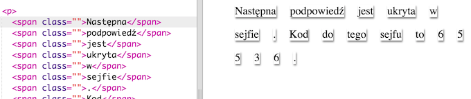

+ Kliknij przycisk "Run", aby przetestować swoją stronę.

	Popatrz na wyrazy - zostały ostylowane w taki sposób, że wyglądają jakby były przyklejone do strony.

# Krok 3: Używanie klas stylów {.activity}

## Lista zadań {.check}

+ Czy zauważyłeś `class=""` w tagach ``? Możesz używać tego do stylowania więcej niż jednego elementu w ten sam sposób.

+ Dodaj klasę `magazine1` do kilku tagów `` i przetestuj stronę.

    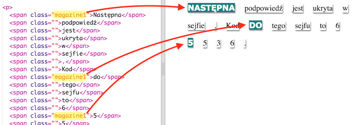

+ Możesz użyć więcej niż jednej klasy dla jednego elementu. Po prostu oddziel nazwy klas spacjami. Dodaj klasę `big` do jednego z tagów ``. Przetestuj stronę.

    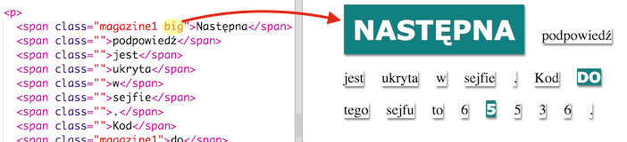

## Zapisz swój projekt {.save}

## Wyzwanie: Ostyluj wiadomość {.challenge}

Użyj poniższych styli, aby twoja wiadomość wyglądała jak tajemniczy list.

Dodaj poniższe klasy do tagów ``:

+ `newspaper`, `magazine1`, `magazine2`

+ `medium`, `big`, `reallybig`

+ `rotateleft`, `rotateright`

+ `skewleft`, `skewright`

Nie dodawaj więcej niż jednego z każdej liniii do pojedyńczego tagu ``.

Twój list może wyglądać na przykład tak:

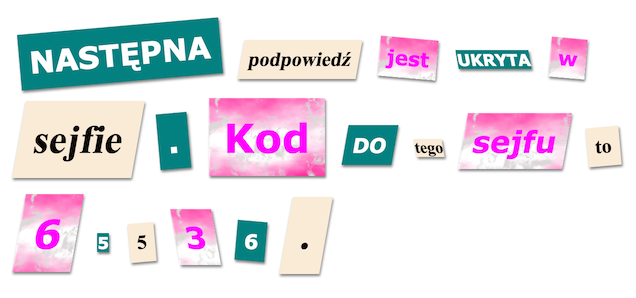

## Zapisz swój projekt {.save}

# Krok 4: Edytowanie klas {.activity}

## Lista zadań {.check}

+ Kliknij na zakładkę __"style.css"__. Znajdź styl dla klasy `newspaper`, której wcześniej używaliśmy.

    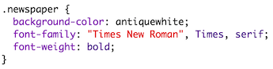

+ Zauważ, że w pliku CSS przed nazwą klasy jest kropka ".", ale nie ma jej w tagu `` w dokumencie HTML. 

+ Popatrz teraz na inne klasy CSS, których używaliśmy do stylowania tajemniczego listu. Możesz tam zobaczyć:

	+ Jak styl `magazine1` zmienia tekst w wielkie litery (kapitaliki).

	+ Jak styl `magazine2` sprawia, że w tle tekstu znajduje się obrazek.

    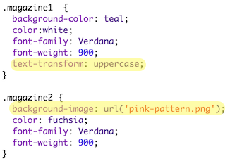

+ Co się stanie kiedy zmienisz `background-image` w `magazine2` na `canvas.png`? Jeśli wolisz `pink-pattern.png` możesz zamienić to z powrotem.

    Jeśli chcesz możesz także pozmieniać kolory w stylach.

+ Znajdź CSS używany do obracania i pochylania wyrazów:

    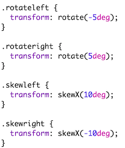

    Spróbuj zmienić liczby, by uzyskać inne efekty, a następnie przetestuj stronę.

# Krok 5: Tworzenie nowej klasy  {.activity}

Stworzymy teraz styl, który będzie wyglądać jakby wyraz był wycięty z komiksu. Na stronie <a href="http://jumpto.cc/web-fonts" target="_blank">jumpto.cc/web-fonts</a> znajdziesz wiele czcionek, których możesz używać.

## Lista zadań {.check}

+ Dodaj klasę `comic` w pliku __style.css__. Możesz to zrobić po klasie `magazine2`. Nie zapomniej o kropce na początku nazwy klasy.

    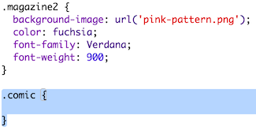

    Nie przejmuj się jeśli zobaczysz ostrzeżenie "The Rule is empty" ("Reguła jest pusta"), zaraz to naprawimy.

+ Teraz dodaj nieco styli do swojej klasy `comic`. Jeśli chcesz możesz użyć różnych kolorów. Listę kolorów możesz znaleźć na stronie <a href="http://jumpto.cc/web-colours" target="_blank">jumpto.cc/web-colours</a>

    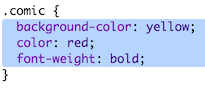

+ Użyj klasy `comic` w kilku tagach `` w dokumencie HTML i przetestuj stronę:

    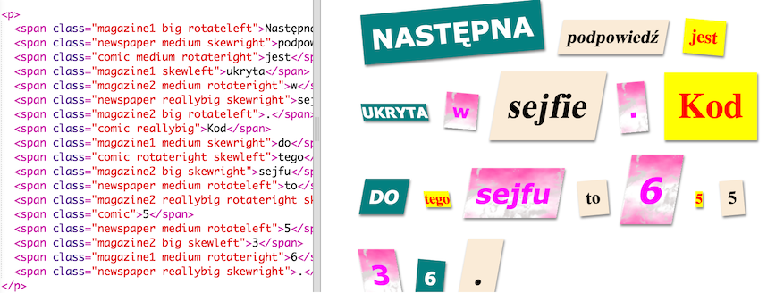

+ Teraz możesz dodać jakąś zabawną czcionkę. Otwórz nową zakładkę lub okno przeglądarki. Przejdź do <a href="http://jumpto.cc/web-fonts" target="_blank">jumpto.cc/web-fonts</a> i  wyszukaj __"bangers"__:

    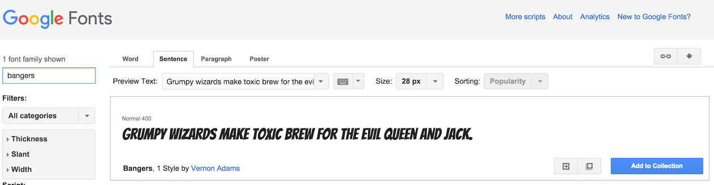

+ Kliknij na przycisk "Quick-use":

    

+ Otworzy się nowa strona. Przewiń na dół aż zobaczysz:

    

    i skopiuj zaznaczony kod.

+ Wklej tag `<link>`, który właśnie skopiowałeś ze strony Google Fonts wśrodku tagu `<head>` na swojej stronie:

    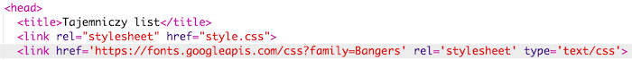

    Dzięki temu będziesz mógł użyć czcionki Bangers na swojej stronie.

+ Wróć do strony Google Fonts, przewiń jeszcze niżej i skopiuj kod CSS:

    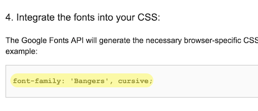

+ Teraz wróć do twojego pliku __"style.css"__ w edytorze i wklej kod CSS w style klasy `comic`:

    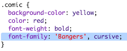

+ Przetestuj swoją stronę. Powinno to wyglądać mniej więcej tak:

    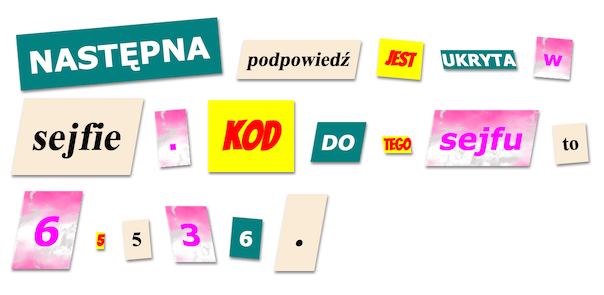

## Zapisz swój projekt {.save}

## Wyzwanie: Nowy styl - wydruk komputerowy {.challenge}

Stworzymy teraz styl, który sprawi, że wyrazy będą wyglądać, jakby były wydrukowane ze starego komputera. Użyjemy tego stylu dla kliku wyrazów:

Będziesz potrzebować:

+ Czcionki `VT323` ze strony <a href="http://jumpto.cc/web-fonts" target="_blank">jumpto.cc/web-fonts</a>. Możesz sprawdzić jak skorzystać z Google Fonts cofając się do kroku 5.

+ Obrazka tła `computer-printout-paper.png`. Możesz sprawdzić jak ustawić tło cofając się do kroku 4.

## Wyzwanie: Stwórz własny styl {.challenge}

Teraz stwórz swoją własną klasę CSS i spraw, że twój tajemniczy list będzie jeszcze ciekawszy. Użyj styli CSS, które już znasz z poprzednich projektów. Możesz też zobaczyć przykłady w pliku __style.css__.

Oto przykład:

Możesz zobaczyć obrazki, których możesz użyć klikając w edytorze na zakłądkę Images.
Spróbuj ustawić tło korzystając z jednego z dostępnych obrazków:

+ `rough-paper.png`

+ `canvas.png`

Jeśli masz konto na trinket.io możesz też dodać obrazki, które zrobiłeś podczas wykonywania projektu z tworzeniem historyjki.

Możesz także użyć dowolnej czcionki ze strony <a href="http://jumpto.cc/web-fonts" target="_blank">jumpto.cc/web-fonts</a> - skopiuj jej tag `<link>` i kod CSS do twojego edytora.

## Zapisz swój projekt {.save}
