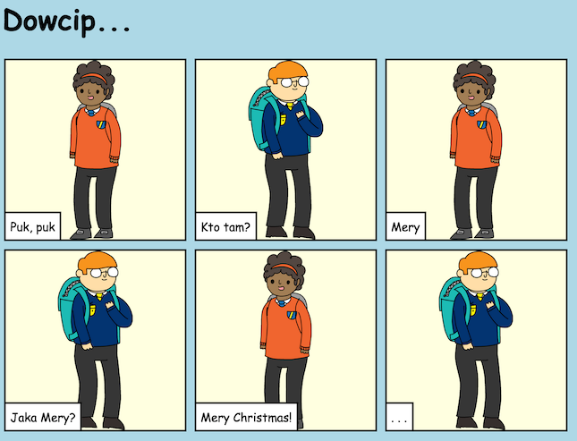
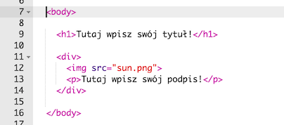
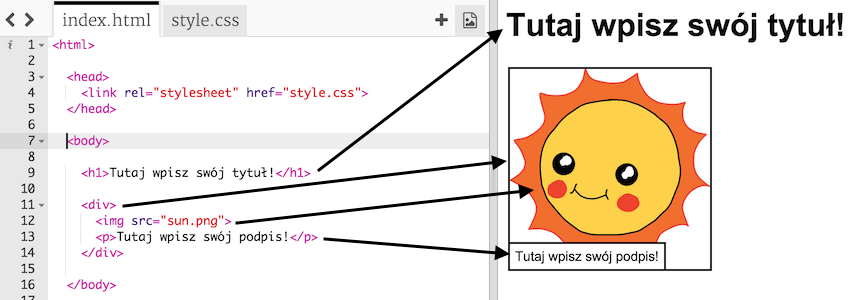
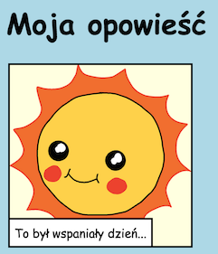
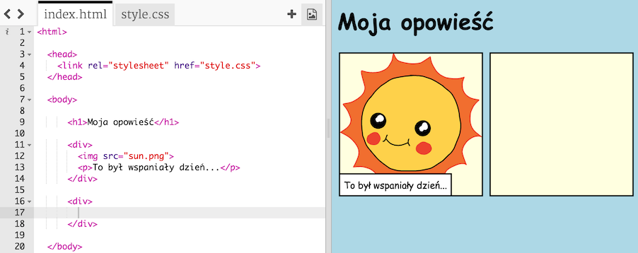
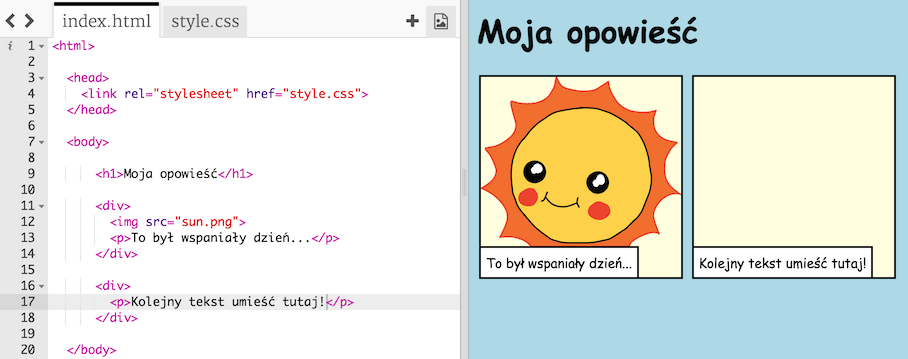
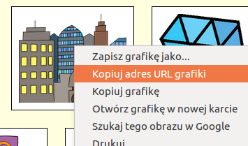
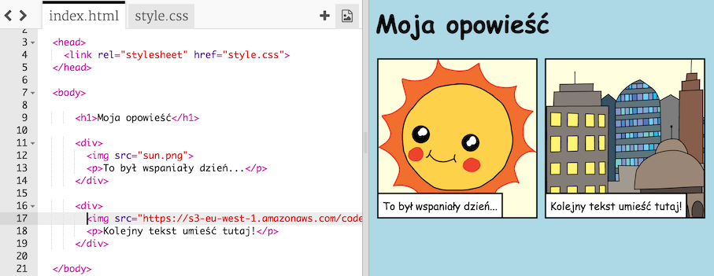

---
title: Tell a Story
level: HTML & CSS 1
language: pl-PL
embeds: "*.png"
materials: ["Club Leader Resources/*.*","Project Resources/*.*"]
stylesheet: web
...

# Wstęp {.intro}

W tym projekcie nauczycie się, jak stworzyć własną stronę internetową, by opowiedzieć historyjkę, dowcip albo wiersz. 



# Krok 1: Wybierz historyjkę {.activity}

Zanim zaczniesz kodować, potrzebna Ci będzie historyjka, którą można opowiedzieć. 

## Zadania do wykonania {.check}

+ Zastanów się nad historyjką, którą chcesz opowiedzieć. Może to być na przykład: 
	+ Znana opowieść;
	+ Wymyślona historia;
	+ Historia, która przytrafiła się Tobie albo Twojemu znajomemu.

	To nawet nie musi być historia. Równie dobrze sprawdzi się żart, wiersz lub cokolwiek, na co masz ochotę!

# Krok 2: Edytowanie historii {.activity}

Zacznijmy od edycji treści HTML i stylów CSS na stronie z historyjką. 

## Zadania do wykonania {.check}

+ Otwórz edytor: <a href="http://jumpto.cc/html-historyjka" target="_blank">jumpto.cc/html-historyjka</a>. Jeśli pracujesz online, możesz również posłużyć się wersją wyświetloną poniżej.

<div class="trinket">
	<iframe src="https://trinket.io/embed/html/8083cfebb3" width="100%" height="400" frameborder="0" marginwidth="0" marginheight="0" allowfullscreen>
	</iframe>
</div>

+ Może pamiętasz z projektu 'Happy Birthday', że zawartość strony internetowej zawiera się w `<body>` dokumentu HTML. 

	Przejdź do 7. linii kodu, gdzie znajdziesz treść strony, która jest pomiędzy tagami `<body>`.

	

+ Czy potrafisz wskazać, które tagi użyte są do stworzenia poszczególnych części strony?

	

	+ `<h1>` to __heading__ (nagłówek). Możesz użyć cyfr od 1 do 6, by stworzyć nagłówki różnych rozmiarów;
	+ `<div>` to skrót od __division__ (podział), co służy grupowaniu treści razem. Na tej stronie użyjesz tego taga do grupowania treści w każdej części Twojej historyjki; 
	+ `` to __image__ (obraz);
	+ `<p>` to __paragraph__ (akapit) tekstu. 

## Wyzwanie: Wprowadź zmiany {.challenge}
Wyedytuj kod HTML i CSS, by dostosować swoją stronę do konkretnych potrzeb.  



Możesz modyfikować kolorystykę i używać czcionek takich jak <span style="font-family: Arial;">Arial</span>, <span style="font-family: Comic Sans MS;">Comic Sans MS</span>, <span style="font-family: Impact;">Impact</span> oraz <span style="font-family: Tahoma;">Tahoma</span>.

Jeśli potrzebujesz pomocy, możesz skorzystać z projektu 'Happy Birthday'.

## Zapisz swój projekt {.save}

# Krok 3: Opowiadanie historii {.activity}

Dodajmy do Twojej historii część drugą. 

## Zadania do wykonania {.check}

+ Przejdź do 17. linii kodu i dodaj jeszcze jeden zestaw tagów `<div>` jako początek i koniec. W ten sposób powstanie wydzielona przestrzeń do następnej części Twojej historii. 

	

+ Dodaj akapit tekstu pomiędzy tagami `<div>`.

	

+ Możesz dodać obraz poprzez wprowadzenie poniższego kodu pomiędzy tagami `<div>`:

	```
	
	```

	Zauważ, ze tagi `` nieco różnią się od pozostałych, ponieważ nie posiadają zakończenia. 

+ Dla obrazów HTML niezbędne będzie dodanie __source__ (źródła) obrazu pomiędzy cudzysłowami. Znajdźmy obraz do dodania do historii. 

	Przejdź do: <a href="http://jumpto.cc/html-obrazki" target="_blank">jumpto.cc/html-obrazki</a> i znajdź obraz, który chciałbyś zamieścić w historii.
+ Kliknij prawym przyciskiem myszy na obraz, a następnie wybierz ‘skopiuj adres obrazu’. 

	

+ Wklej adres pomiędzy cudzysłowami w tagu ``. Powinieneś móc zobaczyć swój obraz! 

	

+ __Jeśli masz konto w serwisie Trinket__, możesz również załadować Twoje własne zdjęcia na swoją stronę internetową! By to zrobić, kliknij na ikonę obrazu na górze edytora, a następnie kliknij ‘upload’.

	

+ Znajdź na komputerze wybrane zdjęcie i przeciągnij je do edytora.
	

+ Później możesz po prostu dodać nazwę swojego nowego obrazu pomiędzy cudzysłowami w tagu `` , tak jak poniżej:

	```
	
	```

## Zapisz swój projekt {.save}

## Wyzwanie: Nie zatrzymuj się! {.challenge}
Wykorzystaj to, czego się nauczyłeś, by zakończyć opowiadanie swojej historii! Poniżej znajdziesz przykład: 


## Zapisz swój projekt {.save}
