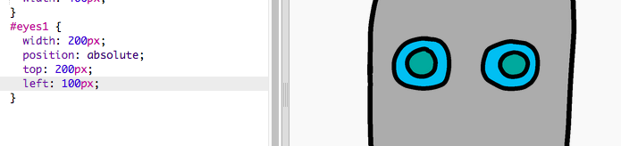

---
title: Zbuduj robota
level: HTML & CSS 1
language: pl-PL
embeds: "*.png"
materials: ["volunteer-resources/*.*","project-resources/*.*"]
stylesheet: web
...

# Wprowadzenie { .intro}

W tym projekcie nauczysz się, jak wstawiać obrazki, by stworzyć własnego robota!


# Krok 1: Dodawanie robotowi oczu { .activity}

## Lista zadań { .check}

+ Otwórz edytor: <a href="http://jumpto.cc/web-robot" target="_blank">jumpto.cc/web-robot</a>. Jeśli pracujesz online, możesz również posłużyć się wersją wyświetloną poniżej. 

<div class="trinket">
  <iframe src="https://trinket.io/embed/html/b29b50e571" width="100%" height="600" frameborder="0" marginwidth="0" marginheight="0" allowfullscreen>
  </iframe>
</div>

+ Każdy obrazek w ramach tego projektu ma swoją własną nazwę (albo __id__ - identyfikator). Na przykład HTML dla obrazków twarzy i oczu (‘face’, ‘eyes1’ i ‘eyes2’ począwszy od 8. linii kodu) wygląda tak:

```


```

+ Możesz użyć id obrazka, by nadać mu własny styl, poprzez użycie symbolu `#`. Pozwoli ci to stylizować każdy obrazek osobno. 

Kliknij w plik `style.css`. Zauważ, jak różnią się rozmiary obrazków twarzy robota i innych części. 


+ Dodaj ten CSS, by stylizować oczy robota: 

```
#eyes1 {
    width: 200px;
}
```

Zauważ, że stylizujesz jedynie obraz `eyes1` poprzez użycie `#eyes1` w twoim CSS. Jeśli wolisz, możesz użyć `#eyes2` albo `#eyes3`!


+ Zauważ, że każdy obraz pokazywany jest jeden po drugim. Nazywa się to pozycjonowaniem typu __relative__ (pozycjonowanie relatywne). Jeśli chcesz przekazać przeglądarce, gdzie dokładnie mają znaleźć się oczy robota, musisz użyć pozycjonowania typu __absolute__ (pozycjonowanie absolutne).

Dodaj te 3 linie kodu do CSS dla obrazu `eyes1`:

```
position: absolute;
top: 200px;
left: 100px;
```

Powinieneś zauważyć, że oczy przesuną się na właściwe miejsce.



Ten kod CSS mówi przeglądarce, jak daleko od górnej / lewej krawędzi strony ma pojawić się obraz.  


Możesz użyć `bottom` zamiast `top`, by powiedzieć przeglądarce, w jakiej odległości od dolnej krawędzi ma pojawić się obraz, podobnie jak można użyć `right` zamiast `left`.

# Krok 2: Dodawanie robotowi ust { .activity}

## Lista zadań { .check}

+ Dodaj następujący kod CSS, by stylizować obraz `mouth1`:

```
#mouth1 {
    width: 50px;
    position: absolute;
    top: 200px;
    left: 200px;
}
```

+ Usta twojego robota wyglądają na dość małe i nie znajdują się we właściwym miejscu.


Czy potrafisz to naprawić zmieniając kod CSS? 

## Zachowaj swój projekt {.save}

##Wyzwanie: Zaprojektuj swojego własnego robota {.challenge}
Skorzystaj z wiedzy, którą nabyłeś, by skończyć projektowanie twojego robota. Oto przykłady, jak twój robot może wyglądać: 


## Zachowaj swój projekt {.save}

##Wyzwanie: Dodaj swoje własne obrazy {.challenge}
Czy potrafisz znaleźć dodatkowe obrazy do dodania do projektu robota, a potem umiejscowić je na stronie? Możesz nawet zastąpić twarz robota swoją własną! 

```

```

## Zachowaj swój projekt {.save} 