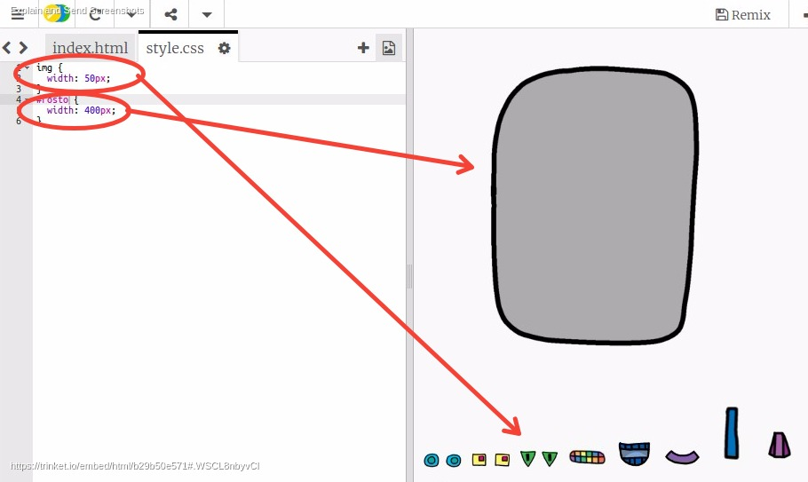
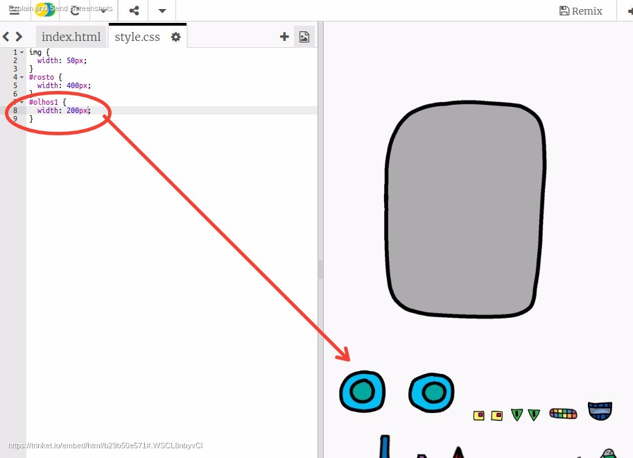
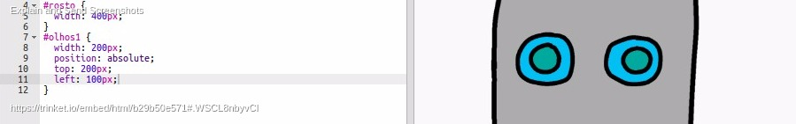
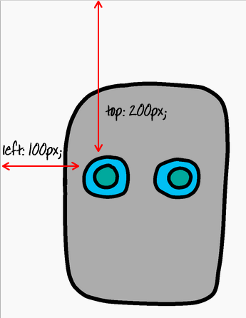

---
title: Construa um robô
level: HTML & CSS 1
language: pt-BR
embeds: "*.png"
materials: ["Club Leader Resources/*.*","Project Resources/*.*"]
stylesheet: web
...

# Introdução { .intro}

Neste projeto, você aprenderá como posicionar imagens para criar seu próprio robô!


# Passo 1: Dando olhos ao seu robô { .activity}

Vamos dar ao seu robô alguns olhos!

## Lista de atividades { .check}

+ Abra este trinket: <a href="http://jumpto.cc/web-robot" target="_blank">jumpto.cc/web-robot</a>. Se você está lendo isto online, você pode também usar a versão embutida desse trinket abaixo.

<div class="trinket">
  <iframe src="https://trinket.io/embed/html/b29b50e571" width="100%" height="600" frameborder="0" marginwidth="0" marginheight="0" allowfullscreen>
  </iframe>
</div>

+ Cada imagem deste projeto tem seu próprio nome (ou __id__). Por exemplo, o HTML para as imagens do rosto e dos olhos (‘rosto’, ‘olhos1’ e ‘olhos2’ começando na linha 8 do seu código) se parece com isto:

```


```

+ Você pode usar o id da imagem para dar a ela seu próprio estilo, usando o símbolo `#`. Isso permite que você estilize cada imagem separadamente.

Clique no arquivo `style.css`. Percebeu como o tamanho do rosto do robô e as outras imagens são diferentes?



+ Adicione este código CSS para estilizar os olhos do robô:

```
#olhos1 {
    width: 200px;
}
```

Perceba que você está estilizando apenas a imagem `olhos1`, usando `#olhos1` em seu CSS. Se você preferir, você pode usar `#olhos2` ou `#olhos3`!



+ Observou como cada imagem é exibida uma após a outra? Isso é chamado de posicionamento __relativo__. Se você quiser dizer para o navegador exatamente onde posicionar o olho do robô, você precisará usar posicionamento __absoluto__.

Adicione estás 3 linhas de código no CSS para sua imagem `olhos1`

```
position: absolute;
top: 200px;
left: 100px;
```

Você deverá ver que os olhos do seu robô se moveram para o local correto em seu robô.



Este código CSS diz ao navegador o quão distante do topo / esquerda da sua página a imagem será mostrada.



Você pode usar `bottom` ao invés de `top` para dizer ao navegador o quão distante da borda da tela a imagem deverá ser mostrada, assim como `right` ao invés de `left`.

# Passo 2: Dando uma boca ao seu robô { .activity}

Vamos dar uma boca ao seu robô!

## Lista de atividades { .check}

+ Adicione o seguinte código CSS para estilizar sua imagem `boca1`:

```
#boca1 {
    width: 50px;
    position: absolute;
    top: 200px;
    left: 200px;
}
```

+ A boca do seu robô parece bem pequena, e não está no lugar correto.


Você pode corrigir isso, fazendo mudanças no seu CSS?

## Salve Seu Projeto {.save}

##Desafio: Projete seu próprio robô {.challenge}
Use o que você aprendeu para terminar de projetar seu próprio robô. Aqui estão alguns exemplos de como seu robô pode parecer:


## Salve Seu Projeto {.save}

##Desafio: Adicione suas próprias imagens {.challenge}
Você pode encontrar imagens extras para adicionar ao seu robô, e posicioná-los na sua página web? Você pode até mesmo substituir o rosto do robô pelo seu!

```

```

## Salve Seu Projeto {.save}
