---
title: Feliz Aniversário
level: HTML & CSS 1
language: pt-BR
embeds: "*.png"
materiais: ["Club Leader Resources/*.*","Project Resources/*.*"]
stylesheet: web
...
 
# Introdução { .intro}

Neste projeto, você começará a sua jornada pelo HTML e CSS aprendendo a fazer seu próprio cartão de aniversário customizado.

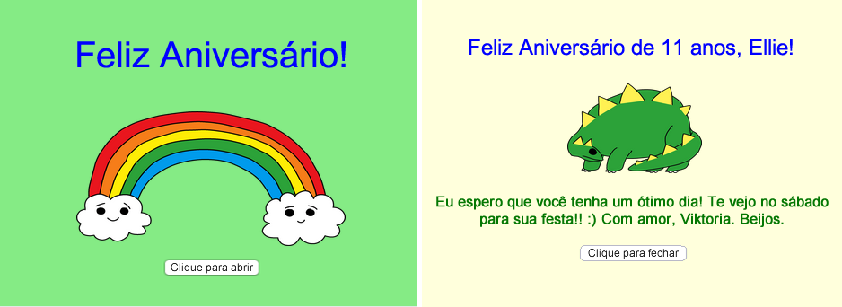

# Passo 1: O que é HTML? { .activity}

HTML significa _Linguagem de Marcação de Hipertexto_ (Hyper Text Markdown Language), essa linguagem é usada para criar páginas da web. Vamos dar uma olhada em um exemplo!

## Lista de atividades { .check}

+ Você utilizará um website chamado Trinket para escrever HTML. Abra o Trinket: <a href="http://bit.ly/html-introducao" target="_blank">bit.ly/html-introducao</a>. Se você estiver lendo isso online, você também poderá usar a versão embutida do Trinket, abaixo.

<div class="trinket">
	<iframe src="https://trinket.io/embed/html/61ade91dfa" width="100%" height="400" frameborder="0" marginwidth="0" marginheight="0" allowfullscreen>
	</iframe>
</div>

+ O código que você vê à esquerda do Trinket é HTML. À direita, voce pode ver a página web que o código HTML criou.

	HTML usa _tags_para construir páginas da web. Você pode ver esse código HTML na linha 8 do seu código?

	```
	<p>Oi. Meu nome é Andy.</p>
	```

	`<p>` é um exemplo de uma tag, e é utilizada para *parágrafo*. Você pode começar um parágrafo com `<p>`; e finalizar com o `</p>`.

+ Você consegue detectar alguma outra tag? Uma outra tag, que pode ser detectada na linha 9, é a `<b>`, que quer dizer *bold* (negrito em inglês):

	```
	<b>correr</b>
	```

	Aqui estão mais algumas:

	+ `<html>` e `</html>` marca o início e o fim de um documento HTML;
	+ `<head>` e `</head>` é onde coisas como CSS são colocadas (nós vamos chegar a isso mais tarde!);
	+ `<body>` e `</body>` é onde o conteúdo de sua página web é colocada.


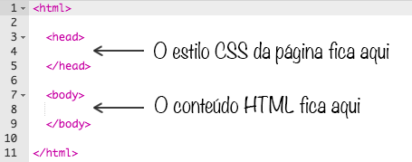


+ Faça uma mudança em um dos parágrafos do texto, no HTML (à esquerda). Clique em 'Run' e você deve ver sua página web mudar (à direita)!


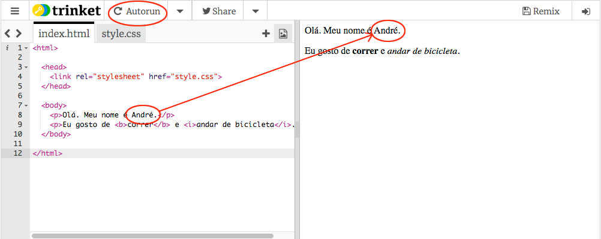


+ Se você cometeu um erro e quer desfazer as mudanças, você pode ir até o menu e clicar em 'Reset'. Tente!


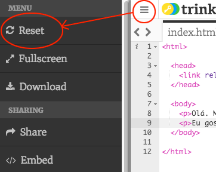


## Salve seu projeto {.save}

Você não precisa de uma conta no Trinket para salvar seus projetos!

Se você não tem uma conta, clique na seta e depois em ‘Link’. Você será direcionado a um Link, onde você pode salvar seus arquivos e acessar depois. Toda vez que você fizer alguma alteração/mudança precisará salvar, pois o Link muda.

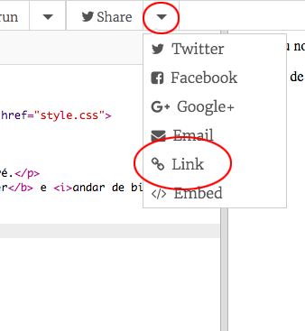

Se você tem uma conta no Trinket, a maneira mais fácil de salvar sua página web é clicar no botão 'Remix' no topo do Trinket. Isso salvará uma cópia do Trinket no seu perfil.

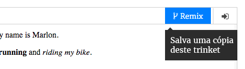

## Desafio: Adicionar outro parágrafo {.challenge}
Você pode adicionar um 3º parágrafo de texto na sua página web abaixo dos outros dois? Lembre-se que seu parágrafo deve iniciar com a tag `<p>`, e terminar com `</p>`.

Aqui está como sua página web deve parecer:

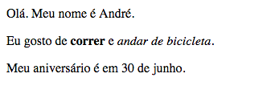

Você pode adicionar __negrito__ e <u>sublinhado</u> ao seu novo parágrafo? Você deve usar `<u>` e `</u>` para texto sublinhado.

## Salve seu projeto{.save}

# Passo 2: O que é CSS? { .activity}

CSS significa Folha de Estilos em Cascata, e é a linguagem utilizada para estilizar páginas web e torná-las mais legais. Você pode linkar sua página web a um arquivo CSS no `<head>` de um documento HTML, assim:


## Lista de atividades { .check}

+ CSS lista todas as __propriedades__ por uma tag particular. Clique na aba 'style.css' para ver o CSS de sua página web.

	

+ Encontre esse código:

	```
	p {
		color: black;
	}
	```

	Esse código CSS tem uma propriedade para parágrafos, que é a cor do texto deve ser preta.

+ Mude a palavra 'black' no CSS para 'blue'. Você deve ver a cor do texto de todo o parágrafo mudar para azul.

	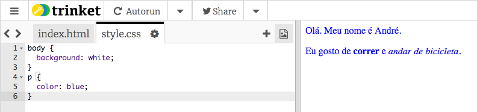

## Salve seu projeto {.save}

##Desafio: Adicione mais estilo {.challenge}
Você pode deixar os parágrafos do texto na cor laranja? Ou o fundo cinza?

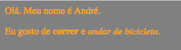

## Salve seu projeto{.save}

# Passo 3: Fazendo um cartão de aniversário { .activity}

Vamos usar o que você aprendeu sobre HTML e CSS para fazer seu próprio cartão de aniversário customizado.

## Lista de atividades { .check}

+ Abra esse Trinket: <a href="http://bit.ly/cartao-aniversario" target="_blank">bit.ly/cartao-aniversario</a>, ou use a versão embutida abaixo, se você está lendo online.

<div class="trinket">
	<iframe src="https://trinket.io/embed/html/2a1de0299b" width="100%" height="400" frameborder="0" marginwidth="0" marginheight="0" allowfullscreen>
	</iframe>
</div>

Não se preocupe se você não entender todo o código. Esse cartão de aniversário parece muito chato, então você fará algumas mudanças nesse HTML e CSS.

+ Clique no botão em frente ao cartão, e você deve ver ele se abrir e revelar seu interior.

	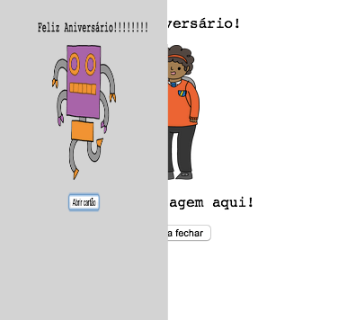

+ Vá para a linha 13 do código. Como no exemplo anterior, você pode editar algum texto no HTML para customizar seu cartão.

	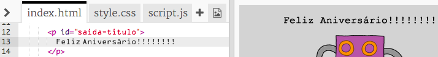

+ Você pode encontrar o código HTML da imagem do robô? (Dica: está na linha 16!) Mude a palavra `robot` para `sun`, e você verá a imagem mudar!

	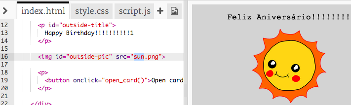

	Você pode usar alguma das palavras `boy`, `diamond`, `dinosaur`, `flowers`, `girl`, `rainbow`, `robot`, `spaceship`, `sun`, `tea`, ou `trophy`.

+ Você também pode editar o CSS do cartão de aniversário. Clique na aba “style.css”. Ele começa com todo o CSS para a `saida` do cartão. Mude o `background-color` para `lightgreen`.

	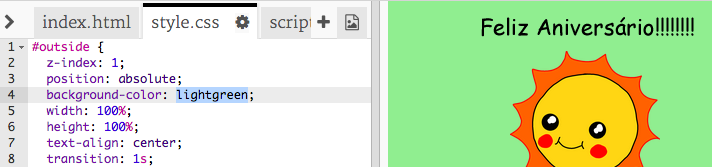

+ Você também pode mudar o tamanho de uma imagem. Vá para a linha 29 do CSS, e mude o `width` e `height` da imagem de saida para `200px` (`px` significa pixels).

	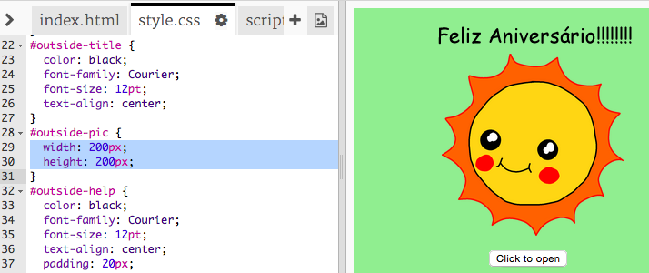	

+ A fonte pode ser modificada também. Vá para a linha 24 e mude o `font-family` para `Comic Sans MS` e o `font-size` para `16pt`.

	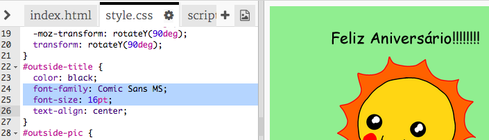

	Você pode usar outras fontes, como <span style="font-family: Arial;">arial</span>, <span style="font-family: impact;">Impact</span> e <span style="font-family: tahoma;">Tahoma</span>. 

## Salve seu projeto {.save}

##Desafio: Crie um cartão personalizado {.challenge}
Use tudo que você aprendeu sobre HTML e CSS para finalizar fazendo um cartão personalizado. Não precisa ser um cartão de aniversário, pode ser para qualquer ocasião!

Aqui está um exemplo:


## Salve seu projeto {.save}

Agora que você finalizou seu cartão, você pode compartilhar ou enviar por email para alguém.

