---
title: Cômodos Interligados
level: HTML e CSS 2
language: pt-BR
embeds: "*.png"
materials: ["Club Leader Resources/*.*","Project Resources/*.*"]
stylesheet: web
...

# Introdução {.intro}

Neste projeto, você vai criar um conjunto de cômodos interligados no qual cada cômodo é uma página web diferente que pode ser decorada usando HTML. 

  <iframe src="https://trinket.io/embed/html/ba5d27ec68?outputOnly=true&start=result" width="600" height="450" frameborder="0" marginwidth="0" marginheight="0" allowfullscreen>
  </iframe>
  

__Instruções__: Clique nas portas para se mover pelos cômodos.

# Etapa 1: Conectando-se a outra página web no mesmo projeto {.activity}

Projetos web podem ser compostos de vários arquivos HTML interligados. 

## Lista de atividades { .check}

+ Abra este link de trinket: <a href="http://jumpto.cc/web-rooms" target="_blank">jumpto.cc/web-rooms</a>. Se você está lendo isso on-line, você também pode usar o link embutido abaixo.

  <iframe src="https://trinket.io/embed/html/ef608f0733" width="100%" height="400" frameborder="0" marginwidth="0" marginheight="0" allowfullscreen>
  </iframe>

+ O link deve ser executado automaticamente e você vai estar no Saguão:

	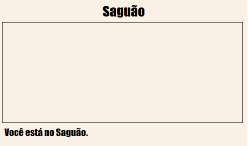

+ Veja a lista de guias de arquivo desse link. Você consegue encontrar o arquivo `tvroom.html`? Clique nele.

	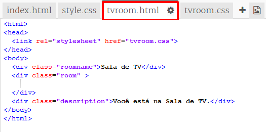

	Este é outro arquivo html do mesmo projeto. 

+ Para acessar a `tvroom.html` você precisa adicionar um link em `index.html`. 

	Adicione o código em destaque dentro da `
` com a classe `room`: 

	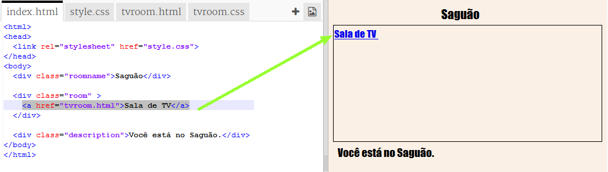

+ Teste seu link clicando em __Sala de TV__ para acessar a página web `tvroom.html`.

	Observe que `tvroom.html` também tem seu próprio arquivo de estilo `tvroom.css` que define o layout dessa página. 

	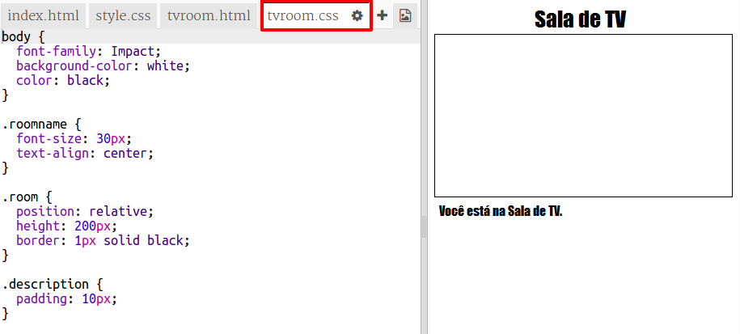

	
##Desafio: Adicione outro link {.challenge}

Adicione um link `<a>` à página `tvroom.html` para levar você de volta à página do Saguão, chamada `index.html`. O texto do link deve ser 'Saguão'.

A Sala de TV deve ter um link que pode ser clicado, como esse:

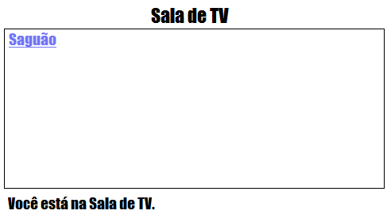

Lembre-se de testar seu código. Você deve conseguir se deslocar do Saguão para a Sala de TV e depois voltar para o Saguão clicando nos links.  

## Salve seu projeto {.save}

# Etapa 2: Adicione outro cômodo {.activity}

Agora, vamos adicionar outro cômodo, uma __Sala de Jogos__. 

+ Clique no botão de adicionar páginas **+**:

	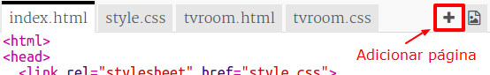

	Digite `gamesroom.html` como o nome da página:

  	

+ O código HTML para a __Sala de Jogos__ é muito parecido com o `tvroom.html`, então __copie__ o código e __cole-o__ em `gamesroom.html`.
	
	Edite os itens em destaque para que eles digam Jogos, não TV:

	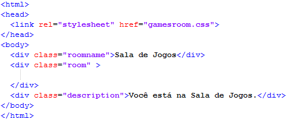	

+ Sua Sala de Jogos `gamesroom.html` agora usa `gamesroom.css`, que ainda não existe. 

	Crie `gamesroom.css` clicando no botão de adicionar páginas **+**. 

+ O código CSS para a __Sala de Jogos__ `gamesroom.css` é muito parecido com o `tvroom.html`, então __copie__ o código e __cole-o__ em `gamesroom.css`.

	

+ Adicione um link que leva do Saguão até a Sala de Jogos:

	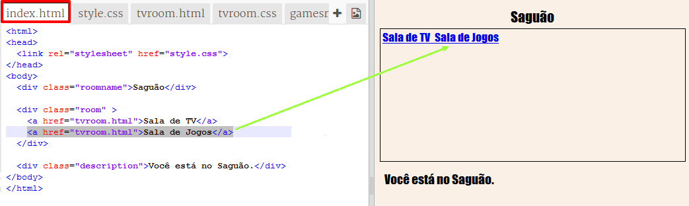

+ Teste seu projeto clicando no link da Sala de Jogos

	A __Sala de Jogos__ deve se parecer com isso:

	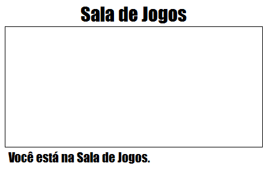

	Isso não é muito empolgante, mas você pode dar um jeito nisso no próximo desafio. 

## Salve seu projeto {.save}

##Desafio: Estilize e faça um link da Sala de Jogos {.challenge}

Edite os códigos HTML e CSS da __Sala de Jogos__ para que a página fique mais ou menos assim: 

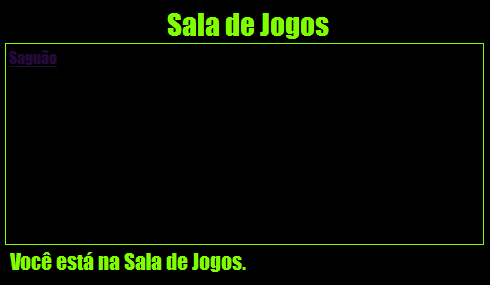

Dica: Você precisa alterar a cor do fundo, a cor da fonte e a cor da borda em `gamesroom.css`. A cor verde brilhante se chama `chartreuse`.  

Dica: Você precisa adicionar um link `<a>` em `gamesroom.html` que leva até `hall.html`.

## Salve seu projeto {.save}

# Etapa 3: Faça com que os links sejam parecidos com portas {.activity}

Os links não precisam ser textos. Vamos fazer uma porta na qual podemos clicar usando uma `
`.

## Lista de atividades { .check}

+ Abra `index.html` e adicione uma `
` que englobe o texto do link de __Sala de TV__. Ela precisa ficar dentro de `<a>` para que possa ser clicada.

  Adicione `id="hall2tv"` para identificá-la como a porta que leva do Saguão para a Sala de TV, assim você pode estilizar a porta. 

  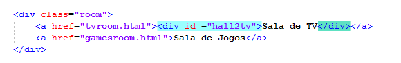  

+ Clique na guia `style.css`, vá até a parte inferior e adicione o seguinte código CSS para alterar o tamanho e a cor da porta:

	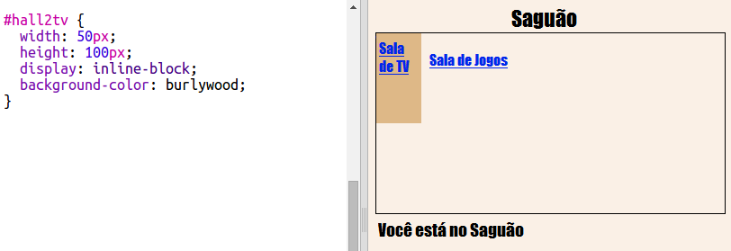

+ Teste sua página clicando em qualquer lugar da porta, não somente no texto.

+ Agora, vamos fazer com que ela seja mais parecida com uma porta adicionando uma borda em três lados:

	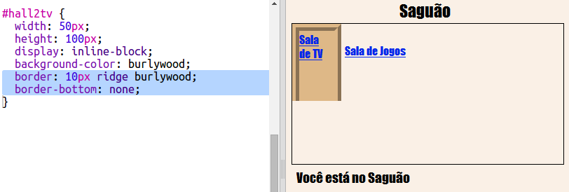

+ E vamos adicionar um código CSS para melhorar a aparência do texto da porta:

	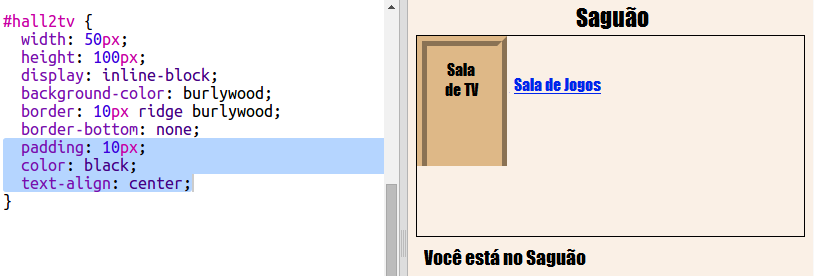

+ Você provavelmente notou que a porta está flutuando no ar. Vamos consertar isso posicionando a porta dentro do cômodo.

	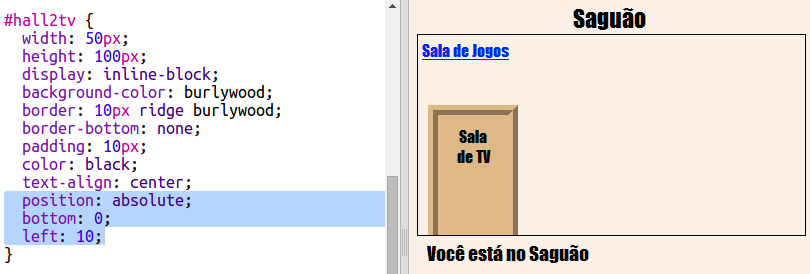	

+ Teste sua página clicando na porta para chegar até a __Sala de TV__.

## Salve seu projeto {.save}

##Desafio: Adicione mais portas! {.challenge}

Da mesma forma, transforme os outros links do seu projeto em portas. 

Para cada porta, você precisa:

+ Editar o link da porta para usar uma `
` com um id como `hall2games` para que você possa estilizá-la. 

	Por exemplo: 

	`<a href="gamesroom.html">
Sala de Jogos
</a>`

+ Adicionar o código CSS para o id da porta ao arquivo `.css` para o seu cômodo. Use _copiar_ e _colar_ para ganhar tempo. Se quiser, você pode fazer com que cada porta seja diferente. 

+ Posicionar a porta usando `bottom:` e `left:` ou `right:`.

O Saguão deve ficar mais ou menos assim:

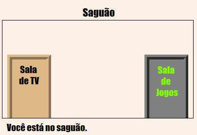

A Sala de TV deve ficar mais ou menos assim:

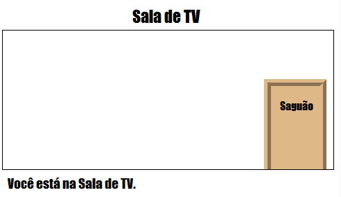	

# Etapa 4: Adicionando uma imagem de fundo {.activity}

Vamos decorar o saguão com uma imagem de fundo.

## Lista de atividades { .check}

+  Edite o arquivo `style.css` para adicionar uma imagem de fundo ao Saguão:

	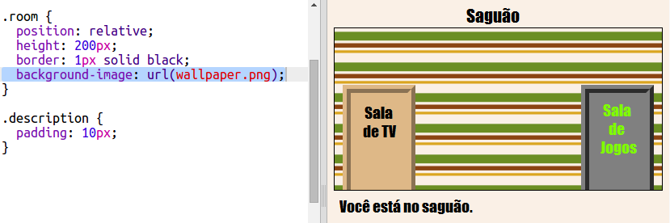	

	A imagem será repetida para preencher todo o cômodo. 

## Salve seu projeto {.save}

##Desafio: Adicione um papel de parede à Sala de Jogos {.challenge}

Você consegue decorar a sala de jogos com uma imagem de fundo?

Você pode usar a imagem de fundo `space-invader.png` que está em seu projeto. 

Você vai precisar:

+ Adicionar uma imagem `background-image:` ao código CSS `.room` da Sala de Jogos. 

O cômodo decorado deve ficar mais ou menos assim:

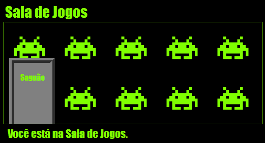	

## Salve seu projeto {.save}

##Desafio: Aproprie-se! {.challenge}

Adicione mais cômodos ao seu projeto. Lembre-se de que você pode usar __copiar__ (`ctrl` + `c`) e  __colar__ (`ctrl` + `v`) para ganhar tempo e alterar apenas o que precisa ser diferente. 

Para cada cômodo, você vai precisar:

+ Criar um arquivo `.html`
+ Adicionar links de portas que dão acesso e que saem do novo 'cômodo'
+ Criar um arquivo `.css` com os estilos do seu novo cômodo e de suas portas 

Você pode alterar a cor de fundo `background-color:` de cada cômodo. Clique no ícone das imagens para ver as imagens de fundo disponíveis para escolha:

	

## Salve seu projeto {.save}

