---
title: Revista
level: HTML e CSS 2
language: pt-BR
embeds: "*.png"
materials: ["Club Leader Resources/*.*","Project Resources/*.*"]
stylesheet: web
...

# Introdução { .intro}

Neste projeto, você vai aprender a usar HTML e CSS para criar um website em formato de revista, com um layout de duas páginas. Você também vai rever várias técnicas de HTML e CSS de outros projetos. 

  <iframe src="https://trinket.io/embed/html/a41e4e1c5c?outputOnly=true&start=result" width="600" height="500" frameborder="0" marginwidth="0" marginheight="0" allowfullscreen>
  </iframe>
  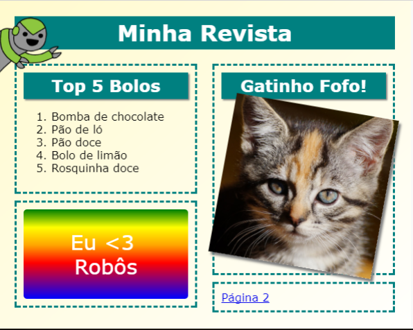

# Etapa 1: Título e plano de fundo

Websites em forma de revista geralmente têm vários itens pequenos em uma página. Primeiro, você vai criar um título e um plano de fundo para a sua revista. 

## Lista de atividades { .check}

+ Abra este link de trinket: <a href="http://jumpto.cc/web-magazine" target="_blank">jumpto.cc/web-magazine</a>. Se você está lendo isso on-line, você também pode usar o link incorporado abaixo.

  <iframe src="https://trinket.io/embed/html/cef5e64bc0" width="100%" height="400" frameborder="0" marginwidth="0" marginheight="0" allowfullscreen>
  </iframe>

+ Vamos adicionar um título. 

	Você consegue pensar em um título melhor para a sua revista. 

	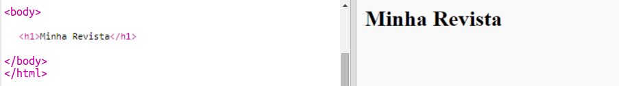

+ Você consegue estilizar o título?

	Temos aqui um exemplo, mas você pode escolher seu próprio estilo:

	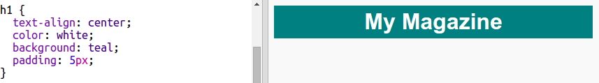

+ Agora, vamos criar um plano de fundo interessante usando um gradiente e escolher uma fonte para a revista. 

	Temos aqui alguns exemplos de estilo para lembrar como criar um gradiente: 

	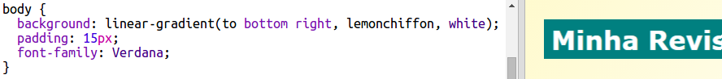

## Salve seu projeto {.save}

# Etapa 2: Criando colunas

Websites geralmente usam várias colunas. Vamos criar um layout de duas colunas para a sua revista. 

## Lista de atividades { .check}

+ Primeiro, crie duas `div`s de coluna.

	Adicione o HTML em destaque a `index.html`:

	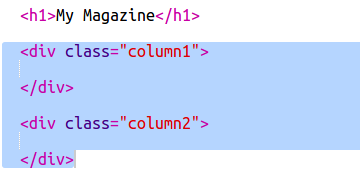

+ Agora, estilize as divs de coluna para que uma fique flutuando à esquerda e a outra à direita. 

	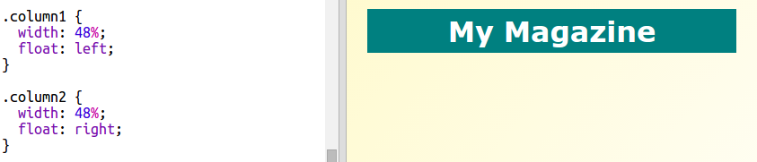

	Cada coluna representa menos de 50%, então há espaço para o preenchimento. 

	Você precisa adicionar algo a uma coluna para ver o efeito. 

+ Vamos adicionar a figura de um gatinho ao topo da coluna 2. 

	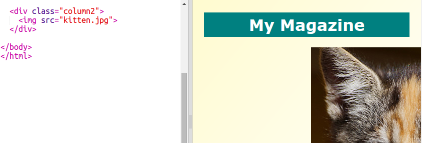

	Observe que a imagem do gatinho está posicionada em praticamente metade da página, na segunda coluna. 

	Isso é muito grande!

+ Vamos usar `max-width: ` para que as imagens caibam no espaço a elas reservado. 

	Adicione o seguinte estilo a `style.css`.

	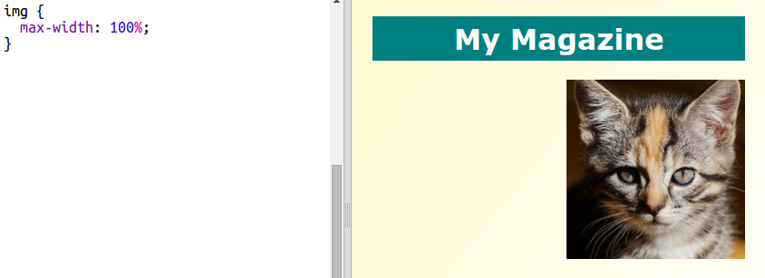

	Isso se aplica a todas as imagens usadas em sua revista, não apenas ao gatinho.

+ Agora, adicione uma classe `foto` à imagem para que você possa estilizá-la:

	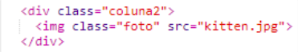

+ E estilize a imagem para adicionar uma sombra e um efeito para fazer a foto aparecer na página:

	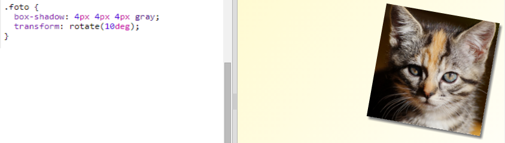

	Faça algumas alterações até obter o resultado desejado. 

# Etapa 3: Estilização de itens da revista

Vamos deixar o layout um pouco mais interessante. 

## Lista de atividades { .check}

+ Adicione uma `div` ao redor da sua imagem com uma classe `class` e adicione um título `h2`:

	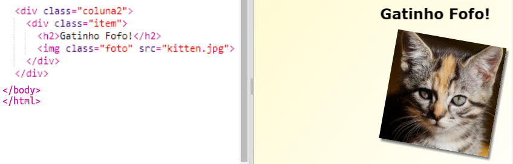

+ Agora, estilize o item e o título. 

	Temos aqui um exemplo, mas você pode fazer alterações:

	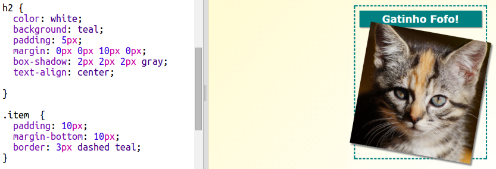

## Salve seu projeto {.save}

## Desafio: Adicione itens à coluna da esquerda {.challenge}

Você consegue adicionar uma lista ordenada e um adesivo gradiente com texto à coluna da esquerda? 

Temos aqui um exemplo:

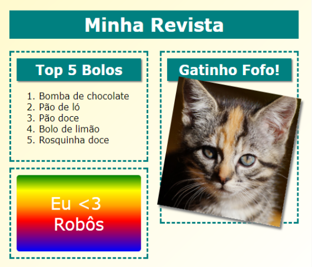

Este é o código do exemplo, mas você pode alterá-lo ou criar o seu próprio.

HTML:

CSS:

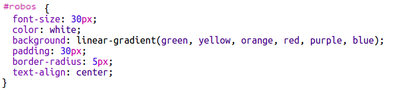

## Salve seu projeto {.save}

# Etapa 4: Adicione uma segunda página

Vamos adicionar outra página ao seu website em forma de revista. 

## Lista de atividades {.check}

+ Adicione uma nova página ao seu projeto e chame-a de `pagina2.html`:

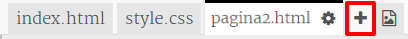

+ A página 2 será parecida com a primeira página da sua revista, então você pode copiar o html de `index.html` e colar em `pagina2.html`.

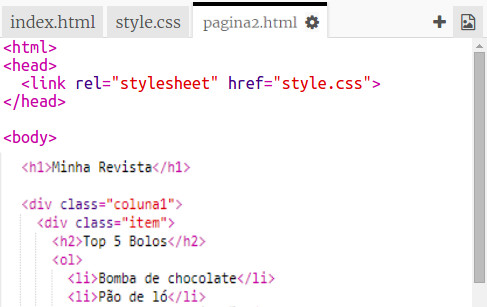

Observe que as duas páginas usam o mesmo arquivo `style.css`, então elas compartilham os estilos. 

+ Altere o título `<h1>` da página `pagina2.html`: 

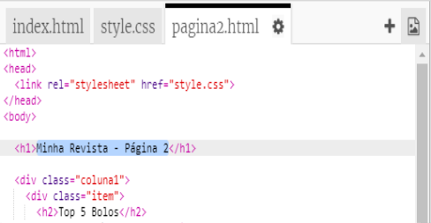

+ Agora, você vai precisar de links entre suas páginas, assim é possível navegar entre a página frontal e a página 2. 

Volte para o arquivo `index.html`. Adicione um link dentro de uma div na coluna 2 em `index.html`:

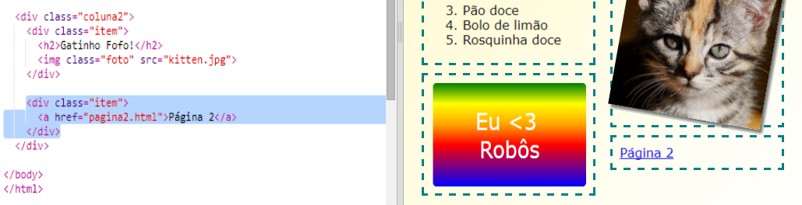

+ Teste para verificar se você consegue clicar em seu novo link e ir para a página 2 de sua revista. 

## Desafio: Adicione um link que leva de volta à primeira página {.challenge}

Você consegue adicionar um link à página 2 `page2.html` para levar de volta à página 1 ao ser clicado?

Dica: Dê uma olhada no código HTML usado para criar um link para a página 2. 

## Desafio: Preencha a segunda página {.challenge}

Temos aqui o código para os exemplos, mas você pode alterar as `div`s ou usar suas próprias ideias.  

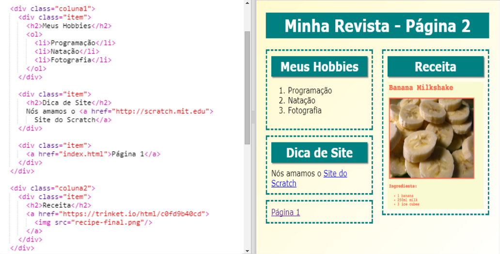

Clique no ícone das imagens para ver quais estão disponíveis para uso:

 

Lembre-se de que você pode fazer o upload de suas próprias imagens. Verifique se você tem permissão para usar essas imagens. 

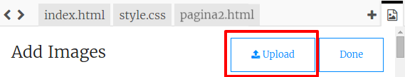

# Etapa 5: Adicione uma animação

Vamos adicionar uma animação divertida à revista. 

## Lista de atividades {.check}

+ Vá para `index.html` e inclua a imagem `greenrobot.png` no topo de sua página. 

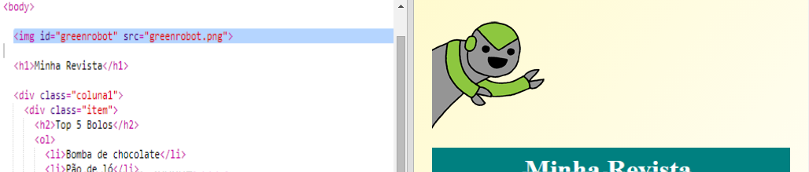

+ Agora, adicione o código CSS para animar seu robô:

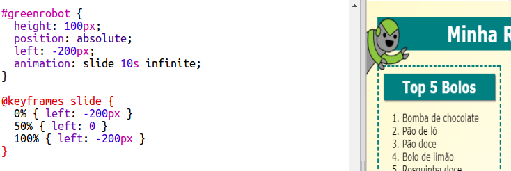

## Desafio: Adicione outra animação {.challenge}

Você consegue adicionar uma animação à segunda página de sua revista? 

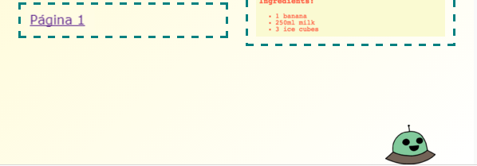

