---
title: Carta Misteriosa
level: HTML & CSS 1
language: pt-BR
embeds: "*.png"
materials: ["Club Leader Resources/*.*","Project Resources/*.*"]
stylesheet: web
...

# Introdução {.intro}

Neste projeto você criará uma carta misteriosa. As palavras dessa carta terão a aparência de que cada palavra foi cortada de um lugar diferente: jornal, revista, história em quadrinhos, etc. 

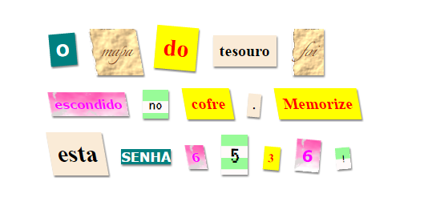

# Passo 1: Escolha sua mensagem {.activity}

Cartas misteriosas são usadas em filmes e livros para mandar mensagens secretas.

## Lista de Atividades { .check}

+ Pense em uma mensagem misteriosa, 12 palavras é uma tamanho adequado. Se você não conseguir bolar uma mensagem, você pode usar este exemplo: 'O mapa do tesouro foi escondido no cofre. Memorize esta senha 6 5 3 6 !'

+ Anote sua mensagem ou tenha certeza que você memorizou direitinho. 

# Passo 2: Editando sua mensagem {.activity}

Vamos colocar sua mensagem em uma página da internet.

## Lista de Atividades { .check}

+ Abra este trinket: <a href="
https://trinket.io/html/4051cefec5" target="_blank">www.bit.ly/carta-misteriosa</a>. Se você estiver estiver lendo estas instruções online, você também pode usar a versão embutida do trinket abaixo.

  <iframe src="https://trinket.io/embed/html/4051cefec5" width="100%" height="400" frameborder="0" marginwidth="0" marginheight="0" allowfullscreen>
  </iframe>

+ A tag de parágrafo `
` foi ensinada no projeto 'Feliz Aniversário' . A tag `` é usada para agrupar pequenos pedaços de texto dentro de um parágrafo, assim nós podemos estilizá-los. 

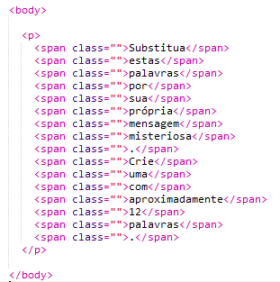

## Lista de Atividades { .check}

+ Mude as palavras do html para as palavras da sua mensagem. Para isso coloque uma palavra em cada ``. Você precisará acrescentar ou remover tags `` se você usar uma mensagem com tamanho diferente. 

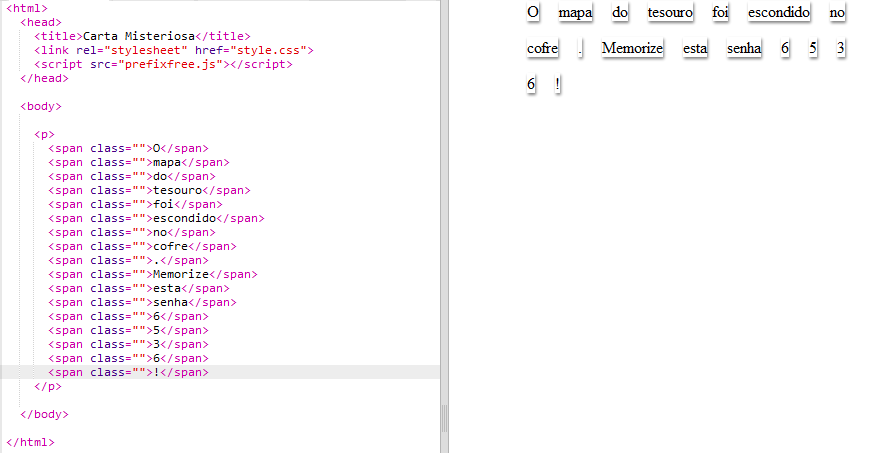

## Lista de Atividades { .check}

+ Clique no botão para executar e testar seu trinket.

	Se você olhar as palavras, você poderá ver que elas foram estilizadas para parecer que elas foram colocadas sobre a página.

# Passo 3: Usando Classes de Estilos {.activity}

## Lista de Atividades { .check}

+ Você reparou nos comandos `class=""` nas tags ``? Você pode usar classes para estilizar mais de um elemento da mesma maneira. 

+ Acrescente a classe `revista1` em algumas das suas tags `` e teste sua página.

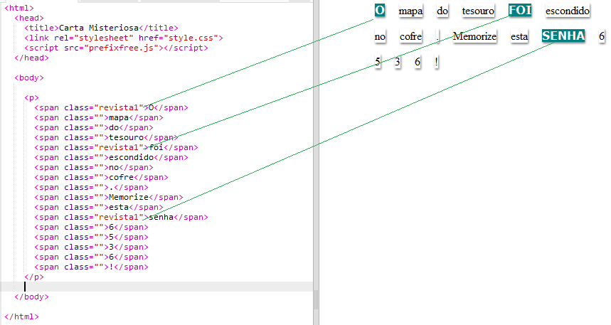

## Lista de Atividades { .check}

+ Você pode adicionar mais que uma classe a um elemento. Apenas deixe um espaço entre as duas classes. Adicione a classe `grande` a uma das suas tags span ``. Teste sua página. 

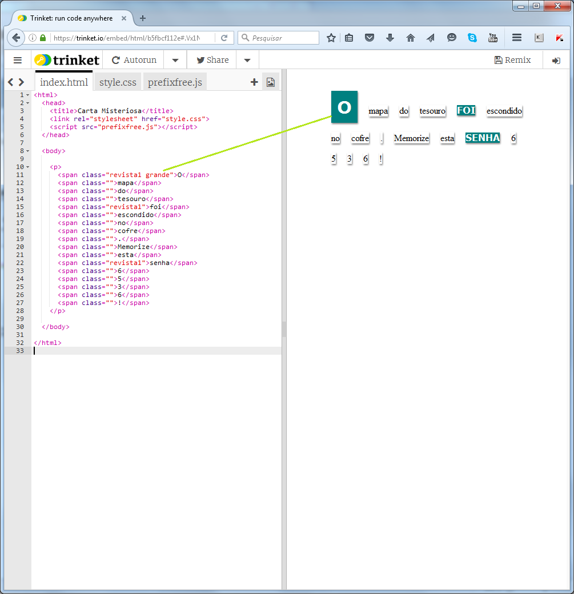

## Salve seu projeto {.save}

## Desafio: Estilize sua mensagem {.challenge}

Use os estilos fornecidos para fazer sua mensagem se parecer com uma carta misteriosa. 

Adicione estas classes às suas tags ``: 

+ `jornal`, `revista1`, `revista2`

+ `medio`, `grande`, `realmentegrande`

+ `rotacionarAEsquerda`, `rotacionarADireita`

+ `inclinarAEsquerda`, `inclinarADireita`

Não adicione mais que uma classe que esteja na mesma linha acima a uma tag  `` específica. Por exemplo, se você escolheu `rotacionarAEsquerda` para uma span, não use `rotacionarADireita` na mesma span. Não faz sentido!

Veja como sua carta pode ficar:

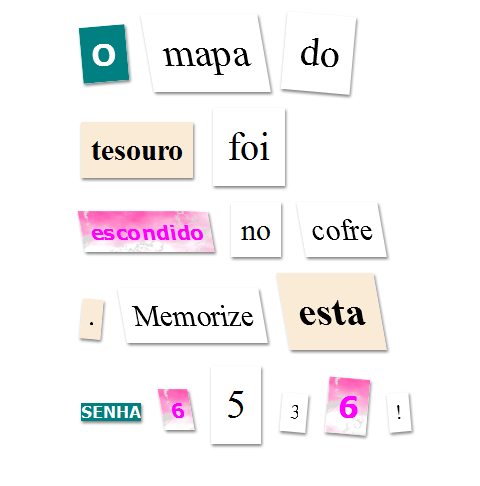

## Salve seu projeto {.save}

# Passo 4: Editando as classes  {.activity}

## Lista de Atividades { .check}

+ Clique na tab __'style.css'__. Encontre a classe CSS `jornal` que você já está usando.

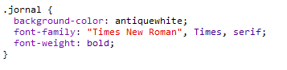

+ Veja que existe um ponto (ponto final) '.' antes do nome da classe no arquivo CSS, mas este ponto não existe antes de `span`, que é uma tag do seu arquivo HTML.

+ Agora olhe as outras classes CSS que você usou para estilizar sua carta misteriosa. Você consegue entender:

	+ Como o estilo `revista1` muda todo o texto para letras maiúsculas?

	+ Como o estilo `revista2` coloca uma imagem de fundo atrás do texto?

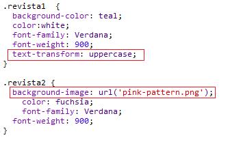

+ O que acontece se você mudar a `background-image` da `revista2` para `canvas.png`? Se você gostar mais do `pink-pattern.png` você pode colocá-lo de novo. 

Você também pode mudar as cores nos estilos revista se você quiser.

+ Encontre a classe CSS utilizada para rotacionar e inclinar suas palavras:

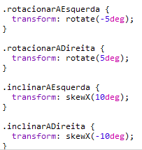

Tente modificar os números para criar efeitos diferentes. Após isso teste sua página. 

# Passo 5: Crie uma nova classe {.activity}

Vamos criar um estilo que pareça que a palavra foi cortada de um gibi. <a href="http://jumpto.cc/web-fonts" target="_blank">jumpto.cc/web-fonts</a> fornece várias fontes que você pode usar gratuitamente. 

## Lista de Atividades { .check}

+ Adicione uma classe `gibi` no arquivo __style.css__. Depois de `revista2` é um bom lugar. Não esqueça o ponto antes do nome da classe. 

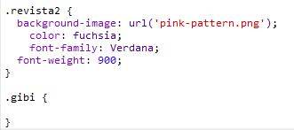

Não se preocupe se você receber uma mensagem dizendo 'The Rule is empty' (Sua regra está vazia), você vai consertar no próximo passo. 

+ Agora acrescente alguns estilos CSS à sua classe gibi. Você pode usar diferentes cores se você quiser. Existem várias cores que você escolher aqui <a href="http://jumpto.cc/web-colours" target="_blank">jumpto.cc/web-colours</a>.

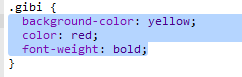

+ Use o estilo gibi em algumas das suas tags `` no seu documento HTML e teste sua página:

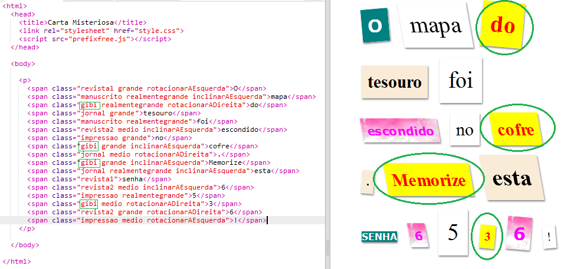

+ Agora você pode acrescentar um fonte mais divertida. Abra uma nova janela ou tab no browser. Vá para <a href="http://jumpto.cc/web-fonts" target="_blank">jumpto.cc/web-fonts</a> e procure por __'bangers'__:

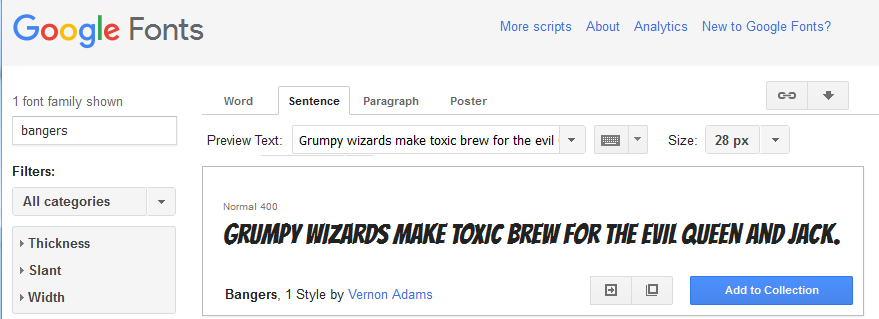

+ Clique no botão Quick-use (que significa Uso rápido):

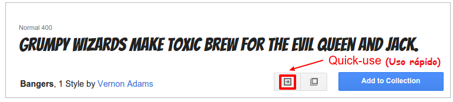

+ Uma nova página será carregada. Desça até que você veja:

e copie o código em destaque. 

+ Cole o código `<link>` que você acabou de copiar do Google fonts para a seção `<head>` da sua página HTML:

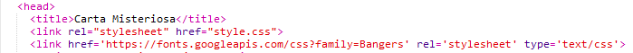

Os passos acima permitiram que você usasse a fonte Bangers na sua página. 

+ Retorne às fontes do Google e vá para o final da página. Lá, copie o código do font-family:

+ Agora volte para o arquivo __'style.css'__ no trinket e cole o código do font-family dentro do estilo gibi:

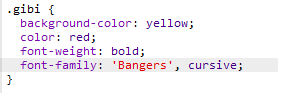

+ Teste sua página. O resultado deve se parecer com esta figura: 

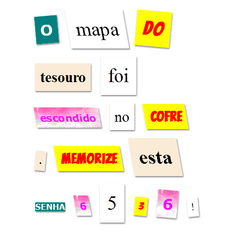

## Salve seu projeto {.save}

## Desafio: Crie um estilo parecido com impressão de computador {.challenge}

Crie um estilo que se pareça com impressão antiga de computadores e aplique-o à algumas de suas palavras:

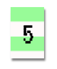

Você precisará:

+ da font family `VT323` que você encontra aqui: <a href="http://jumpto.cc/web-fonts" target="_blank">jumpto.cc/web-fonts</a>. Olhe no 'Passo 5' se você precisar se lembrar como utilizar Google fonts. 

+ da imagem de fundo `computer-printout-paper.png`. Olhe no 'Passo 4' se você precisar recordar como usar imagens de fundo. 	

## Desafio: Crie seus próprios estilos {.challenge}

Agora crie suas próprias classes de estilo e faça com que suas carta misteriosa fique ainda mais interessante. Use o CSS que você aprendeu nos projetos anteriores e olhe os exemplos do __style.css__ para ter idéias. 

Aqui você tem um exemplo:

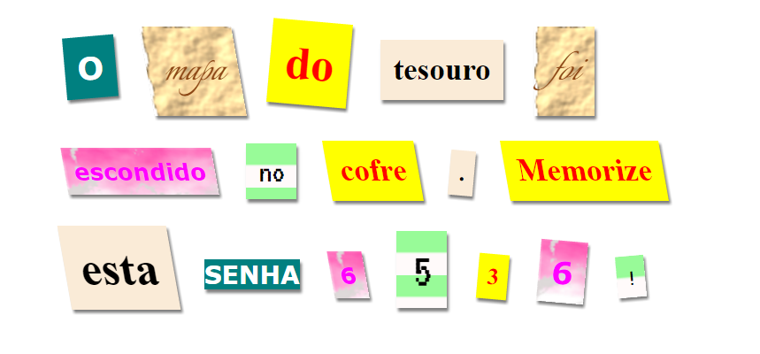

Você pode ver as imagens disponíveis clicando na tab Images do trinket.
Tente modificar os planos de fundo usando alguma destas imagens disponíveis: 

+ `rough-paper.png`

+ `canvas.png`

Se você tiver uma conta trinket, você pode carregar imagens suas como você fez no projeto 'Conte uma história'. 

Procure fontes que te agradem em <a href="http://jumpto.cc/web-fonts" target="_blank">jumpto.cc/web-fonts</a> e copie seus `<link>` e seus códigos CSS para seu trinket utilizá-los. 

## Salve seu projeto {.save}
