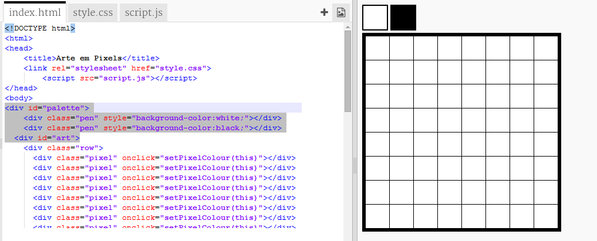

---
title: Arte em Pixels
level: HTML e CSS 2
language: pt-BR
embeds: "*.png"
materials: ["Club Leader Resources/*.*","Project Resources/*.*"]
stylesheet: web
...

# Introdução {.intro}

Neste projeto, você vai criar um editor de arte em pixels. Além de usar conceitos de HTML e CSS, você vai aprender a usar JavaScript para adicionar interatividade ao seu projeto.

  <iframe src="https://trinket.io/embed/html/0e102a306b?outputOnly=true&start=result" width="600" height="450" frameborder="0" marginwidth="0" marginheight="0" allowfullscreen>
  </iframe>
  

__Como usar o editor__: Clique em uma cor da paleta para escolher a cor de sua caneta e então clique nos pixels para alterar sua cor.

# Etapa 1: Criando uma malha quadriculada de pixels {.activity}

Vamos criar uma malha quadriculada de pixels que pode ser usada para criar arte em pixels. O CSS fornece estilos de tabela para malha quadriculada e layouts de tabelas. 

As tabelas contêm linhas que contêm células. Você vai criar uma tabela com fundo preto e então colocar pixels brancos nela. 

## Lista de atividades { .check}

+ Abra este link de trinket: <a href="http://jumpto.cc/web-pixel" target="_blank">jumpto.cc/web-pixel</a>. Se você está lendo isso on-line, você também pode usar o link incorporado abaixo. 

  <iframe src="https://trinket.io/embed/html/705f264f59" width="100%" height="400" frameborder="0" marginwidth="0" marginheight="0" allowfullscreen>
  </iframe>

+ Adicione o seguinte código html ao corpo `<body>` do seu arquivo `index.html` para criar uma `
` que serve como um recipiente para sua arte em pixels e atribua a ela um id `art` para que você possa estilizá-la:

	

 	Agora, vá para o seu arquivo `style.css` e adicione o estilo de tabela para a `
` da arte. Observe que as três linhas de pixels são as mesmas. Digite a primeira e então copie e cole para criar as outras. 

	

	Isso cria uma tabela com uma borda e define o espaçamento dentro da malha quadriculada. 

	Ela ainda não parece muito interessante, você precisa colocar linhas de pixels dentro dela. 

 + Agora, retorne ao seu arquivo `index.html` e adicione uma linha de 3 pixels dentro da `
` da arte:

	

 	Dessa vez, você vai usar classes para estilizar as divs, já que teremos várias delas. 

 	Adicione o seguinte estilo para as linhas e células:

	

 	Agora, seus pixels vão se alinhar em uma malha quadriculada com linhas pretas ao redor deles. 

 + Agora, adicione outras duas linhas de pixels para criar uma malha quadriculada com dimensões 3 x 3. Lembre-se de copiar e colar para ganhar tempo. 

	
	
    
##Desafio: Redimensione sua malha quadriculada {.challenge}

3x3 é uma malha quadriculada pequena para arte em pixels. Você consegue fazer uma maior? 8x8 é um bom tamanho para arte em pixels. 

Experimente copiar e colar ao invés de digitar tudo. 

## Salve seu projeto {.save}

# Etapa 2: Dando cor aos pixels {.activity}

O HTML é usado para organizar seu conteúdo, enquanto o CSS serve para estilizá-lo. O JavaScript é uma linguagem de programação que pode ser usada para alterar uma página web conforme você interage com ela. 

Você poderia usar HTML e CSS para definir a cor de fundo de pixels individuais, mas isso demoraria muito! Ao invés disso, você vai adicionar um código em JavaScript para colorir os pixels automaticamente quando clicar neles. 

+ No JavaScript, o código é colocado em uma função `function` que pode ser chamada quando queremos executar o código. 

	Você vai criar uma função chamada `setPixelColour`

	A função `setPixelColour` precisa saber de qual pixel ela deve alterar a cor, isso é uma entrada `input`.

	Adicione o seguinte código ao arquivo `script.js` para definir a cor de fundo de um pixel:

	

	Observe que `backgroundColor` usa a pronúncia das cores em inglês americano. 

+ Agora, precisamos chamar a função quando um pixel for clicado.

	O HTML usa `onclick` para chamar uma função quando um elemento for clicado. Você precisa passar 'this' como a entrada, assim sua função sabe de qual pixel ela deve alterar a cor. 

	Vá para `index.html` e adicione o seguinte código ao primeiro pixel:

	

+ Teste seu código clicando no primeiro pixel. Ele deve ficar preto:

	

	Você adicionou o código `onclick` apenas ao primeiro pixel, portanto ele ainda não funciona para os demais. 

##Desafio: Torne possível clicar em todos os pixels {.challenge}

Você consegue tornar possível clicar em todos os pixels? Copie e cole para ganhar tempo. 

Crie uma arte em pixels. 

Dica: Você pode clicar em __Autorun__ para limpar todos os pixels. 

# Etapa 3: Adicione uma paleta de cores {.activity}

Você não achou chato não poder alterar novamente a cor de um pixel para branco caso tenha clicado errado? Vamos consertar isso criando uma paleta de cores, assim você pode clicar em uma cor para alterar a caneta. 

+ Primeiro, crie um estilo de caneta. 

	Adicione o código a seguir ao final do seu arquivo `style.css`:

	

+ Agora, crie cores de caneta preta e branca que usam esse estilo. 

	Adicione o seguinte código ao seu arquivo `index.html` depois do corpo `<body>`:

	

	`style=` permite que você adicione CSS ao seu HTML, o que é conveniente aqui. 

+ Você quer poder alterar a cor da caneta quando uma cor da paleta for clicada. 

	As variáveis são usadas para armazenar informações. Vamos criar uma variável penColour em `script.js`.

	Adicione o seguinte código no início do arquivo:

	

	Então, adicione uma função para alterar a variável penColour:

	

+ Você também vai precisar usar a cor da caneta quando alterar a cor de um pixel. 

	Altere a função `setPixelColour` para usar a variável `penColour` ao invés da cor preta `black`:

	 

+ Agora, você precisa chamar a função `setPenColour` que define a cor da caneta quando ela for clicada. 

	Adicione o código `onclick` em destaque às cores de sua caneta:

	

+ Agora, teste para ver se você pode alterar a cor da caneta entre preto e branco para preencher ou remover pixels.

## Salve seu projeto {.save}

##Desafio: Adicione mais colunas à paleta {.challenge}

Você consegue adicionar mais cores à paleta? Escolha as cores com as quais você quer criar arte em pixels. 

Então, crie arte em pixels.

Dica: A cor verde brilhante se chama `chartreuse`.

Pergunte ao seu instrutor se você pode usar a ferramenta de captura de tela ou uma alternativa para salvar uma cópia da sua arte em pixels como uma imagem. 

## Salve seu projeto {.save}

