---
title: Projeto Mostruário
level: HTML & CSS 1
language: pt-BR
embeds: "*.png"
materiais: ["Club Leader Resources/*.*","Project Resources/*.*"]
stylesheet: web
...

# Introdução {.activity}

Nesse projeto, você irá criar um mostruário de seus projetos HTML e aprender sobre links e recursos embutidos. 

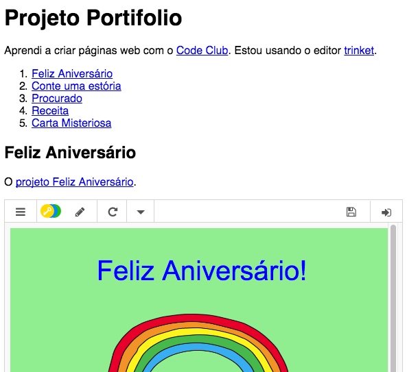

# Passo 1: Adicionando Links a Páginas Web {.activity}

Links de texto permitem que você clique em palavras para ir a uma outra página web, e eles são normalmente sublinhados.

## Lista de atividades { .check}

+ Abra esse trinket: <a href="https://trinket.io/html/9ad31460f0">https://trinket.io/html/9ad31460f0</a>. Se você estiver lendo isso online então isso é um link, você também pode usar a versão embutida do Trinket, abaixo.

  <iframe src="https://trinket.io/embed/html/9ad31460f0" width="100%" height="400" frameborder="0" marginwidth="0" marginheight="0" allowfullscreen>
  </iframe>

+ HTML usa a tag `<a>` para links. 

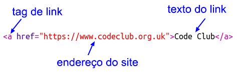

+ Encontre a tag `<a>` no seu projeto. 

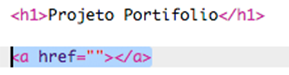

+ Adicione o endereço do website do Code Club <a href="https://www.codeclub.org.uk">`https://www.codeclub.org.uk`</a> e o texto do link:

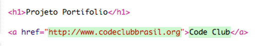

+ Clique em Run para testar o seu trinket.

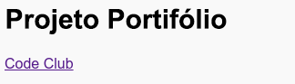

+ Clique no link do Code Club para testar a sua página web. O seu trinket irá agora mostrar a página do Code Club: 	

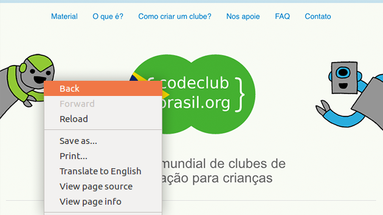

+ Para voltar à sua página você pode: 

	+ Rodar (Run) novamente o seu trinket,

	+ Pressionar a tecla Backspace no seu teclado, ou

	+ Clicar com o botão direito do mouse e escolher a opção Back. 

## Lista de atividades { .check}

+ Agora coloque o seu link em uma sentença dentro de um parágrafo:

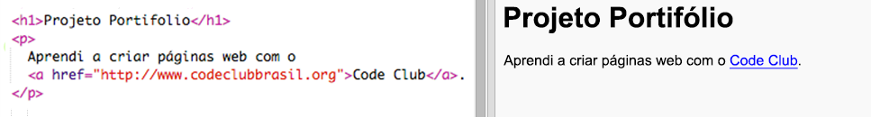

Teste a sua página web. 

## Desafio: Adicionar outro link {.challenge}

Adicione uma sentença com um link a um website que seja útil na criação de projetos web. Por exemplo: <a href="https://trinket.io">https://trinket.io</a> ou <a href="http://colours.neilorangepeel.com">http://colours.neilorangepeel.com</a>.

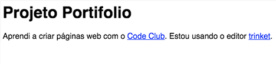

# Salve o seu projeto {.save}

# Passo 2: Link para um Trinket {.activity}

Você pode criar um link para a página web criada com o trinket. 

## Lista de atividades { .check}

+ Você guardou um link para o seu trinket de "Feliz Aniversário"? Se você guardou abra o trinket em outra aba ou janela do navegador. Caso contrário abra o trinket de exemplo pronto: <a href="https://trinket.io/html/e996dc0380">https://trinket.io/html/e996dc0380</a>

+ Clique no menu Share (Compartilhar) acima do seu trinket e escolha Link:

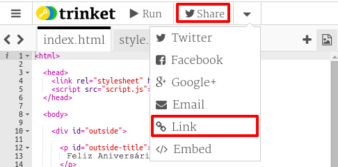

Se você abriu o trinket a partir da sua conta então procure pela opção Share (Compartilhar) abaixo do seu trinket:

+ Escolha 'Only show code or result (let users toggle between them)' [Mostrar apenas código ou resultado (deixar usuários alternarem entre eles)] e copie o link para o trinket. 

+ Volte para o seu trinket do Projeto Mostruário e adicione um cabeçalho `<h2>` e um link para o seu projeto "Feliz Aniversário".

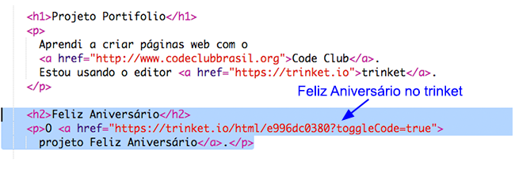

Teste a sua página web, ela deve se parecer mais ou menos assim:

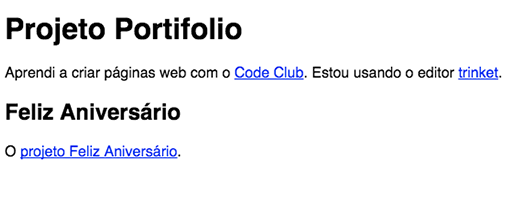

Clique no link Feliz Aniverśario para testar se ele o leva ao trinket.

## Salve o seu projeto {.save}

## Desafio: Crie uma lista dos seus projetos {.challenge}

Adicione alguns dos outros projetos HTML &amp; CSS que você tenha criado no Code Club. Use cabeçalhos `<h2>` para organizar a sua página. 

Se você não possui os links para os projetos que você criou então você pode usar os exemplos do Code Club:

+ Feliz Aniversário: <a href="https://trinket.io/html/e996dc0380">https://trinket.io/html/e996dc0380</a>

+ Conte uma História: <a href="https://trinket.io/html/c8afdef912">https://trinket.io/html/c8afdef912</a>

+ Procurado: <a href="https://trinket.io/html/ebeb56398a">https://trinket.io/html/ebeb56398a</a>

+ Receita: <a href="https://trinket.io/html/c0fd9b40cd">https://trinket.io/html/c0fd9b40cd</a>

+ Carta Misteriosa: <a href="https://trinket.io/html/1d4d4c5ce1">https://trinket.io/html/1d4d4c5ce1</a>

A sua página pronta deve se parecer mais ou menos assim:

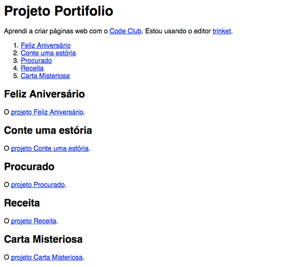

## Salve o seu projeto {.save}

# Passo 3: Embutindo Projetos {.activity}

Assim como criar links para trinkets como páginas web nós podemos também embutí-las em uma página web.

## Lista de atividades { .check}

+ Você pode trabalhar no modo Tela Cheia para ter mais espaço:

Pressione Esc para sair do modo Tela Cheia.

+ Rode (Run) seu trinket e clique no link Feliz Aniversário. 

+ Clique no menu do trinket e selecione __embed__ (embutir). Se você não não estiver no modo Tela Cheia você pode ter que rolar a tela. Utilize a barra de rolagem na direita ou a seta para baixo no teclado.

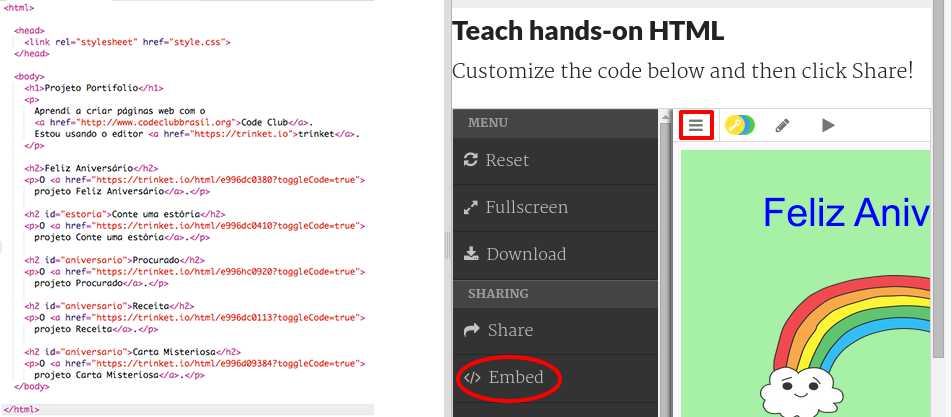

## Lista de atividades { .check}

+ Escolha 'Only show code or result (let users toggle between them)' [Mostrar apenas código ou resultado (deixar usuários alternarem entre eles)] e __copie__ o código embutido para o trinket. 

+ O Trinket criou alguns códigos HTML para você incluir na sua página web. Ele usa uma tag `<iframe>` que permite que conteúdos sejam embutidos dentro de uma página. 

+ Agora cole aquele código abaixo do link para o trinket Feliz Aniversário:

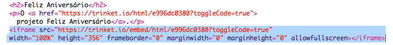

+ Rode (Run) o seu trinket para testá-lo e você deverá ver o seu projeto Feliz Aniverśario embutido na página web. 

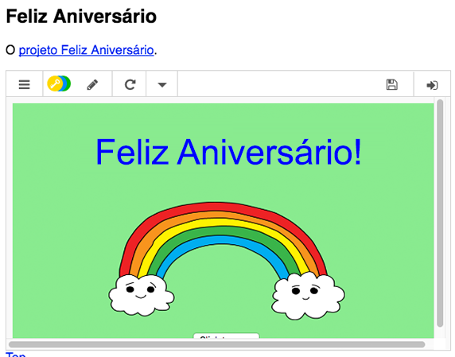

+ Pode acontecer de você pode perceber que o final do seu trinket não está sendo exibido. Você pode arrumar isso mudando o valor da altura no `<iframe>`. 

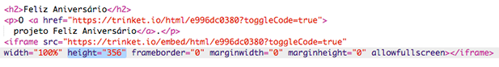

Estabeleça a altura(height) em __400__. Se você fez mudanças no projeto Feliz Aniversário você pode precisar escolher um valor diferente.

## Salve o seu projeto {.save}

## Desafio: Embutir Mais Projetos {.challenge}

Adicione dessa mesma forma outros de seus projetos no Mostruário. Lembre-se que você pode facilmente encontrar seus trinkets clicando nos links na sua página web. 

# Passo 4: Crie uma Tabela de Conteúdo {.activity}

Vamos adicionar uma Tabela de Conteúdo para que possamos facilmente chegar a cada projeto. 

## Lista de atividades { .check}

+ Assim como ser capaz de criar links para outras páginas web, nós podemos também criar links para partes de uma página se nós dermos a ela uma identificação.

Adicione um `id` ao cabeçalho `<h2>` para o projeto Feliz Aniversário:

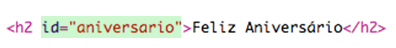

+ Adicione ids para cada um de seus projetos e dê a eles nomes curtos: historia, procurado, receita e carta.

+ Você pode criar um link para um elemento com um `id` colocando um símbolo de hash ‘#’ na frente de seu nome. Por exemplo, `#aniversario`. 

Crie uma lista ordenada de links para os seus projetos. (Listas ordenadas são introduzidas no projeto Receita.)

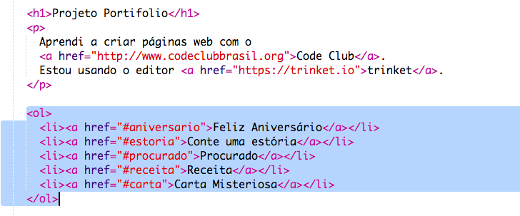

+ Rode (Run) o seu projeto e teste-o clicando nos links para se direcionar a seus projetos.

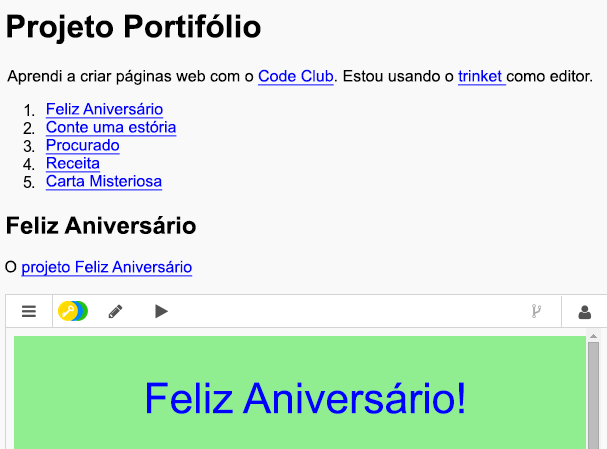

## Salve o seu projeto {.save}

# Passo 4: Voltando ao Topo {.activity}

## Lista de atividades { .check}

+ Também é útil ser capaz de navegar de volta para o topo da página. HTML tem `#top` para esse propósito. 

+ Adicione um link para `#top` depois de cada projeto embutido na sua página web:

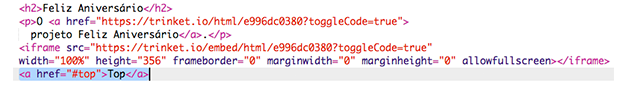

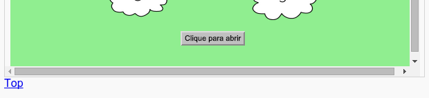

+ Teste seus links clicando em Top para voltar ao topo da página. 

## Salve o seu projeto {.save}

## Desafio: Melhore Seu Mostruário {.challenge}

Use o CSS que você aprendeu para tornar sua página mais interessante. Tente mudar a cor de fundo da página ou a fonte usada nos títulos. 

Você pode também adicionar informações a respeito de cada projeto e o que você gostou ao fazê-los. 

## Desafio: Crie um Novo Mostruário {.challenge}

Trinkets não são as únicas coisas que você pode embutir em uma página web. Você pode embutir vídeos, widgets (como um widget de previsão do tempo) ou projetos no Scratch. 

Abra o trinket Exemplo Embutir Scratch e rode-o (Run): <a href="https://trinket.io/html/9f7212b8fe">https://trinket.io/html/9f7212b8fe</a>

Vá para o website do Scratch e procure por um projeto que você goste. Ele pode ser um próprio ou um que você encontrou.

Se você estiver logado você pode clicar no botão 'Embed' (Embutir) abaixo do projeto para obter o código HTML para embutí-lo. 

Se você não estiver logado então procure pelo número do projeto Scratch em seu endereço web.

Faça uma cópia do código `<iframe>` no exemplo Embutir Scratch e mude o número do projeto para aquele que você deseja embutir:

## Salve o seu projeto {.save}
