---
title: Receita
level: HTML & CSS 1
language: pt-BR
embeds: "*.png"
materials: ["Club Leader Resources/*.*","Project Resources/*.*"]
stylesheet: web
...

# Introdução { .intro}

Neste projeto você aprenderá a criar uma página de internet para sua receita favorita.

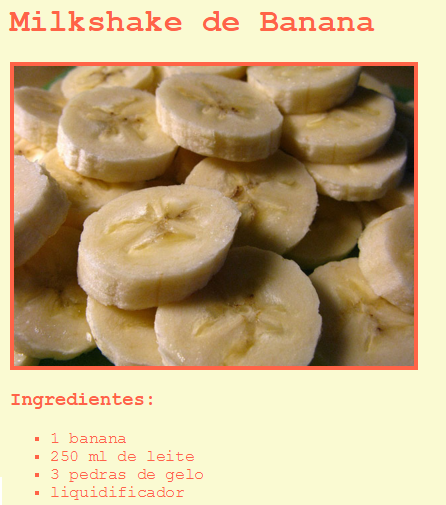

# Passo 1: Escolha uma receita { .activity}

Antes de começar a codificar, você precisar escolher uma receita.

## Lista de Atividades { .check}

+ Pense que receita você quer compartilhar com seus amigos. Pode ser:
	+ Uma receita que você achou na internet;
	+ Sua refeição favorita;
	+ Algo que você inventou!

A receita exemplo que você verá neste projeto é para fazer um milkshake de banana. Você pode copiar esta receita, se você não conseguir se decidir por alguma própria.

# Passo 2: Ingredientes { .activity}

Vamos listar os ingredientes que são necessários para sua receita.

## Lista de Atividades { .check}

+ Abra este template trinket: [http://bit.ly/codeclub-template](http://bit.ly/codeclub-template). Se você estiver lendo online, você pode usar a versão embutida do trinket abaixo.

<div class="trinket">
  <iframe src="https://trinket.io/embed/html/a4fa944734" width="100%" height="400" frameborder="0" marginwidth="0" marginheight="0" allowfullscreen>
  </iframe>
</div>

+ Para sua lista de ingredientes, você usará uma __lista sem ordenação__, usando a tag  `<ul>` (ul vem do inglês 'unordered list', que significa lista sem ordenação). Vá para a linha 8 do seu template e adicione este HTML, substituindo o texto no título `<h1>` pelo nome da sua receita:

```
<h1>Milkshake de Banana</h1>

<h3>Ingredientes:</h3>

<ul>

</ul>
```

+ Veja sua página de internet, você deverá algo parecido com isto:

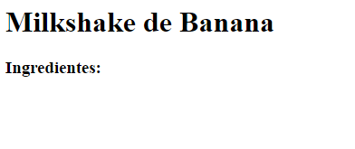

Mas você ainda não verá sua lista ainda, porque você ainda não acrescentou nenhum item à lista de ingredientes!

+ O próximo passo consiste em acrescentar items à sua lista, usando a tag `<li>` (li vem do inglês 'list item', que significa item da lista). Adicione o código abaixo dentro da sua tag`<ul>`:

```
<li>1 banana</li>
```
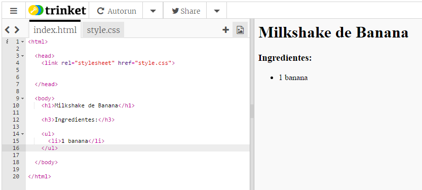

Como sua lista é sem ordenação, não há nenhum número nas linhas de items, apenas marcadores em forma de bolinhas.

##Desafio: Mais ingredientes {.challenge}
Você consegue acrescentar todos os ingredientes da __sua__ receita?

A sua página de internet deve se parecer com esta:

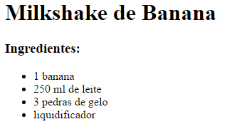

## Salve Seu Projeto {.save}

# Passo 3: Método { .activity }

Em seguida, vamos explicar como fazer a receita.

## Lista de Atividades { .check}

+ Você usará uma outra lista para escrever o Modo de Preparo, mas desta vez você usará uma __lista ordenada__, utilizando a tag `<ol>` (ol vem do inglês 'ordered list', que significa lista com ordenação).

Uma lista ordenada é uma lista que mostra números antes dos items. Ela deve ser usada quando a ordem dos passos é importante.

Acrescente este código abaixo da sua lista de ingredientes, mas garanta que ele esteja dentro da tag `<body>`:

```
<h3>Modo de Preparo:</h3>

<ol>

</ol>
```

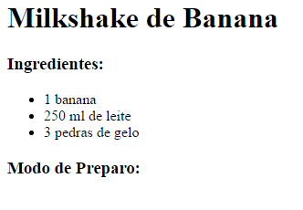

+ Agora você precisa acrescentar items na sua nova lista ordenada:

```
<li>Descasque a banana e coloque-a no liquidificador</li>
```

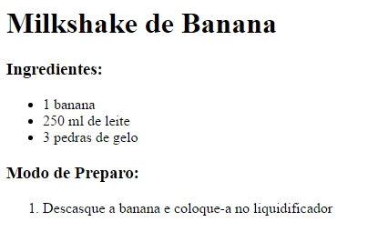

Note que os items da lista são automaticamente numerados!

## Desafio: Mais passos {.challenge}
Você consegue acrescentar todos os passos para preparar a __sua__ receita?

O seu Modo de Preparo deve se parecer com este:

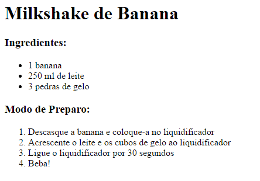

## Salve Seu Projeto {.save}

# Passo 4: Cores! { .activity}

Vamos acrescentar algumas cores à página de internet da sua receita.

## Lista de Atividades { .check}

+ Você já aprendeu como adicionar um texto colorido à sua página de internet. Acrescente este código ao seu arquivo `style.css`, para fazer com que todo texto no corpo (body) da sua página fique azul:

```
body {
    color: blue;
}
```

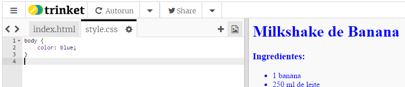

+ O seu browser conhece cores como `blue` (azul), `yellow` (amarelo) e até mesmo `lightgreen` (verde claro), mas você sabia que seu browser sabe os __nomes__ de mais de 140 cores diferentes?

Aqui você pode encontrar uma lista com todos os nomes de cores que você pode usar: [jumpto.cc/web-colours](http://jumpto.cc/web-colours), isto inclui nomes de cores como `tomato` (tomate), `firebrick` (tijolo de fogo) e `peachpuff` (sopro de pêssego).

Mude a cor de seu texto de `blue` (azul) para `tomato` (tomate).


+ O seu browser sabe o nome exato de 140 cores e sabe o __valor__ de mais de 16 milhões de cores!


Como você talvez saiba, todas as cores podem ser criadas a partir das cores primárias: red (vermelho), green (verde) and blue (azul). Para dizer para o browser qual cor mostrar, você pode simplesmente dizer quanto de cada cor primária ele deve usar.

A quantidade de vermelho (red), verde (green) e azul (blue) a serem usadas são escritas como números entre `0` e `255`.


Acrescente este código ao CSS para o corpo (body) da usa página de internet, para mostrar um fundo (background) amarelo claro (light yellow):

```
background: rgb(250,250,210);
```

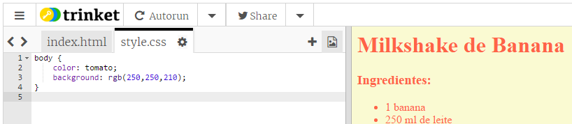

+ Se você preferir, você pode dizer ao browser que cor usar usando código hexadecimal (ou __hex code__). Os código hexadecimal funcionam de forma parecida ao `rgb()` utilizado acima, exceto que hex codes sempre começa com um `#`, e utiliza ‘números’ entre `00` e `ff` para os valores de red (vermelho), green (verde) e blue (azul).


Substitua o código `rgb()` em seu CSS por este código hexadecimal:

```
background: #fafad2;
```

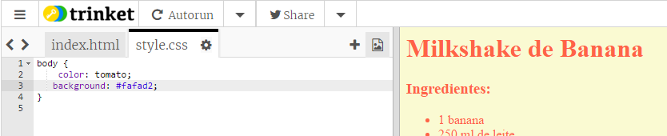

Você terá que ver o mesmo amarelo claro que você tinha antes!

## Salve Seu Projeto {.save}

# Passo 5: Toques finais { .activity}

Vamos acrescentar um pouco mais de HTML e CSS para melhorar sua página.

## Lista de Atividades { .check}

+ Você pode acrescentar uma linha horizontal no final da sua receita, utilizando a tag `<hr>`.

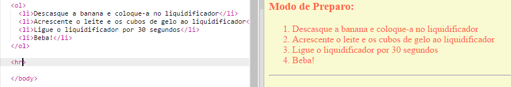

Note que esta tag não tem uma tag de fechamento, é assim também com a tag ``.

+ A linha que você acabou de acrescentar não combina com o estilo do restante da página. Vamos consertar isto acrescentando alguns códigos CSS:

```
hr {
    height: 2px;
    border: none;
    background-color: tomato;
}
```

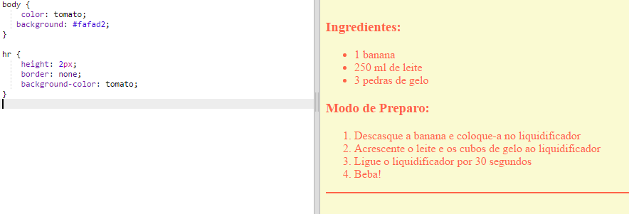

+ Você pode até mesmo mudar a aparência dos marcadores da lista com código CSS:

```
ul {
    list-style-type: square;
}
```

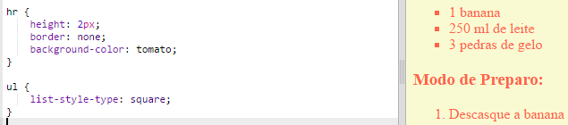

## Desafio: Mais cores! {.challenge}
Mude as cores no seu código utilizando o nome das cores, valores em `rgb()` e código hexadecimais. Existe uma lista com várias cores neste link <a href="http://jumpto.cc/web-colours" target="_blank">jumpto.cc/web-colours</a>.

Aqui temos alguns exemplos de cores:

+ Vermelho (Red) pode ser escrito como:
	+ `red` (obviamente!)
	+ `rgb(255,0,0)` (Muito vermelho, nenhum verde e nenhum azul)
	+ `#ff0000`

+ Oliva pode ser escrita como:
	+ `olive`
	+ `rgb(128, 128, 0)` (um pouco de vermelho, verde e nenhum azul)
	+ `#808000`

Tente garantir que as cores que você usa combinem com sua receita!

## Salve Seu Projeto {.save}

## Desafio: Comentários {.challenge}
Peça para alguns de seus amigos para deixar um comentário sobre sua receita. Você precisará fazer outra lista para obter isto.

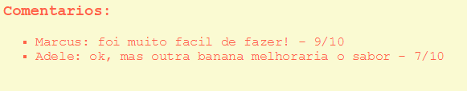

## Salve Seu Projeto {.save}

## Desafio: Mais estilização {.challenge}
Você consegue adicionar uma imagem à sua página? Ou mudar a fonte usada? Aqui você tem um exemplo de como sua página poderia ser:


E aqui você tem o código que te ajudará a obter esse resultado:

```
font-family: Arial / Comic Sans MS / Courier / Impact / Tahoma;
font-size: 12pt;
font-weight: bold;


```

## Salve Seu Projeto {.save}
