---
title: Adesivos!
level: HTML e CSS 2
language: pt-BR
embeds: "*.png"
materials: ["Club Leader Resources/*.*","Project Resources/*.*"]
stylesheet: web
...

# Introdução {.intro}

Neste projeto, você vai criar vários adesivos divertidos que podem ser usados para decorar páginas web. Você vai aprender sobre o uso de gradientes para deixar seus adesivos com uma aparência legal. 

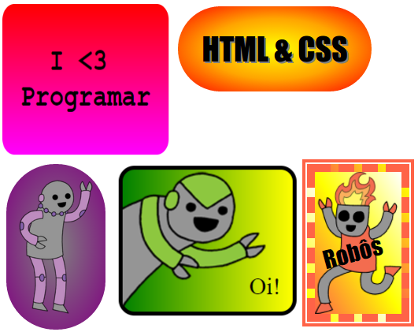

# Etapa 1: Faça um adesivo com gradiente linear {.activity}

Um gradiente é uma mudança gradual de uma cor para outra. Gradientes podem ser usados para criar efeitos bacanas. Você vai usá-los para criar adesivos que podem ser usados em suas páginas web. 

+ Abra este link de trinket: <a href="http://jumpto.cc/web-stickers" target="_blank">jumpto.cc/web-stickers</a>. Se você está lendo isso on-line, você também pode usar o link incorporado abaixo. 

  <iframe src="https://trinket.io/embed/html/af0ea6fa35" width="100%" height="400" frameborder="0" marginwidth="0" marginheight="0" allowfullscreen>
  </iframe>

+ Vamos fazer um adesivo 'Eu &lt;3 Programar'.

  Use uma `
` com uma classe `adesivo` e um id `programar` para que você possa estilizá-la:

	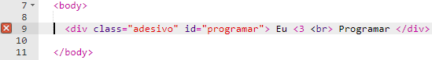

+ Hmm, você percebeu que ocorreu um erro? Isso aconteceu porque '<' é um caractere especial em HTML. Ao invés de '<', você precisa usar o código especial `&lt;`. 

	Atualize seu código para usar `&lt;`, assim o erro deixa de existir. 

	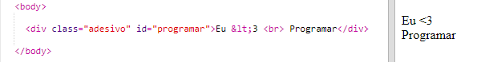

	` ` vai para uma nova linha. 

+ Agora vamos deixar o adesivo interessante. 

	Acesse o arquivo `style.css`. Você vai ver que a classe `.adesivo` foi fornecida. Ela vai fazer o layout dos adesivos na página e centralizar seu conteúdo. 

	Lembre-se de que você adicionou o id `programar` ao seu adesivo. No final de `style.css`, adicione o seguinte código para estilizar o texto:

	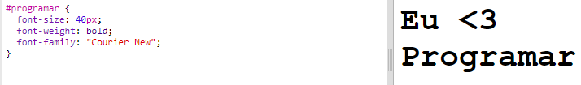

+ Agora você pode adicionar um gradiente para o fundo do adesivo. Um gradiente linear muda de uma cor para outra ao longo de uma linha reta.

	Este gradiente vai mudar de vermelho para magenta na parte inferior. Adicione o código do gradiente ao estilo `programar`:

	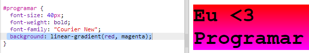

+ Você pode melhorar o resultado adicionando espaçamento e cantos arredondados. 

	Adicione o código em destaque:

	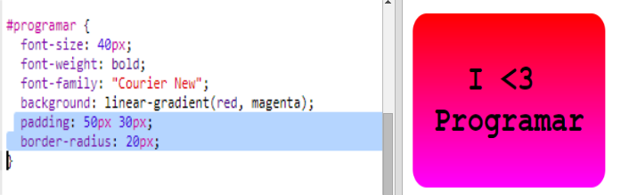

	O estilo de espaçamento `padding` adiciona um espaçamento de 50px nas partes superior e inferior e de 30px na esquerda e na direita. 

## Salve seu projeto {.save}

# Etapa 2: Faça um adesivo com gradiente radial {.activity}

Gradientes também podem mudar de cor do centro para as bordas, o que chamamos de gradiente radial. 

+ Vamos criar um adesivo com o texto `HTML & CSS.`  `&` é outro caractere que precisa de um código em HTML, que é `&amp;`.

	Adicione o código em destaque para criar um novo adesivo: 

	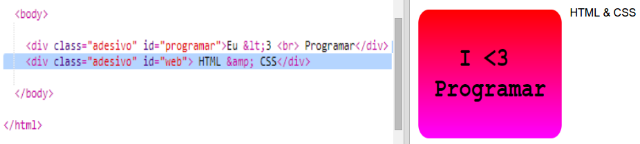

+ Agora, acesse seu arquivo `style.css` e adicione um estilo para seu novo adesivo:

	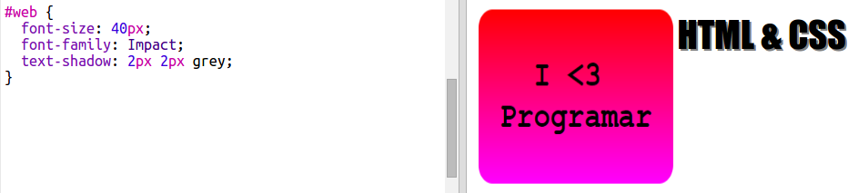

	O código `text-shadow` adiciona uma sombra que se estende 2px para baixo e para a direita do texto para que ele se destaque. 

+ Agora, vamos ao gradiente. Dessa vez, vamos usar um gradiente radial. A cor vai mudar de amarelo no centro para laranja e depois vermelho. 

	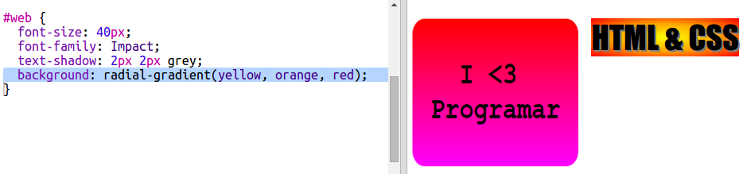

	Observe que gradientes podem incluir várias cores, não apenas duas. 

+ O adesivo vai ficar muito mais bonito com um pouco de espaçamento e uma borda arredondada. 

	Adicione o código em destaque:

	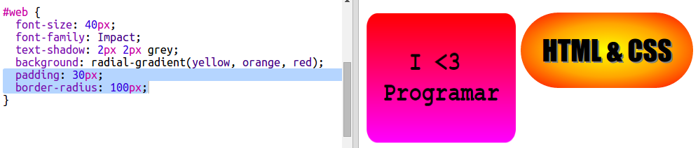

## Salve seu projeto {.save}

## Desafio: Crie seu próprio adesivo em gradiente {.challenge}

Agora, crie seu próprio adesivo em gradiente. Experimente gradientes lineares e radiais usando várias cores HTML. 

Você vai precisar:

+ Adicionar uma `
` com o texto do seu adesivo em `index.html` e dar a ela a classe `adesivo` e um novo `id`.
+ Adicionar um estilo para `id` que pode ser escolhido em `style.css`. Você pode copiar e editar um dos estilos de adesivo que você já fez. 

Há uma lista de todos os nomes de cores que você pode usar: [jumpto.cc/web-colours](http://jumpto.cc/web-colours), que inclui nomes como `tomato`, `firebrick` e `peachpuff`.

Se você quiser alterar a cor do texto, use `color:`.

Temos aqui um exemplo do que você pode fazer com várias cores em um gradiente linear:

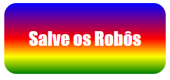

## Salve seu projeto {.save}

# Etapa 3: Faça um adesivo em gradiente com uma imagem  {.activity}

Você também pode fazer um adesivo em gradiente usando uma imagem. Se você usar uma imagem com um fundo transparente, o gradiente vai aparecer. 

+ Primeiro, vamos criar um adesivo que inclui uma imagem. 

	Seu projeto já inclui uma imagem chamada `purplerobot.png`.

	Adicione o código em destaque a `index.html`:

	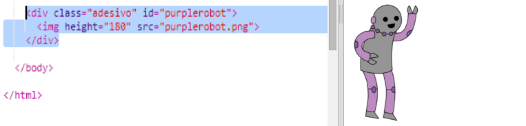

	Você pode ajustar a altura `height` para redimensionar a imagem, a largura será alterada automaticamente. 

+ Agora, adicione o código de estilo para criar um fundo em gradiente para seu adesivo com imagem:

	

## Salve seu projeto {.save}

## Desafio: Faça seu próprio adesivo com imagem {.challenge}

Agora, faça seu próprio adesivo com uma imagem em gradiente. 

Você vai precisar:

+ Adicionar uma nova `
` de adesivo ao arquivo `index.html`, a qual inclui uma imagem. 
+ Adicione a classe `adesivo` e um novo id à div de adesivo.
+ Crie um estilo para seu novo id com um gradiente e espaçamento. 

Seu projeto já inclui um conjunto de imagens de robôs. Clique no ícone das imagens para ver quais estão disponíveis. 

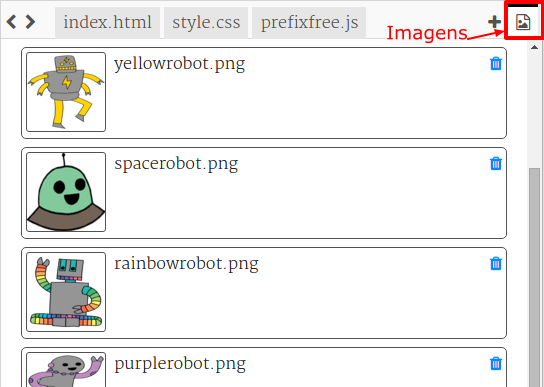

Temos aqui um exemplo de adesivo com imagem usando um gradiente linear:

## Salve seu projeto {.save}

# Etapa 4: Gradientes horizontais  {.activity}

Gradientes podem ser tanto horizontais quanto verticais. 

+ Vamos criar outro adesivo com imagem. 

	Dessa vez, vamos usar a imagem `greenrobot.png`. Adicione o seguinte código ao arquivo `index.html`:

	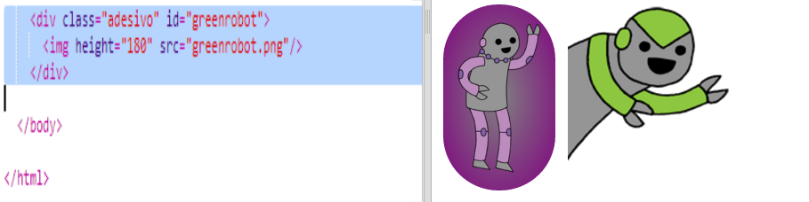

+ Normalmente, um gradiente linear vai de cima para baixo, mas se adicionarmos `to right` (à direita) podemos fazê-lo ir da esquerda para a direita. 

	Adicione o código em destaque a `style.css` para adicionar um gradiente horizontal ao seu adesivo de robô verde. 

	

	Observe que o gradiente vai de verde, na esquerda, para amarelo na direita. 

+ Parece que esse robô quer dizer alguma coisa. Vamos colocar um texto no seu adesivo. 

	Vá para `index.html` e adicione o texto 'Oi!' ao seu adesivo de robô verde, coloque-o dentro de uma tag `` com um id para que você possa estilizá-lo:  

	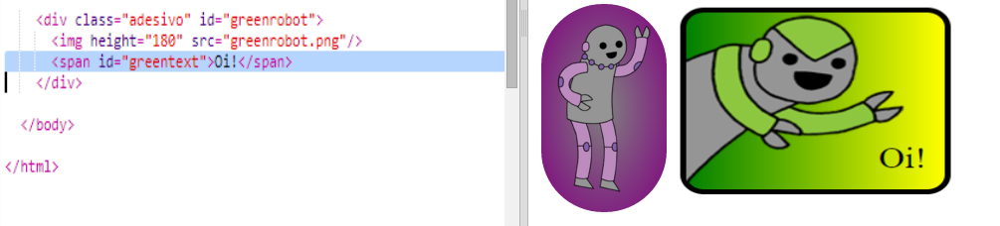

+ O texto vai ficar melhor se você deixá-lo maior e posicioná-lo. 

	Para posicionar o texto, você precisa adicionar a posição relativa `position: relative;` a `#greensticker` e a posição absoluta `position: absolute` a `#greentext`. Isso é abordado em mais detalhes no projeto `Construa um Robô`. 

	Adicione o código em destaque a `style.css`:

	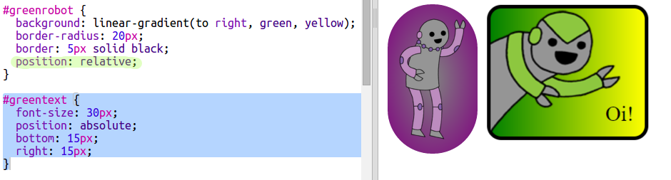

	Agora, o texto 'Oi!' está posicionado em relação ao canto inferior direito do adesivo. 

## Salve seu projeto {.save}

# Etapa 5: Gradientes diagonais  {.activity}

Você também pode criar gradientes diagonais que vão de canto a canto. 

+ Adicione um adesivo a `index.html` usando a imagem `firerobot.png`:

	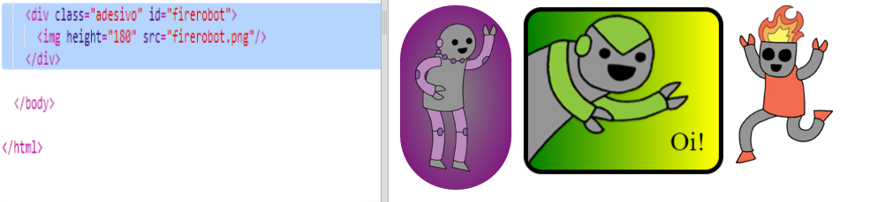

+ Com um gradiente diagonal você dá duas direções. O exemplo usa `to bottom left`, que é na direção do canto inferior esquerdo.

	Adicione esse estilo a `style.css` para dar ao seu adesivo de robô um gradiente diagonal e uma borda chique:

	

	Observe que você pode usar `outline` para criar outra borda fora da normal. 
	`outline-offset` dá o espaço entre a borda e o contorno. 

+ Vamos adicionar um texto ao adesivo. 

	Adicione uma tag `` com o texto "ROBÔS!" a `index.html` e dê um id a ela. 

	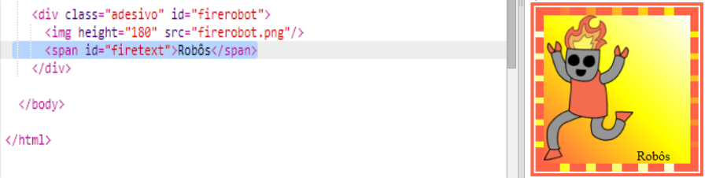

+ Agora você pode posicionar o texto adicionando o seguinte estilo:

	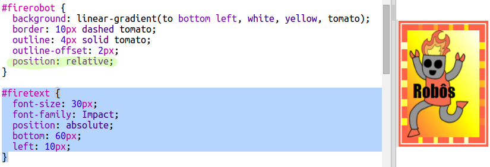

+ Por último, vamos girar o texto usando `transform: rotate`.

	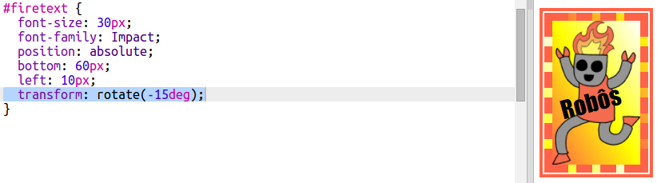

	Experimente alterar o número de graus de rotação do texto. 

## Salve seu projeto {.save}

## Desafio: Faça mais adesivos {.challenge}

Agora, experimente fazer mais adesivos usando direções diferentes de gradiente e adicionando imagens e textos usando bordas e contornos. 

Você pode copiar um dos seus exemplos e fazer alterações para criar um novo adesivo. 

Temos aqui um exemplo usando um gradiente diagonal:

## Salve seu projeto {.save}