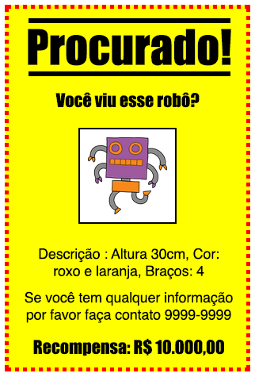
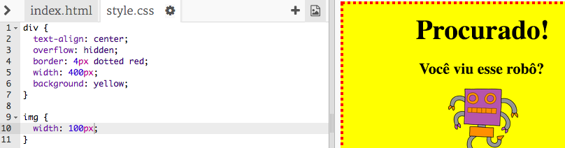
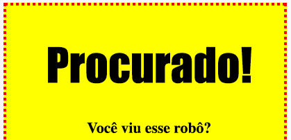
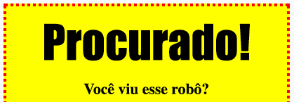

---
title: Procurado!
level: HTML & CSS 1
language: pt-BR
embeds: "*.png"
materials: ["Club Leader Resources/*.*","Project Resources/*.*"]
stylesheet: web
...

# Introdução { .intro}

Neste projeto, você aprenderá como fazer seu próprio cartaz.



# Passo 1: Estilizando seu cartaz { .activity}

Vamos começar editando o código CSS para o cartaz.

## Lista de atividades { .check}

+ Abra este trinket: <a href="http://jumpto.cc/web-wanted" target="_blank">jumpto.cc/web-wanted</a>. Se você está lendo isto online, você pode também usar a versão embutido desse trinket abaixo.

<div class="trinket">
	<iframe src="https://trinket.io/embed/html/58318bee1f" width="100%" height="550" frameborder="0" marginwidth="0" marginheight="0" allowfullscreen>
	</iframe>
</div>

+ Clique na aba "style.css". Você perceberá que já há propriedades CSS para a `div` contendo diferentes partes do cartaz.

	```
	div {
		text-align: center;
		overflow: hidden;
	 	border: 2px solid black;
	 	width: 300px;
    	}
	```

+ Vamos começar alterarando a propriedade `text-align`:

	```
	text-align: center;
	```

	O que acontece quando você muda a palavra `center` para `left` ou `right`?

+ E a propriedade `border`?

	```
	border: 2px solid black;
	```

	`2px` no código acima significa 2 pixels. O que acontece quando você muda `2px solid black` para `4px dotted red`?

+ Mude o `width` do cartaz para `400px`. O que acontece com o cartaz?

+ Vamos adicionar algum CSS para colocar uma cor de fundo no cartaz. Vá para o final da linha 5 do seu código e aperte **Enter**, assim você tem uma nova linha vazia.

	

	Digite o código a seguir nessa linha vazia

	```
	background: yellow;
	```

	Certifique-se de digitar _exatamente_ como acima. Você notará que a cor de fundo da `<div>` agora é amarela.

	

##Desafio: Melhorando seu cartaz {.challenge}
Adicione a seguinte propriedade CSS na sua `div`:

```
border-radius: 40px;
```

O que essa propriedade faz? O que acontece se você mudar o número do código acima?

## Salve seu projeto {.save}

# Passo 2: Estilizando imagens { .activity}

Vamos melhorar da imagem no cartaz.

## Lista de atividades { .check}

+ No momento, não há nenhuma propriedade CSS para sua __tag__ ``, então vamos adicionar alguma!

	Primeiramente, adicione o seguinte código embaixo do CSS para sua `div`:

	```
	img {

	}
	```

	

+ Agora, nós podemos adicionar propriedades CSS para imagens entre os colchetes `{` e `}`.

	Por exemplo, adicione este código entre os colchetes para definir a largura da imagem:

	```
	width: 100px;
	```

	Você verá que o tamanho da imagem muda, de modo que sua largura é 100 pixels.

	

+ Você também pode adicionar uma borda em torno da imagem com este código:

	```
	border: 1px solid black;
	```

+ Você percebeu que não há muito espaço entre a imagem e a borda?

	

	Você pode consertar isso adicionando um pouco de espaço em torno da imagem:

	```
	padding: 10px;
	```

	__padding__ é o espaço entre o conteúdo (nesse caso a imagem) e sua borda.

	

	O que você acha que aconteceria se você mudar o __padding__ para `50px`?

##Desafio: Melhorando sua imagem {.challenge}
Você pode dar a sua imagem uma cor de fundo? Ou uma borda arredondada?

## Salve Seu Projeto {.save}

# Passo 3: Estilizando Cabeçalhos { .activity .new-page }

Vamos melhorar o estilo do cabeçalho `<h1>`.

## Lista de atividades { .check}

+ Adicione o seguinte código embaixo do CSS da sua imagem:

	```
	h1 {

	}
	```

	Este é o lugar onde você vai adicionar propriedades CSS para seu principal cabeçalho `<h1>`.

+ Para mudar a fonte do seu cabeçalho `<h1>`, adicione o seguinte código entre os colchetes:

	```
	font-family: Impact;
	```

+ Você também pode alterar o tamanho do cabeçalho:

	```
	font-size: 50pt;
	```

+ Você percebeu que há um grande espaço entre o cabeçalho `<h1>` e as coisas em torno dele?

	

	Isso ocorre porque há uma margem em torno do cabeçalho. A margem é o espaço entre o elemento (nesse caso o cabeçalho `h1`) e as outras coisas em torno dele.

	Você pode deixar a margem menor com este código:

	```
	margin: 10px;
	```

	

+ Você também pode sublinhar o seu cabeçalho:

	```
	text-decoration: underline;
	```

##Desafio: Faça seu cartaz ficar incrível! {.challenge}
Adicione mais código CSS para estilizar seus cabeçalhos `<h3>` e seus parágrafos.


Aqui está uma lista de algumas propriedades CSS que você pode usar:

```
color: black;
background: white;
font-family: Arial / Comic Sans MS / Courier / Impact / Tahoma;
font-size: 12pt;
font-weight: bold;
text-decoration: underline overline line-through;
margin: 10px;
padding: 10px;
width: 100px;
height: 100px;
```

## Salve Seu Projeto {.save}

##Desafio: Anuncie um evento! {.challenge}
Você é capaz de fazer um cartaz para um evento acontecendo em sua escola? Poderia ser uma peça de teatro, um evento esportivo, ou até mesmo um cartaz anunciando o seu Code Club!

## Salve Seu Projeto {.save}
