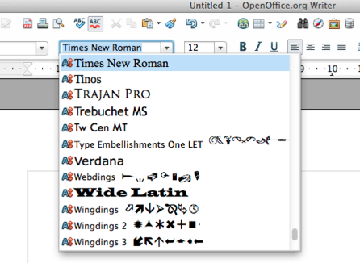

---
title: Styla och formatera text
level: Nivå 2
language: en-GB
embeds: "*.png"
materials: "code and images"
stylesheet: web
...

## __Uppgiften:__ {.intro } 
I den här lektionen ska vi lära oss hur man stylar text med olika typsnitt(fonts), färger och storlekar. Vi kommer också att lära oss hur man lägger till bakgrundsfärger och ramar. Vi kommer att använda samma projekt som du arbetade på sist, så se till att du öppnar index.html från Felix-mappen. 

#Steg 1: Typsnitt {.activity}

Vi kan ändra utseendet på texten genom att ändra __typsnittet__ (font). De vanligaste typsnitten heter

+ Arial
+ Courier New, Courier
+ Garamond
+ Georgia
+ Lucida Sans, Lucida Grande, Lucida
+ Palatino Linotype
+ Tahoma
+ Times New Roman, Times
+ Trebuchet
+ Verdana

Alla typsnitt finns inte på alla datorer, så vi måste även tillhandahålla __reservtypsnitt__. Dessa är väldigt allmänna som ‘sans serif’ och ‘serif’.

Vi testar att ändra typsnitt på rubriken genom att använda `font-family´-egenskapen. 

```css
h1 {
	color: red;
	background-color: black;
	font-family: impact, sans-serif;
	font-size: 72px;
	text-decoration: underline;
	text-transform: uppercase;
}
```
Och typsnittet för styckena...

```css
p {
	font-family: Georgia, 'Times New Roman', serif;
}
```

##__Spara__ och __granska__. {.save}

Prova några av de olika typsnitten för att se vilka du gillar bäst. Notera hur vi separerar varje typsnitt med ett komma, och om typsnittet har ett namn med mer än ett ord måste vi sätta det inom citattecken. 

Vilket av typsnitten som vi nämnde tycker du ser bäst ut? Vilken tycker du är lättast att läsa?

Har du några andra typsnitt på din dator än de som har nämnts här? (Det har du förmodligen). Försök att öppna ett program som t.ex. Word, alla typsnitt som är sparade på datorn kan vanligtvis hittas där. 



Hitta ett som du gillar och prova det på websidan!

Du kan göra  texten __fet__(bold), *kursiv* (italic) eller både och med font-style-egenskapen. Låt oss ändra emailtexten (kom ihåg att den är inom en `<a>`-tagg).
 
```css
a {
	font-style: bold;
}
```

##__Spara__ och __granska__. {.save}

Eller så kan vi göra den kursiv. 

```css
a {
	font-style: italic;
}
```
##__Spara__ och __granska__. {.save}

Det finns även ett font-stylevärde som kallas `oblique`. Hur ser det ut? 

Vi kan även bestämma hur fet (bold) viss text ska vara genom att använda egenskapen `font-weight`. Den tar värdena `normal`, `bold`, `bolder`, `lighter`. Du kan även använda siffror, 100, 200, 300, 400, 500, 600, 700, 800, och 900, där 100 är den tunnaste texten och 900 är den tjockaste (fetaste texten). Normal text är samma som 400, bold(fet) är samma som 700. Hur som helst, alla typsnitt har inte alla dessa, så det är säkrare att bara använda normal och bold. Rubriker är vanligtvis bold (feta) som standard. Om vi vill att vår `h2` inte ska vara bold (fet), måste vi skriva:
 

```css
h2 {
	font-weight: normal;
}
```

Prova!

#Steg 2: Ramar! {.activity}

Vi lägger till en border (ram) runt bilden.

```css
img {
	border-color: green;
	border-style: solid;
	border-width: 5px;
}
```
##__Spara__ och __granska__. {.save}

Prova att byta color (färg), width (bredd) och border-style (ramstil) tills du är nöjd. Vissa värden för border-style är `dashed`, `dotted`, `double`, `groove`, `ridge`, `inset`, `outset`.

Du kan sätta ramar runt alla delar, varför inte prova några till?

#Steg 3: ID och klasser {.activity}

Vi vill göra stycket med kontaktuppgifterna __highlighted__ (markerad). Vi kan inte använda `<p>`-taggen eftersom det skulle ändra alla stycken. För att göra så att ett typsnitt bara gäller för en del, använder vi något som kallas ID. Vi behöver ändra i html:en så det blir såhär:

```html
<p id ="highlight">Har du sett Felix? <em>Vänligen</em> kontakta hans ägare på <a href="mailto:felixowners@email.com">felixowners@email.com</a></p>
```

Sen kan vi styla ID:t såhär:

```css
#highlight {
	color: red;
}
```

##__Spara__ och __granska__. {.save}

Ett ID är unikt och kan bara användas en gång per sida. Så om vi vill att två av styckena ska ha större font-size (typsnittsstorlek) kan vi göra det genom att använda klasser. Först behöver vi ge klassnamn till de stycken som vi vill ändra. 

```html
<p class="large">Han försvann från trädgården igår.</p>
<p class="large"><strong>Tack!</strong><p>
```
vi stylar en klass såhär (med ett `.`istället för ett `#`):

```css
.large {
	font-size:24px;
}
```

##Prova också: {.try}

+ Hur skulle du ändra en sida för att få den att se bättre ut? Varför inte försöka använda dina favorittypsnitt och favoritfärger?
+ Om du blir klar tidigt kan du gå tillbaka och styla html:en som vi gjorde i tidigare lektioner. 
+ Förresten, visste du att background-egenskapen(bakgrund) inte bara tar värden som är färger, utan även bilder?
