---
title: З днем народження
level: HTML & CSS 1
language: uk-UA
embeds: "*.png"
materials: ["Club Leader Resources/*.*","Project Resources/*.*"]
stylesheet: web
...

# Вступ {.intro}

В ході цього проекту ви ознайомитесь з HTML та CSS, практикуючись у створенні власної вітальної листівки.

  <iframe src="https://trinket.io/embed/html/e996dc0380?outputOnly=true&start=result" width="600" height="450" frameborder="0" marginwidth="0" marginheight="0" allowfullscreen>
  </iframe> 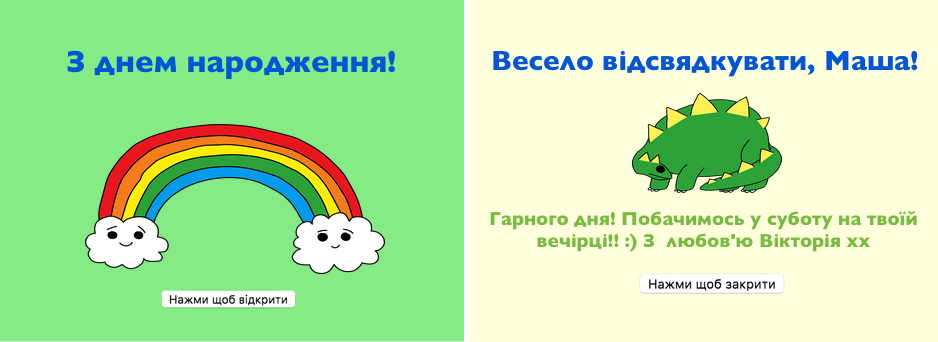

# Крок 1: Що таке HTML? {.activity}

HTML розшифровується як **HyperText Markup Language**, що в перекладі означає "Мова розмітки гіпертекстових документів". Вона використовується для створення веб-сторінок. Розглянемо приклад!

## Список дій {.check}

+ Для написання HTML ви користуватиметесь сайтом, що має назву Trinket. Відкрийте цю чернетку: <a href="http://jumpto.cc/web-intro" target="_blank">jumpto.cc/web-intro</a>. Якщо ви читаєте це онлайн, то можете скористатись вбудованою версією Trinket нижче.

  <iframe src="https://trinket.io/embed/html/850a678202" width="100%" height="400" frameborder="0" marginwidth="0" marginheight="0" allowfullscreen>
    </iframe>

+ Код у лівій частині чернетки — це HTML. У правій частині чернетки розміщена веб-сторінка, створена HTML-кодом.
    
    HTML використовує **теги** для створення веб-сторінок. Бачите цю HTML у 8-му рядку свого коду?
    
        
Привіт. Мене звати Андрій.

        
    
    `
` є прикладом тегу і скороченням для **paragraph** (в перекладі — "абзац"). Ви можете починати абзаци тегом `
`, а закінчувати — тегом `
`.

+ Бачите якісь інші теги? Один з них можна було помітити в 9-му рядку. Це тег `<b>`, що означає **bold** (в перекладі — "жирний"):
    
        <b>бігати</b>
        
    
    Ось ще кілька:
    
    + `<html>` і `</html>` позначають початок та кінець HTML-документу;
    + `<head>` і `</head>` — теги, в межах яких застосовуються такі штуки, як CSS (ми розберемося з ними пізніше!);
    + `<body>` і `</body>` — теги, в межах яких розташовується вміст вашого веб-сайту.
    
    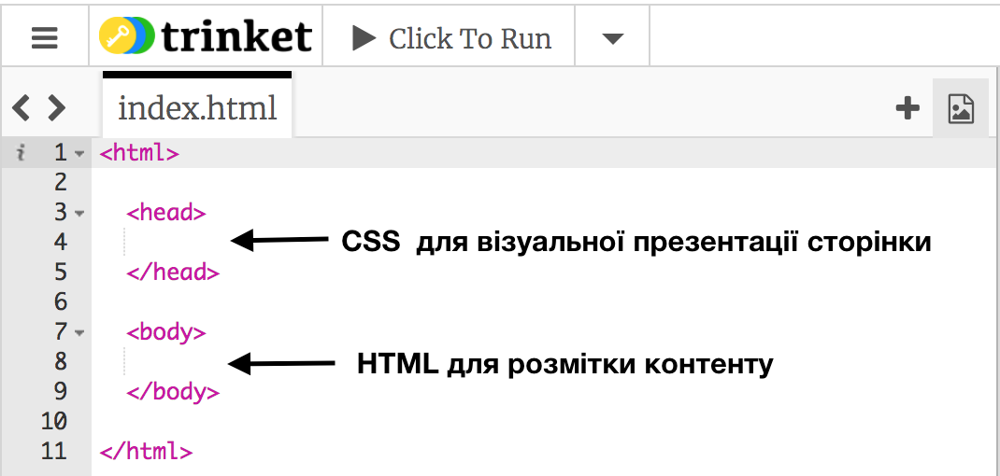

+ Внесіть зміни до одного з абзаців тексту в HTML (ліворуч). Клацніть на "Run" (що означає "виконати") і побачите, як зміняться ваші веб-сторінки (праворуч)!
    
    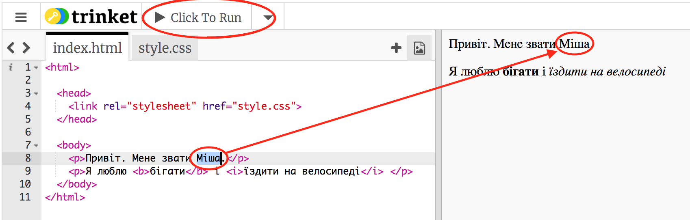

+ Якщо ви зробили помилку і хочете скасувати зміни, клацніть на кнопку меню, а потім — "Reset" (що означає "скинути"). Спробуйте!
    
    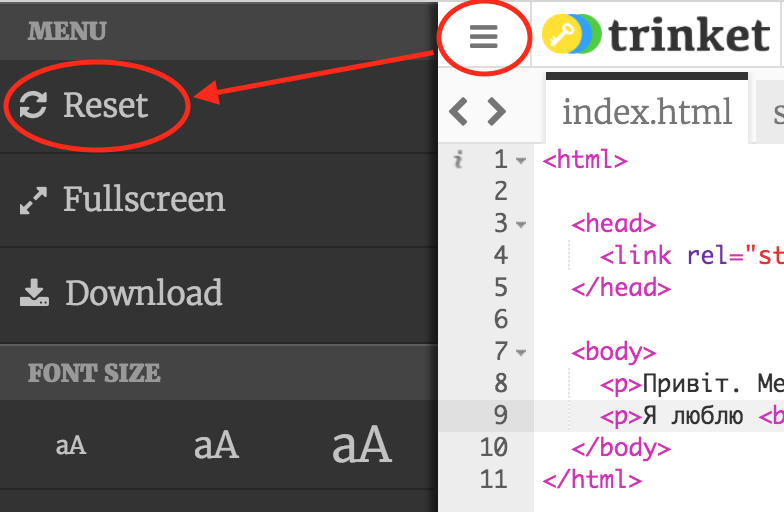

## Збережіть свій проект {.save}

**Вам не потрібно реєструватись в Trinket, щоб зберігати свої проекти!**

Якщо у вас немає облікового запису Trinket, клацніть на стрілку вниз і виберіть пункт "Link" (що означає "посилання"). Так ви отримаєте посилання, яке можна зберегти, а пізніше — відкрити. Це потрібно буде робити щоразу, коли вноситимете зміни, бо й саме посилання змінюватиметься!

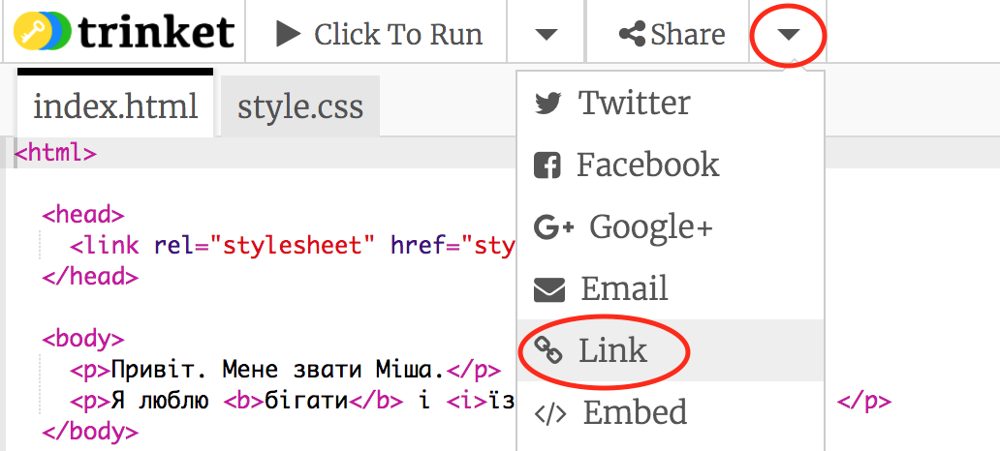

Якщо ж у вас є обліковий запис Trinket, найпростішим способом зберегти свою веб-сторінку буде натиснути кнопку "Remix" (що означає "перезаписати") зверху. Так ви збережете копію чернетки у своєму профілі.

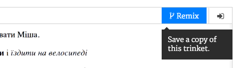

## Завдання: Додайте ще один абзац {.challenge}

Можете додати 3-й абзац тексту під двома попередніми? Пам'ятайте, що ваш новий абзац має починатися з тегу `
` і закінчуватися тегом `
`.

Ось як повинна виглядати ваша веб-сторінка:

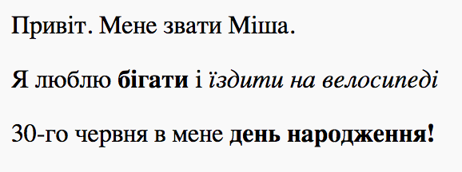

Можете додати **жирний** та <u>підкреслений</u> текст до свого нового абзацу? Для підкреслення тексту вам слід скористатись тегами `<u>` і `</u>`.

## Збережіть свій проект {.save}

# Крок 2: Що таке CSS? {.activity}

CSS розшифровується як **Cascading Style Sheets**, що в перекладі означає "Каскадні таблиці стилів". Це мова, що використовується для оформлення веб-сторінок і надання їм гарного вигляду. Ви можете зв'язати свою веб-сторінку з CSS-файлом у `<head>` (заголовку) HTML-документу, як показано у прикладі:

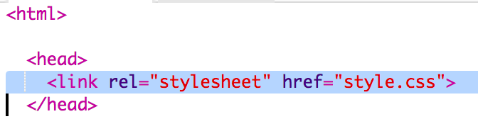

## Список дій {.check}

+ CSS містить список усіх **властивостей** для певного тегу. Клацніть на вкладку "style.css", щоб побачити CSS для своєї веб-сторінки.
    
    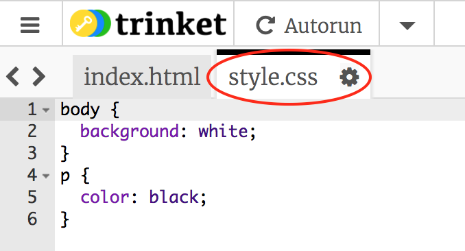

+ Знайдіть цей код:
    
        p {
            color: black;
        }
        
    
    Цей код CSS має одну властивість для абзаців, а саме — що колір тексту має бути чорний.

+ Змініть слово "black" (чорний) на "blue" (синій) в CSS. Ви побачите, що колір тексту усіх абзаців зміниться на синій.
    
    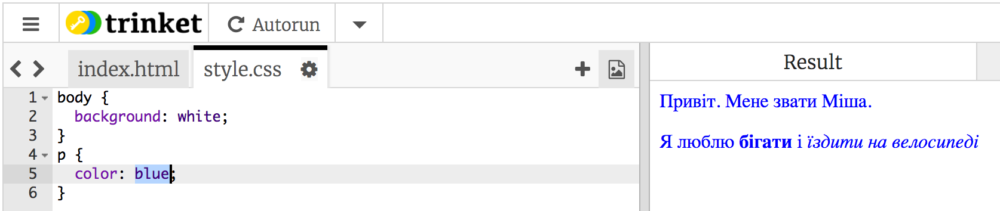

## Збережіть свій проект {.save}

## Завдання: Додайте більше оформлення {.challenge}

Можете зробити текст абзаців помаранчевим (orange)? Або тло (background) сірим (grey)?

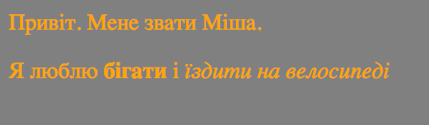

## Збережіть свій проект {.save}

# Крок 3: Створення вітальної листівки {.activity}

Давайте скористаємось усім, що ви дізнались про HTML і CSS, щоб створити вашу власну вітальну листівку.

## Список дій {.check}

+ Відкрийте цю чернетку <a href="http://jumpto.cc/web-card" target="_blank">jumpto.cc/web-card</a> або скористайтесь вбудованою версією нижче, якщо читаєте це онлайн.

  <iframe src="https://trinket.io/embed/html/90506676c9" width="100%" height="400" frameborder="0" marginwidth="0" marginheight="0" allowfullscreen>
    </iframe>

Не переймайтесь, якщо не розумієте всього коду. Ця вітальна листівка виглядає нуднувато, тому зараз ви внесете деякі зміни до її HTML та CSS.

+ Клацніть на кнопку на передній частині листівки. Ви побачите, як листівка розкриється.
    
    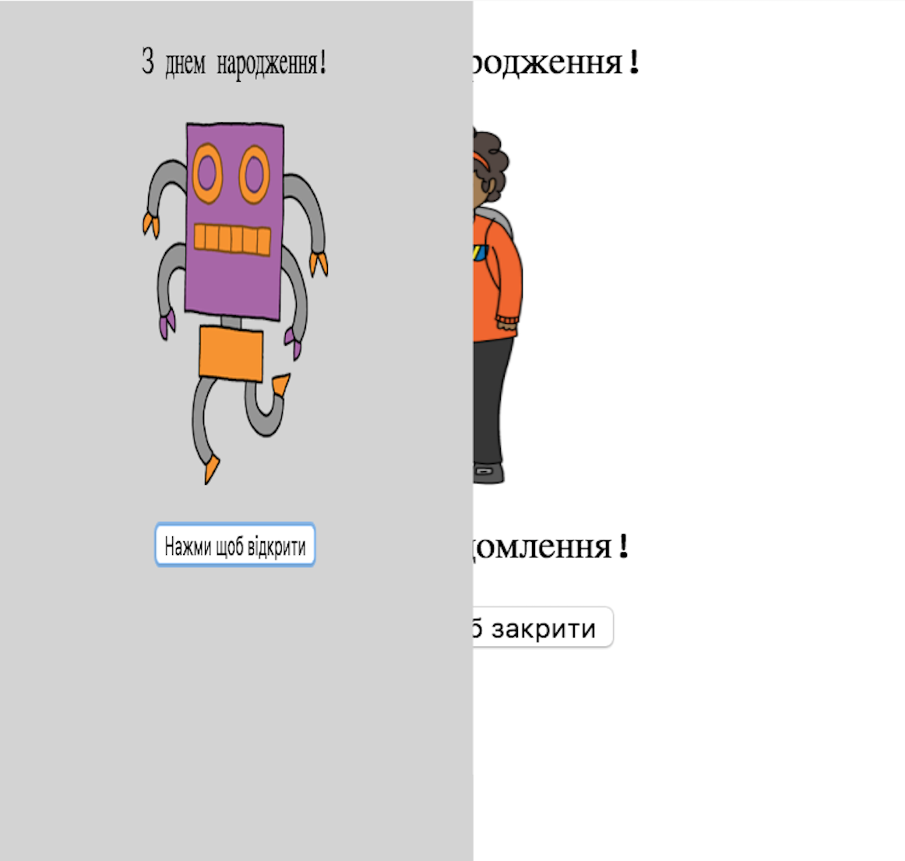

+ Перейдіть до 13-го рядка коду. Як і в попередньому прикладі, тут можна редагувати весь текст у форматі HTML, щоб змінити листівку.
    
    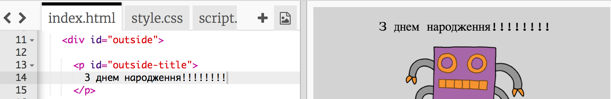

+ Можете знайти HTML для зображення робота? (Підказка: це 16-й рядок!) Змініть слово `robot` (робот) на `sun` (сонце) і побачите, що зображення змінилося!
    
    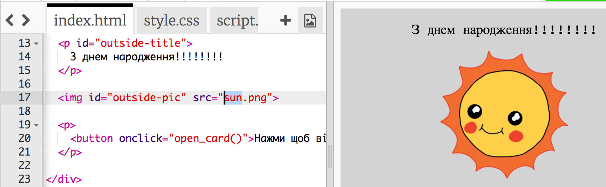
    
    Можете скористатись будь-яким зі слів: `boy` (хлопчик), `diamond` (діамант), `dinosaur` (динозавр), `flowers` (квіти), `girl` (дівчинка), `rainbow` (веселка), `robot` (робот), `spaceship` (зореліт), `sun` (сонце), `tea` (чай) чи `trophy` (приз).

+ Також можете відредагувати CSS вітальної листівки. Клацніть на вкладку "style.сss". Вона починається з усіх CSS для `outside` (зовнішньої сторони) листівки. Змініть `background-color` (колір тла) на `lightgreen` (салатовий).
    
    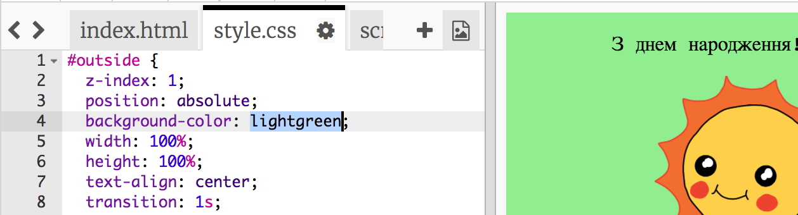

+ Ще можете змінити розмір зображення. Перейдіть до 29-го рядка CSS та змініть `width` (ширину) та `height` (висоту) зовнішнього зображення на `200px` (`px` означає pixels — пікселі).
    
    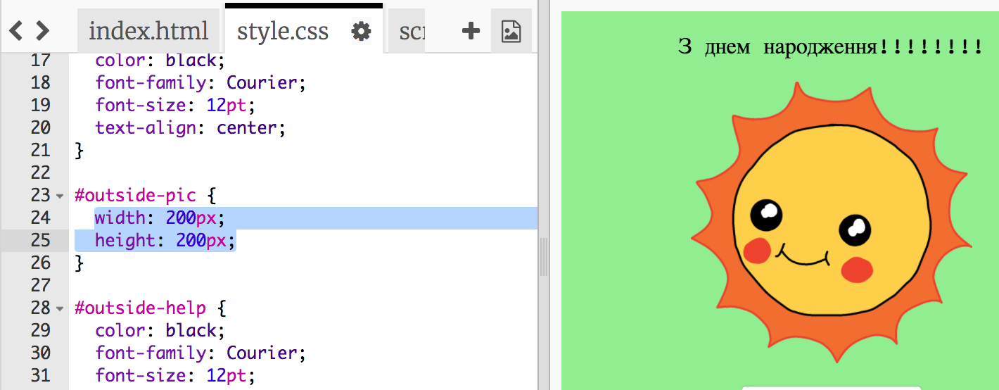

+ Шрифт також можна змінити. Перейдіть до 24-го рядка і змініть `font-family` (вид шрифту) на `Comic Sans MS`, а `font-size` (розмір шрифту) на `16pt`.
    
    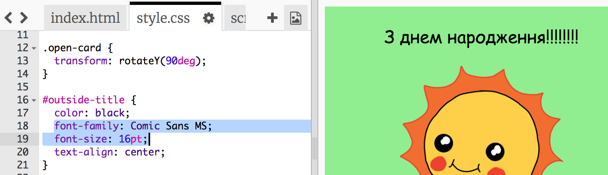
    
    Ще можете скористатись шрифтами arial, Impact та Tahoma.

## Збережіть свій проект {.save}

## Завдання: Створіть власну листівку {.challenge}

Скористайтесь усім, що дізнались про HTML і CSS, щоб закінчити власну листівку. Це не обов'язково має бути вітальна листівка до дня народження — нагода підійде будь-яка!

Ось приклад:

## Збережіть свій проект {.save}

Тепер, коли ви закінчили власну листівку, можете поділитись нею чи надіслати комусь електронною поштою.

