---
title: З'єднані кімнати
level: HTML & CSS 2
language: uk-UA
embeds: "*.png"
materials: ["Club Leader Resources/*.*","Project Resources/*.*"]
stylesheet: web
...

# Передмова {.intro}

У цьому проекті ви створите кілька з'єднаних кімнат, кожна з яких буде іншою веб-сторінкою, яку можна прикрасити за допомогою HTML.

  <iframe src="https://trinket.io/embed/html/ba5d27ec68?outputOnly=true&start=result" width="600" height="450" frameborder="0" marginwidth="0" marginheight="0" allowfullscreen>
  </iframe> 

**Інструкції**: клацніть на двері, щоб рухатись між кімнатами.

# Крок 1: Посилання на іншу сторінку з того ж проекту {.activity}

Веб-проекти можуть бути зроблені з багагатьох HTML файлів, з'єднаних між собою посиланнями.

## Список дій {.check}

+ Відкрийте цю чернетку: <a href="http://jumpto.cc/web-rooms" target="_blank">jumpto.cc/web-rooms</a>. Якщо ви читаєте це онлайн, то також можете використати вкладену чернетку нижче. 

  <iframe src="https://trinket.io/embed/html/ef608f0733" width="100%" height="400" frameborder="0" marginwidth="0" marginheight="0" allowfullscreen>
  </iframe>

+ Чернетка повинна сама запуститись, і ви опинитесь в Коридорі:
    
    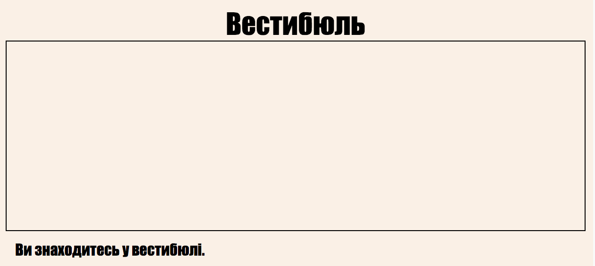

+ Подивіться на перелік вкладок файлів для цієї чернетки. Бачите `tvroom.html`? Клацніть його.
    
    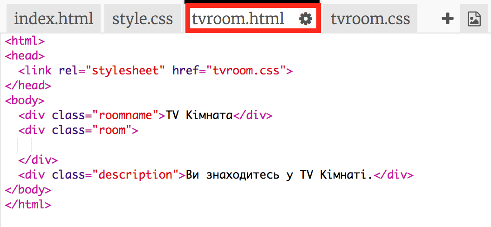
    
    Це інший файл html з цього ж проекту.

+ Щоб дістатись до `tvroom.html` треба додати посилання до `index.html`.
    
    Додайте виділений код всередину тегу `
` з класом `room`:
    
    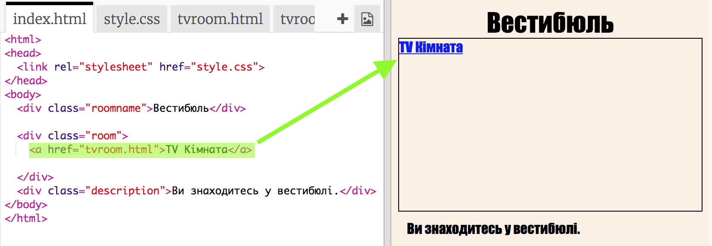

+ Протестуйте свою чернетку, клацнувши на **TV Room**, щоб побачити сторінку `tvroom.html`.
    
    Зауважте, що сторінка `tvroom.html` також має свій власний файл стилів `tvroom.css`, який визначає розташування елементів для цієї сторінки.
    
    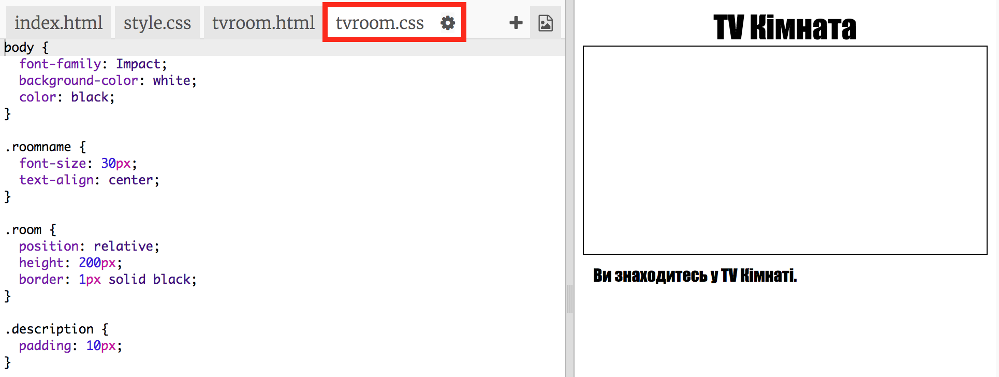

## Завдання: Додайте ще одне посилання {.challenge}

За допомогою тегу `<a>` додайте посилання на сторінку `tvroom.html`, що приведе вас назад на сторінку Коридору, яка має назву `index.html`. Текст посилання - 'Коридор'.

Тоді на сторінці Кімнати ТБ має з'явитись приблизно таке посилання:

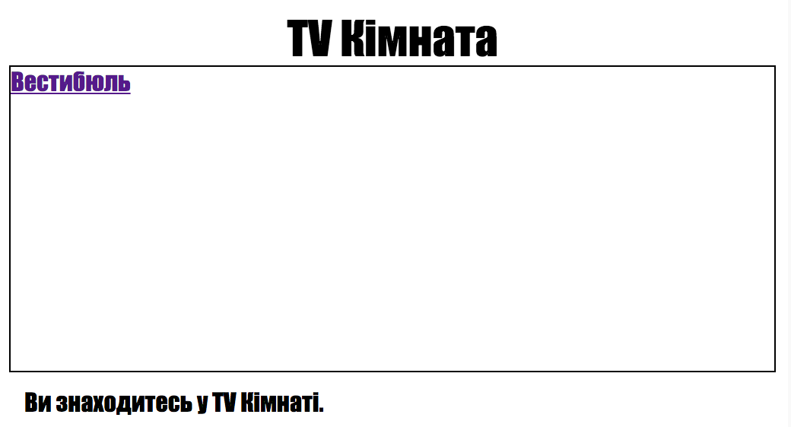

Обов'язково протестуйте код. Впевніться, що можете рухатись з Коридору в Кімнату ТБ і назад, натискаючи на посилання.

## Збережіть свій проект {.save}

# Крок 2: Додайте ще одну кімнату {.activity}

Тепер додамо ще одну кімнату, **Ігрову кімнату**.

+ Натисніть на клавішу add page **+**:
    
    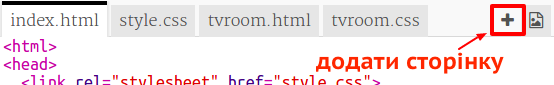
    
    Назвіть сторінку `gamesroom.html`:
    
    

+ HTML-код для **Ігрової кімнати** дуже схожий на код із `tvroom.html`, тому просто **скопіюйте** та **вставте** його до `gamesroom.html`.
    
    Змініть виділені елементи, щоб писало Games, а не TV:
    
    

+ Тепер `gamesroom.html` використовує `gamesroom.css`, якого поки що не існує.
    
    Створіть `gamesroom.css`, натиснувши на клавішу add page **+**.

+ CSS для **Ігрової кімнати** дуже схожий на `tvroom.css`, тому просто **скопіюйте** та **вставте** його до `gamesroom.css`.
    
    

+ Додайте посилання з Коридору до Ігрової кімнати:
    
    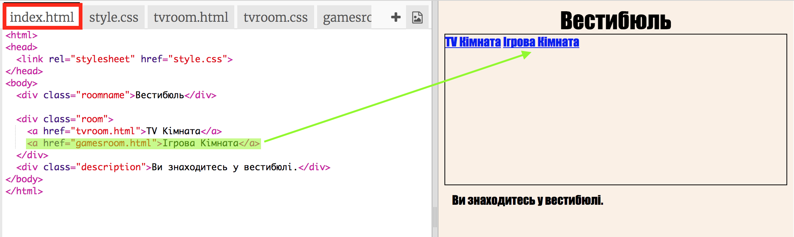

+ Протестуйте свій проект, клацнувши на посилання до Ігрової кімнати
    
    **Ігрова кімната** має виглядати десь так:
    
    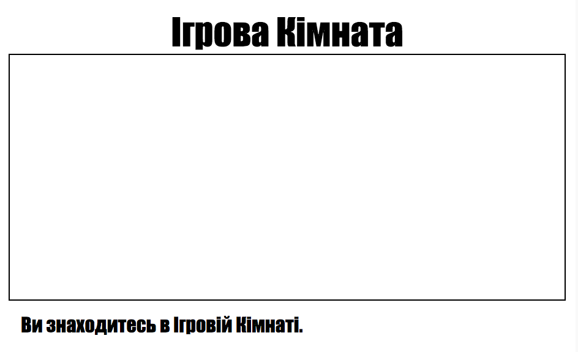
    
    Не дуже захопливо, але ви можете це виправити в наступному завданні.

## Збережіть свій проект {.save}

## Завдання: Стилі та посилання в Ігровій кімнаті {.challenge}

Змініть HTML та CSS **Ігрової кімнати** так, щоб сторінка мала такий вигляд:

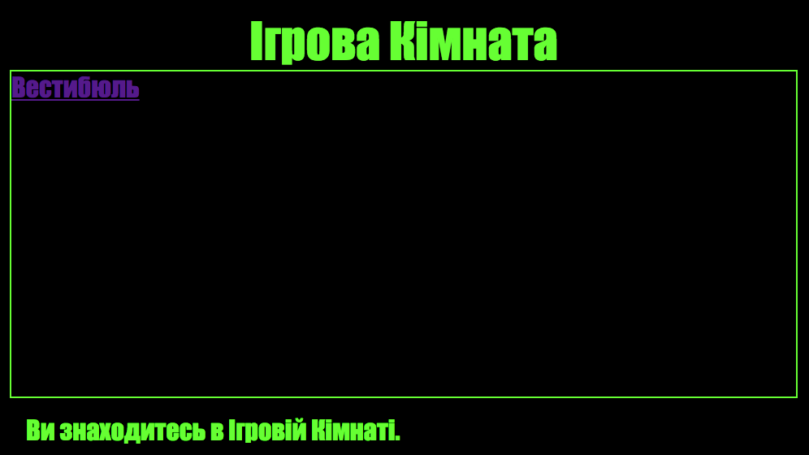

Підказка: Потрібно буде змінити кольори фону, шрифту та меж у `gamesroom.css`. Яскраво-зелений колір записується як `chartereuse`.

Підказка: Потрібно буде додати посилання через тег `<a>` у `gamesroom.html`, яке веде до `hall.html`.

## Збережіть свій проект {.save}

# Крок 3: Зробити посилання схожими на двері {.activity}

Посилання можуть бути не лише простим текстом. Давайте зробимо клікабельні двері, використовуючи тег `
`.

## Список дій {.check}

+ Відкрийте `index.html` та додайте `
` навколо напису **TV Room**. Він повинен бути всередині тегу `<a>`, щоб по ньому можна було клацати.
    
    Додайте `id="hall2tv"`, щоб позначити їх як двері з Коридору до Кімнати ТБ та мати змогу міняти їхній стиль.
    
    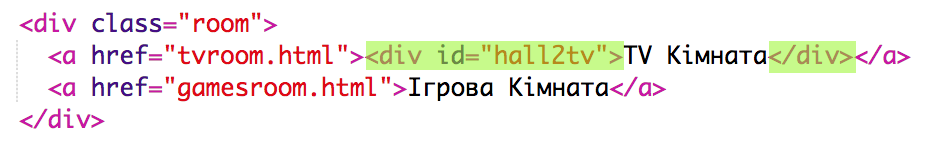

+ Клацніть на вкладці `style.css`, прокрутіть донизу та додайте такі рядки до CSS, щоб поміняти розмір та колір дверей:
    
    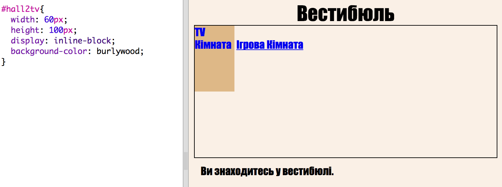

+ Протестуйте свою сторінку, клацаючи де-небудь на дверях, не тільки на тексті.

+ Давайте зробимо їх більш схожими на двері, додавши межі навколо трьох сторін:
    
    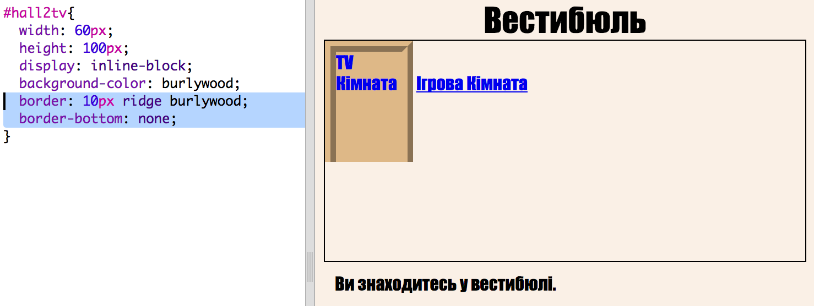

+ І ще додамо трохи CSS, щоб текст на дверях вигдядав краще:
    
    

+ Ви напевно помітили, що зараз двері висять у повітрі. Давайте виправимо це, розташувавши двері всередині кімнати.
    
    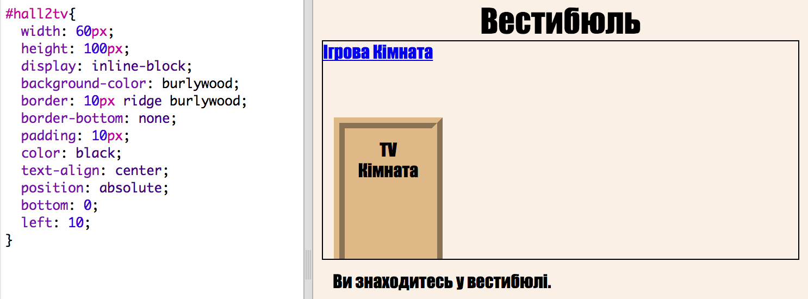

+ Протестуйте свою сторінку, клацнувши на дверях, що ведуть до **Кімнати ТБ**.

## Збережіть свій проект {.save}

## Завдання: Додайте більше дверей! {.challenge}

Таким же чином перетворіть решту посилань у вашому проекті на двері.

Для кожних дверей вам треба буде:

+ Змінити посилання на двері, додавши `
` з таким id, як `hall2games`, щоб мати змогу міняти стилі.
    
    Наприклад:
    
    `<a href="gamesroom.html">
Ігрова кімната
</a>`

+ Додайте CSS для id дверей до файлу `.css` відповідної кімнати. *Копіюйте* та *вставляйте*, щоб зекономити час. За бажанням, можете зробити всі двері різними.

+ Розмістіть двері за допомогою `bottom:` та `left:` або `right:`.

Коридор може виглядати отак:

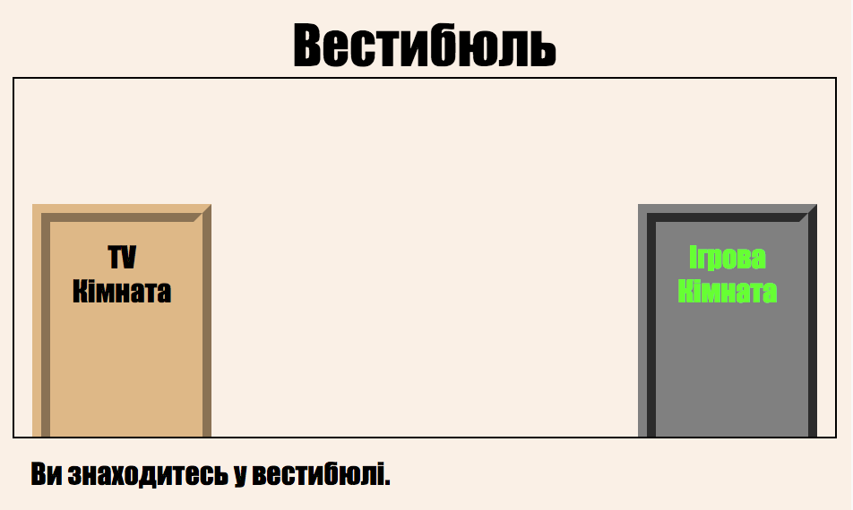

Кімната ТБ має виглядати приблизно так:

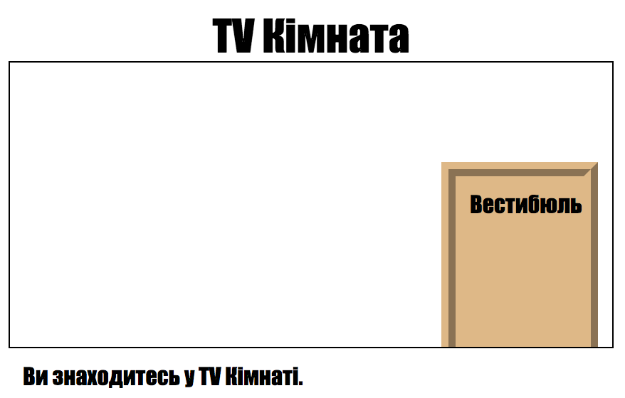

# Крок 4: Додавання фонового малюнку {.activity}

Давайте прикрасимо коридор фоновим малюнком.

## Список дій {.check}

+ Додайте фонове зображення до Коридору, змінивши `style.css`:
    
    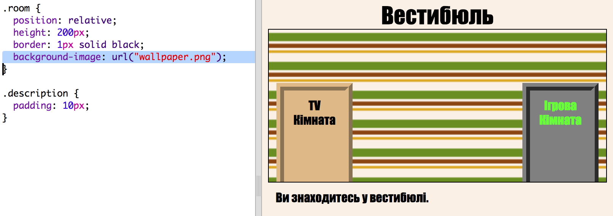
    
    Малюнок буде повторюватись, заповнюючи всю кімнату.

## Збережіть свій проект {.save}

## Завдання: Додайте шпалери в Ігрову кімнату {.challenge}

Ви зможете прикрасити Ігрову кімнату фоновим зображенням?

Як фон, можете взяти `space-invader.png`, що міститься у вашому проекті.

Потрібно буде:

+ Додати `background-image:` до `.room` CSS Ігрової кімнати. 

Розмальована кімната виглядатиме ось так:

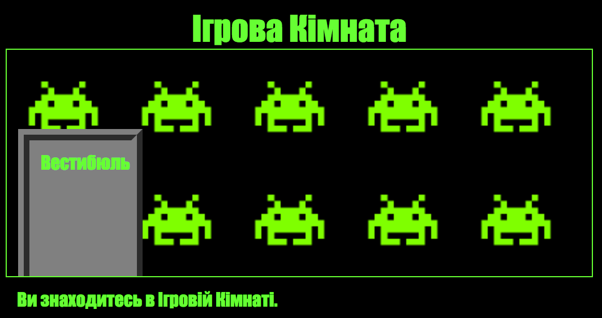

## Збережіть свій проект {.save}

## Завдання: Зробіть проект своїм! {.challenge}

Додайте ще кімнат до проекту. Пам'ятайте, що можете використовувати **копіювати** та **вставити**, щоб зекономити час, а далі лише міняйте те, що має відрізнятись.

Для кожної кімнати потрібно:

+ Створити файл `.html`
+ Додати посилання-двері з і до нової 'кімнати'
+ Створити файл `.css` зі стилями нової кімнати та її дверей

Можна змінювати `background-color:` у кожній кімнаті. Клацніть на значок зображень, щоб побачити, які фонові малюнки можна обрати:

## Збережіть свій проект {.save}