---
title: Журнал
level: HTML & CSS 2
language: uk-UA
embeds: "*.png"
materials: ["Club Leader Resources/*.*","Project Resources/*.*"]
stylesheet: web
...

# Передмова {.intro}

Цей проект навчить вас, як використовувати HTML та CSS для створення веб-сайту багатосторінкового журналу, макет якого складатиметься із двох сторінок. Також ви будете мати змогу переглянути багато методів із інших проектів.

  <iframe src="https://trinket.io/embed/html/a41e4e1c5c?outputOnly=true&start=result" width="600" height="500" frameborder="0" marginwidth="0" marginheight="0" allowfullscreen>
  </iframe> 

# Крок 1: Заголовок і фон

Веб-сайти у стилі журналів часто містять на сторінці багато дрібних об'єктів. Спершу вам потрібно створити для свого журналу заголовок та фон.

## Список дій {.check}

+ Відкрийте цю чернетку: <a href="http://jumpto.cc/web-magazine" target="_blank">jumpto.cc/web-magazine</a>. Якщо ви читаєте це онлайн, то можете також використати вкладений варіант цієї чернетки нижче.

  <iframe src="https://trinket.io/embed/html/cef5e64bc0" width="100%" height="400" frameborder="0" marginwidth="0" marginheight="0" allowfullscreen>
  </iframe>

+ Давайте додамо заголовок.
    
    Ви можете вигадати кращий заголовок для свого журналу.
    
    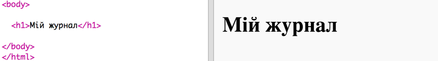

+ Можете красиво оформити заголовок?
    
    Ось приклад, але ви можете обрати свій власний стиль:
    
    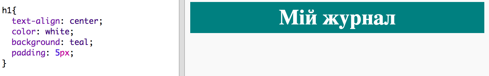

+ А зараз давайте створимо цікавий фон, використовуючи градієнтну палітру кольорів, і виберемо шрифт для журналу.
    
    Ось приклад стилю, щоб нагадати вам, як створювати градієнт:
    
    

## Збережіть свій проект {.save}

# Крок 2: Створення стовпців

Веб-сайти часто використовують кілька стовпців. Давате створимо двостовпцевий макет для вашоо журналу.

## Список дій {.check}

+ Спершу створіть два стовпці `div`s.
    
    Додайте виділений HTML до `index.html`:
    
    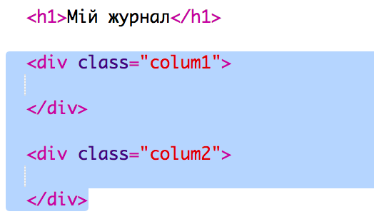

+ Тепер оформіть div-и стовпців таким чином, щоб один із них опинився ліворуч, а інший - праворуч.
    
    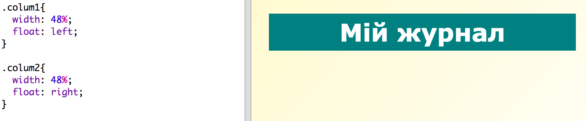
    
    Кожен стовпець займає менше 50%, тож у вас є місце, яке потрібно заповнити.
    
    Потрібно додати щось у цей стовпець, щоб побачити ефект.

+ Давайте помістимо вгорі стовпця 2 зображення кошеняти.
    
    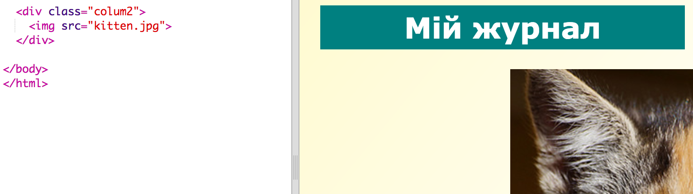
    
    Зверніть увагу, що зображення кошеняти розміщене приблизно посередині сторінки у другому стовпці.
    
    Проте воно трохи завелике!

+ Давайте використаємо `max-width:`, щоб надати зображенню того розміру, який нам потрібен.
    
    Додайте до `style.css` наступний стиль.
    
    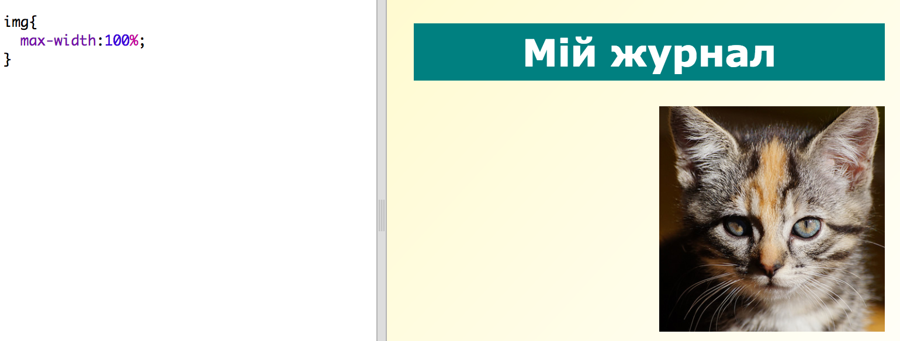
    
    Він буде застосовуватися до всіх зображень, які ви будете використовувати у своєму журналі, а не лише до зображення кошеняти.

+ Тепер додайте до зображення клас `photo`, щоб мати змогу оформити його:
    
    

+ Тепер оформіть зображення, додавши тіні та повороти, щоб здавалося, ніби фото "вистрибує" зі сторінки:
    
    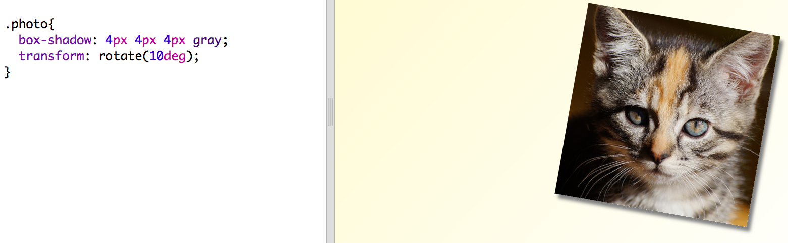
    
    Змінюйте щось доти, доки вам не сподобається результат.

# Крок 3: Оформлення елементів журналу

Давайте зробимо макет трохи цікавішим.

## Список дій {.check}

+ Додайте навколо свого зображення `div` із `class`, а також заголовок `h2`:
    
    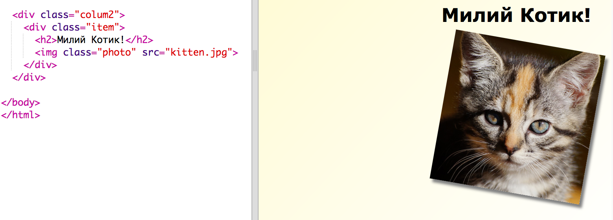

+ Тепер відформатуйте елемент і заголовок.
    
    Ось приклад, але ви можете внести свої зміни:
    
    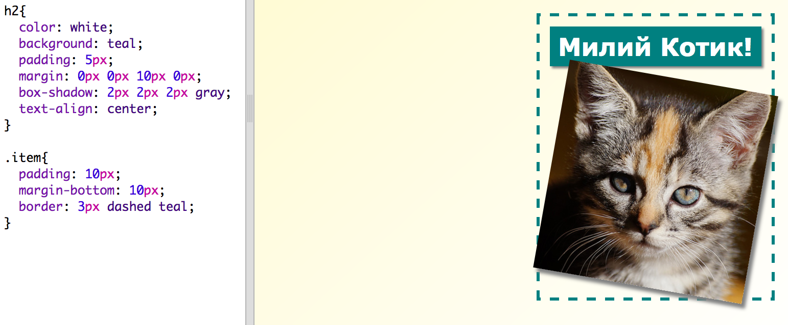

## Збережіть свій проект {.save}

## Завдання: Додайте елементи до лівого стовпця {.challenge}

Можете додати до лівого стовпця впорядкований список і градієнтний стікер з текстом?

Ось приклад:

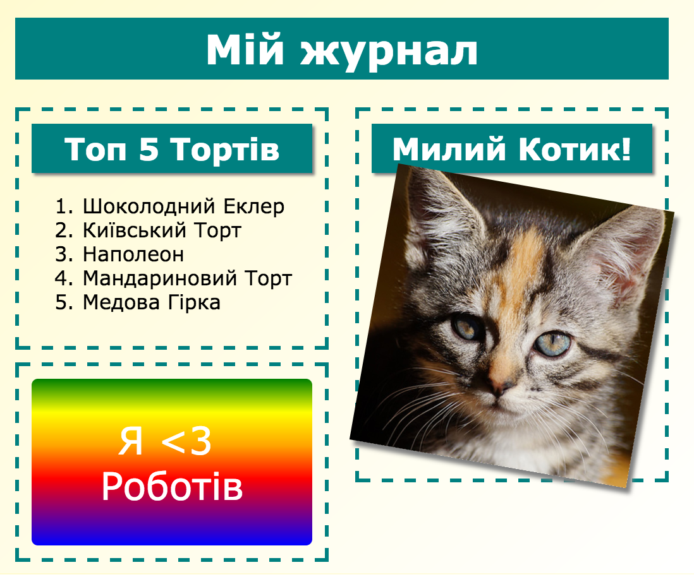

Нижче наведений код для прикладу, але ви можеш змінити його або вигадати свій власний.

HTML:

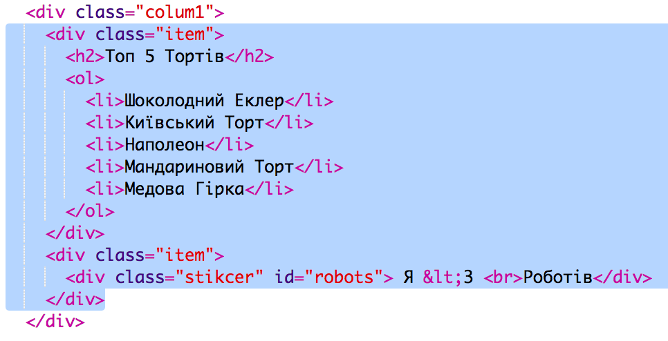

CSS:

## Збережіть свій проект {.save}

# Крок 4: Створення другої сторінки

Давайте створимо ще одну сторінку для сайту вашого журналу.

## Список дій {.check}

+ Додайте нову сторінку до вашого проекту і назвіть її `page2.html`:

+ Сторінка 2 буде трохи схожа на першу сторінку вашого журналу, тож ви можете скопіювати HTML з `index.html` і вставити його в `page2.html`.

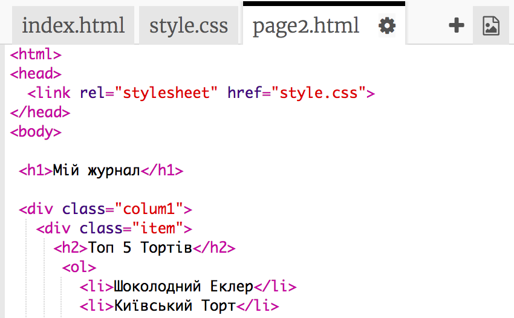

Зверніть увагу, що для обох сторінок використовується `style.css`, тож вони матимуть однаковий стиль.

+ Змініть заголовок `<h1>` для сторінки 2: 

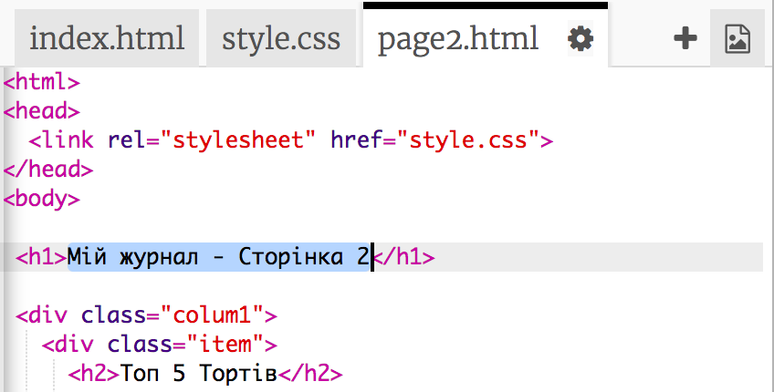

+ Тепер вам потрібно створити зв'язок між сторінками за допомогою посилань, щоб мати змогу переходити з одної сторінки на іншу. 

Поверніться до `index.html`. Додайте посилання всередині div у стовпці 2 в `index.html`:

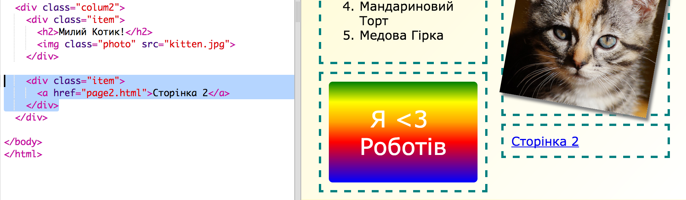

+ Перевірте чи ви зможете перейти до сторінки 2 вашого журналу, клацнувши на нове посилання. 

## Завдання: Додайте посилання для повернення на першу сторінку {.challenge}

Можете додати посилання до `page2.html` так, щоб, клацнувши на нього, ви могли повернутися на першу сторінку?

Підказка: Подивіться на HTML, який ви використовували, щоб створити посилання для переходу на сторінку 2.

## Завдання: Заповніть другу сторінку {.challenge}

Ось код для прикладу, але ви можеш змінити `div`и або вигадати щось своє.

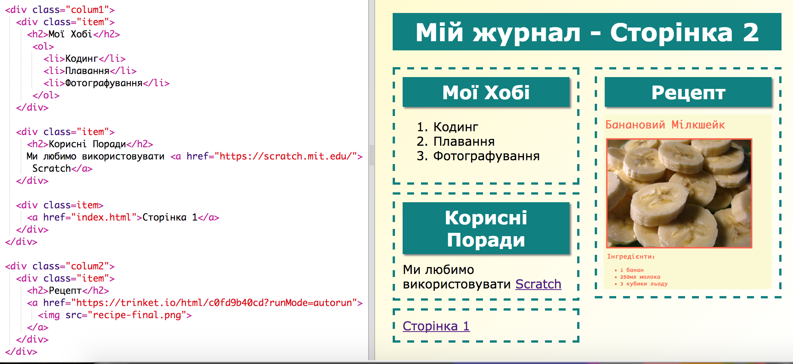

Клацніть на значок зображення, щоб побачити доступні для використання зображення:

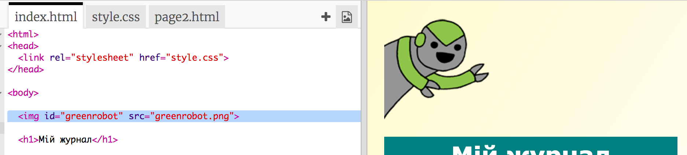

Пам'ятайте, що ви можете завантажувати і використовувати власні зображення. Переконайся, що маєте дозвіл на використання зображеннь, які ви завантажуєте.

# Крок 5: Додавання анімації

Давайте додамо до вашого журналу якусь веселу анімацію.

## Список дій {.check}

+ Перейдіть до `index.html` і помістіть вгорі вашої сторінки зображення `greenrobot.png`. 

+ Тепер додайте CSS, щоб "оживити" вашого робота:

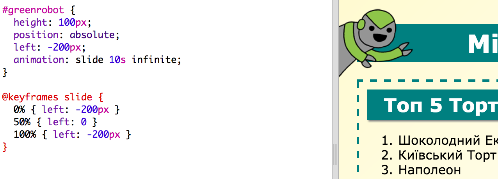

## Завдання: Додайте ще одну анімацію {.challenge}

Можете додати анімацію на другу сторінку вашого журналу?

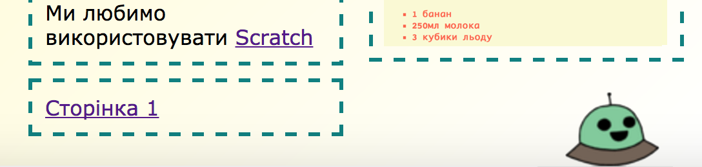