---
title: Загадковий Лист
level: HTML & CSS 1
language: uk-UA
embeds: "*.png"
materials: ["Club Leader Resources/*.*","Project Resources/*.*"]
stylesheet: web
...

# Передмова {.intro}

У цьому проекті ви будете створювати лист, кожна літера якого ніби вирізана з газети, журналу, коміксу чи чогось іншого.

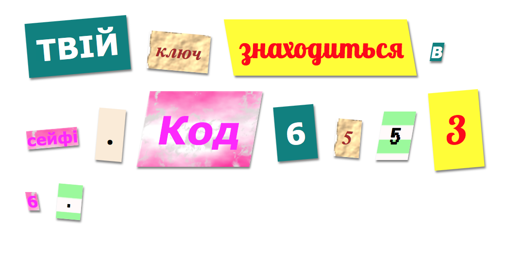

# Крок 1: Оберіть повідомлення {.activity}

Загадкові листи використовують у фільмах та книжках щоб надсилати таємні повідомлення.

## Список дій {.check}

+ Подумайте про загадкове повідомлення, 12 слів буде достатньо. Якщо ти не можеш придумати повідомлення, ти можеш скористатися прикладом: 'Ваш наступний ключ знаходиться в сейфі. Код 65536.'

+ Занотуйте своє повідомлення або запам'ятайте його.

# Крок 2: Відредагуйте своє повідомлення {.activity}

Помістіть своє повідомлення на веб-сторінку.

## Список дій {.check}

+ Відкрийте цю чернетку: <a href="http://jumpto.cc/web-letter" target="_blank">jumpto.cc/web-letter</a>. Якщо ви читаєте це онлайн, то також можете використати вкладену чернетку нижче.

  <iframe src="https://trinket.io/embed/html/b5fbcf112e" width="100%" height="400" frameborder="0" marginwidth="0" marginheight="0" allowfullscreen>
  </iframe>

+ Тег параграфу `
` вже використовувався в проекті 'З Днем народження'. Тег `` використовується для групування менших частин тексту у параграфі, щоб ми могли їх форматувати. 

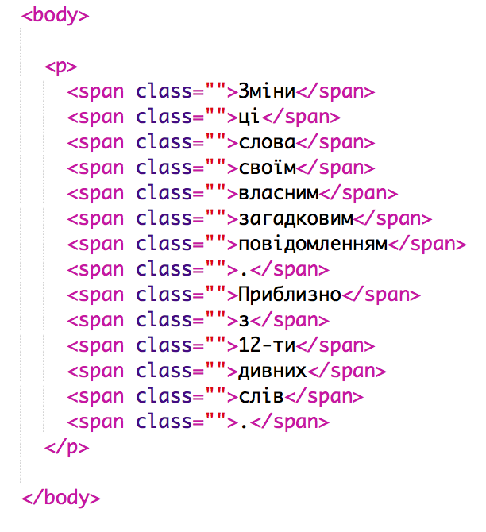

## Список дій {.check}

+ Замініть слова у повідомленні, додаючи одне слово в кожен ``. Вам потрібно буде додати або видалити тег `` якщо повідомлення зміниться за розміром. 

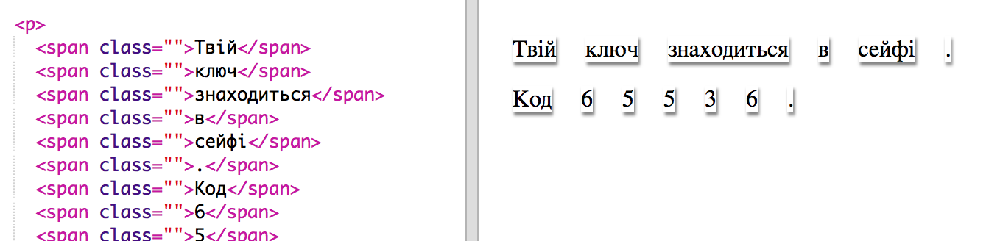

## Список дій {.check}

+ Натисніть кнопку Запустити щоб протестувати вашу чернетку.
    
    Якщо ви поглянете на слова, то побачите, що вони стилізовані так, ніби застрягли на сторінці.

# Крок 3: Використання Стилів Класу {.activity}

## Список дій {.check}

+ Чи помітили ви `class=""` у тегу ``? Ви можете використовувати це, щоб стилізувати більш ніж одну річ таким же чином.

+ Додайте `magazine1` до декількох ваших тегів `` і протестуйте свою сторінку.

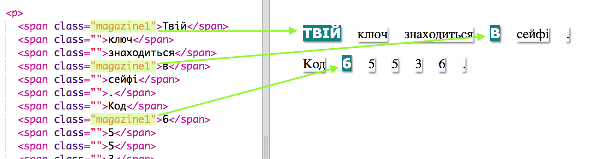

## Список дій {.check}

+ Ви можете додати більше ніж один клас до елементу. Просто залиште між ними пробіл. Додайте `big` клас до одного з ваших `` тегів. Протестуйте сторінку. 

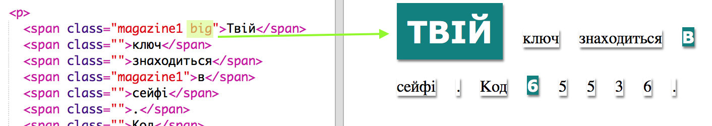

## Збережіть свій проект {.save}

## Виклик: Стилізуйте своє повідомлення {.challenge}

Використовуйте надані стилі, щоб ваше повідомлення виглядало наче загадковий лист.

Додайте класи до ваших `` тегів:

+ `newspaper`, `magazine1`, `magazine2`

+ `medium`, `big`, `reallybig`

+ `rotateleft`, `rotateright`

+ `skewleft`, `skewright`

Не додавайте більше ніж один з кожного рядка в певний ``.

Так може виглядати ваш лист:

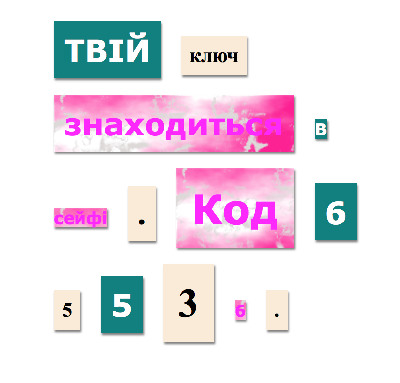

## Збережіть свій проект {.save}

# Крок 4: Редагування Класів {.activity}

## Список дій {.check}

+ Натисніть на вкладку **'style.css'**. Знайдіть стиль для `newspaper` клас CSS, який ви використовували.

+ Зверніть увагу, що є точка (крапка) '.' перед назвою класу у файлі CSS, але не у тезі `` у вашому HTML документі.

+ Тепер подивіться на інші CSS класи, які ви використали для стилізації вашого загадкового листа. Ви можете знайти:
    
    + Як стиль `magazine1` змінює текст (на всі великі літери).
    
    + Як стиль `magazine2` ставить зображення за текстом.

+ Що станеться, якщо змінити `background-image` для `magazine2` на `canvas.png`? Якщо ви надаєте перевагу `pink-pattern.png`, то змініть його назад. 

Також, за бажанням, можна змінити кольори стилю у журналі.

+ Знайдіть CSS, який використовується для повертання і нахилу (схилу) наших слів:

Спробуйте змінити цифри для створення різних ефектів, а потім протестувати вашу сторінку.

# Крок 5: Створення Нового Класу {.activity}

Давайте створимо стиль, щоб він виглядав наче з коміксу. <a href="http://jumpto.cc/web-fonts" target="_blank">jumpto.cc/web-fonts</a> забезпечує завантаження шрифтів, які безкоштовні для використання.

## Список дій {.check}

+ Додати клас `comic` у файлі **style.css**. Після того, як `magazine2` буде правильно розташований. Не забувайте про крапку перед ім'ям класу. 

Не хвилюйтеся, якщо ви отримуєте попередження "Правило порожнє', потім ви це виправите.

+ Тепер додайте трішки CSS до комічного CSS класу. За бажанням ви можете використовувати різні кольори. Існує список уже завантажених кольорів на <a href="http://jumpto.cc/web-colours" target="_blank">jumpto.cc/web-colours</a>.

+ Використайте стиль коміксів в деяких тегах `` у своєму HTML документі і протестуйте свою сторінку:

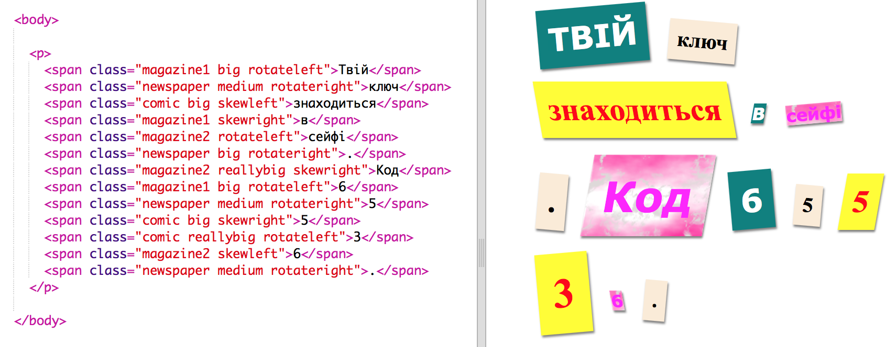

+ Тепер ви можете додати смішний шрифт. Відкрийте нову вкладку чи вікно. Перейдіть на <a href="http://jumpto.cc/web-fonts" target="_blank">jumpto.cc/веб-шрифти</a> й знайдіть**'bangers'**:

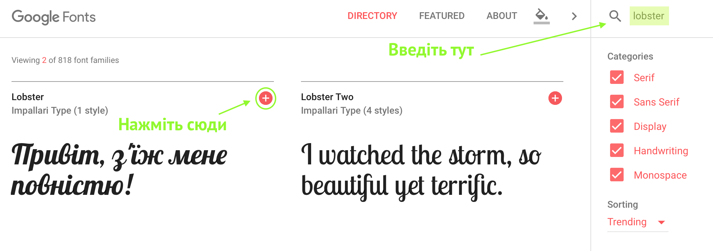

+ Натисніть на кнопку Швидкого використання:

+ Коли нова сторінка буде завантажена, прокручуйте вниз, поки не побачите:

і скопіюєте виділений код.

+ Вставте код `<link>`, який ви щойно скопіювали з Google шрифтів, в `<head>` веб-сторінки:

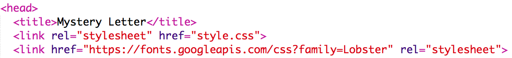

Це дає змогу використовувати шрифт Bangers на ваших веб-сторінках.

+ Поверніться до Google шрифтів, прокрутіть далі у низ сторінки і скопіюйте код сімейства-шрифів:

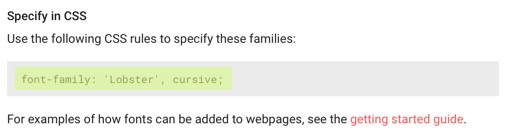

+ Тепер поверніться назад до вашого файлу **'style.css'** в чернетці і вставте код шрифту в стиль коміксу:

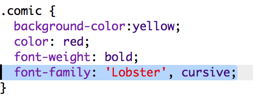

+ Перевірте свою веб-сторінку. Результат має виглядати приблизно так: 

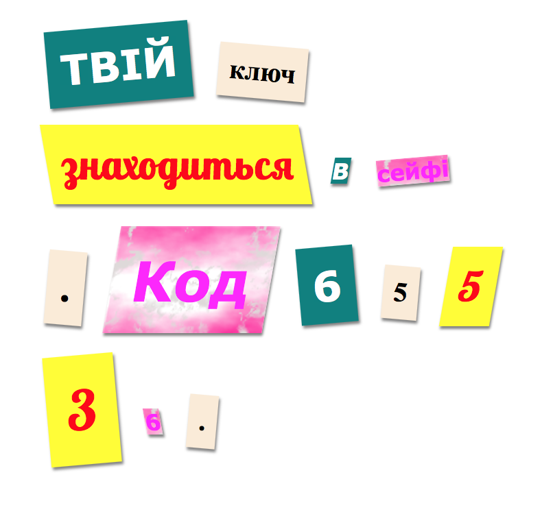

## Збережіть свій проект {.save}

## Завдання: Створіть стиль комп'ютерного друку {.challenge}

Створіть стилю друку старомодного комп'ютера і застосуйте його до деяких слів:

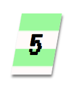

Вам знадобиться:

+ Сім'я шрифтів `VT323` з <a href="http://jumpto.cc/web-fonts" target="_blank">jumpto.cc/web-fonts/1>. Погляньте ще раз на Крок 5, якщо вам потрібне нагадування про використання Google шрифтів.
</li> 
    
    <li>
      

        Фонове зображення <code>computer-printout-paper.png</code>. Погляньте ще раз на Крок 4, якщо вам потрібне нагадування про використання фонових зображень.
      

    </li></ul> 
    
    <h2 class="challenge">
      Завдання: Створіть власні стилі
    </h2>
    
    

      Тепер створіть ваші власні стилі класу і зробіть ваш загадковий лист ще більш цікавим. Використайте CSS стилі, які ви вивчили у попередніх проектах та подивіться на приклади в <strong>style.ccs</strong> для ідей.
    

    
    

      Ось приклад:
    

    
    

      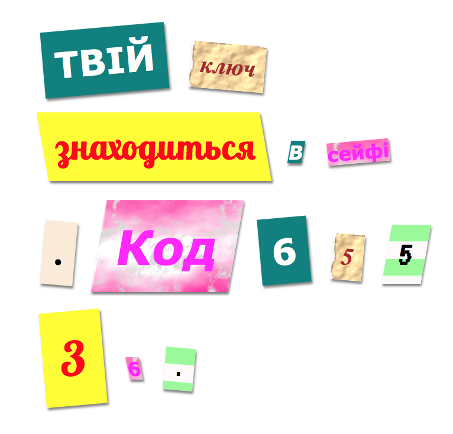
    

    
    

      Ви можете побачити зображення, які можна використовувати, натиснувши на вкладку Зображення у чернетці. Спробуйте встановити зображення фону за допомогою одного із цих зображень:
    

    
    <ul>
      <li>
        

          <code>rough-paper.png</code>
        

      </li>
      
      <li>
        

          <code>canvas.png</code>
        

      </li>
    </ul>
    
    

      Якщо у вас є обліковий запис чернетки, ви можете самостійно завантажити зображення так, як ви це робили для проекту 'Розкажи історію'.
    

    
    

      Знайти шрифти, які вам подобаються на <a href="http://jumpto.cc/web-fonts" target="_blank">jumpto.cc/web-fonts</a>, скопіюйте їх<code>&lt;link&gt;</code> та CSS код до своєї чернетки і використайте їх.
    

    
    <h2 class="save">
      Збережіть свій проект
    </h2>