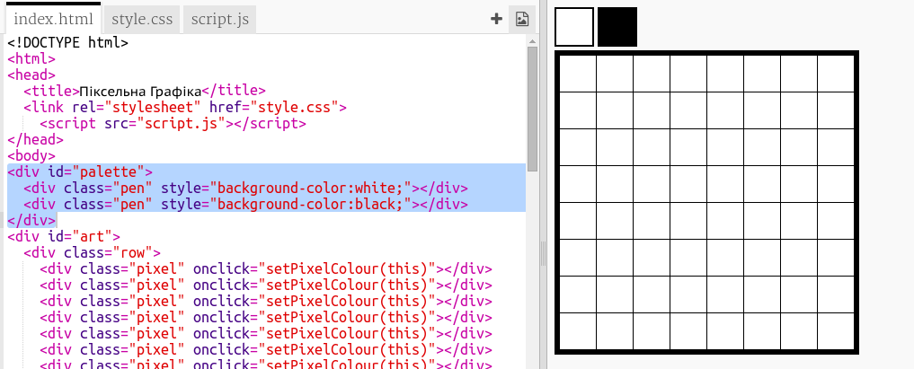

---
title: Піксельна графіка
level: HTML & CSS 2
language: uk-UA
embeds: "*.png"
materials: ["Club Leader Resources/*.*","Project Resources/*.*"]
stylesheet: web
...

# Передмова {.intro}

У цьому проекті ви створите редактор піксельної графіки. А також, застосовуючи HTML та CSS, ви дізнаєтесь як використовувати мову програмування JavaScript для створення інтерактивних веб-сторінок.

  <iframe src="https://trinket.io/embed/html/0e102a306b?outputOnly=true&start=result" width="600" height="450" frameborder="0" marginwidth="0" marginheight="0" allowfullscreen>
  </iframe> 

**Як використовувати редактор**: Натисніть на колір з палітри, для того щоб вибрати колір вашого пера, після цього натисніть на пікселі для зміни їхнього кольору.

# Крок 1: Створення сітки пікселів {.activity}

Зробімо сітку пікселів, яку ви можете використовувати для створення піксельної графіки. CSS надає стилі таблиці для сітки та макетів таблиці.

Таблиці містять рядки, які містять клітинки. Ви збираєтесь створити таблицю з чорним фоном і потім помістити в неї білі пікселі.

## Список дій {.check}

+ Відкрийте цю чернетку: <a href="http://jumpto.cc/web-pixel" target="_blank">jumpto.cc/web-pixel</a>. Якщо ви читаєте це онлайн, то також можете використати вкладену чернетку нижче. 

  <iframe src="https://trinket.io/embed/html/705f264f59" width="100%" height="400" frameborder="0" marginwidth="0" marginheight="0" allowfullscreen>
  </iframe>

+ Додайте цей html код до `<body>` файлу `index.html`, для того щоб створити `
`, який буде містити вашу піксельну графіку. Додатково, надайте своєсо html коду, ідентифікатор `мистецтво`, щоб можна було його стилізувати:
    
    
    
    Тепер перейдіть до вашого `style.css` файлу і додайте стиль таблиці для графіки `
`. Зверніть увагу, що три рядки пікселів однакові. Введіть перший рядок і потім скопіюйте інші.
    
    
    
    Це створює таблицю з межею і встановлює відступи всередині сітки.
    
    Це не виглядає дуже цікаво поки що, але вам потрібно вставити рядки пікселів всередині таблиці.
    
    + Тепер повернімось до вашого `index.html` файлу і додамо рядок з 3 пікселів всередину графіки `
`:
    
    
    
    Цього разу ви використає класи, щоб стилізувати теги div, так як вони будуть зустрічатися часто.
    
    Додайте наступний стиль для рядків та клітинок:
    
    
    
    Тепер ваші пікселі будуть вибудовуватися в сітці з чорними лініями навколо них.
    
    + Тепер додайте ще два рядки пікселів для створення сітки 3 x 3. Пам'ятайте, щоб заощадити час використовуйте копіювання та вставку. 
    
    

## Завдання: Змініть розмір сітки {.challenge}

3x3 це мала сітка піксельної графіки. Чи можете ви зробити її більшою, розміро наприклад 8x8.

Спробуйте використовувати вирізання і вставку замість введення всього вручну.

## Збережіть свій проект {.save}

# Крок 2: Розмальовуємо пікселі {.activity}

HTML використовується для організації коду, а CSS - для його стилізування. JavaScript є мовою програмування, що використовується для зміни веб-сторінки, під час взаємодії з нею.

Ви можете використати HTML та CSS для встановлення фонового кольору окремих пікселів, але це буде дуже повільно! Замість цього ви додасьте код JavaScript, щоб розмальовувати пікселі автоматично при натисканні на них.

+ В мові програмування JavaScript код розміщується всередині функції `function`, яку можна викликати, коли ми хочемо запустити код.
    
    Ви створите функцію під назвою `setPixelColour`
    
    Функція `setPixelColour` повинна знати колір якого пікселя потрібно змінити, це є `input` (вхідні дані).
    
    Додайте наступний код до файлу `script.js` для встановлення фонового кольору пікселя:
    
    
    
    Зверніть увагу, що `backgroundColor` використовує американське написання кольору.

+ Тепер нам потрібно викликати функцію, коли піксель натиснутий.
    
    Щоб викликати функцію, коли натиснуто на елемент, HTML використовує атрибут `onclick`. Потрібно буде передати "цей" як у вхідні дані, так що ваша функція знала колір якого пікселя потрібно змінити.
    
    Перейдіть до файлу `index.html` та додайте наступний код до першого пікселя:
    
    

+ Перевірте свій код, натиснувши на перший піксель. Він повинен стати чорним:
    
    
    
    Ви тільки додали `onclick` код до першого пікселя, тому це не буде поки працювати для інших пікселів.

## Завдання: Зробіть всі пікселі клікабельними {.challenge}

Чи можете ви зробити так, щоб на всі пікселі можна було натиснути? Використовуйте вирізання та вставку для того, щоб зробити це швидше.

Створіть швидко частинку піксельної графіки.

Порада: Ви можете клікнути **Запустити автоматично**, щоб очистити всі пікселі.

# Крок 3: Додати палітру кольорів {.activity}

Вас також дратує те, що ви не можете змінити колір пікселя назад до білого, якщо зробили помилку? Давайте виправимо це, створивши палітру кольорів так, щоб ви змогли натиснути на колір для зміни пера.

+ Спочатку створіть стиль пера.
    
    Додайте наступний код у нижню частину вашого файлу `style.css`:
    
    

+ Тепер створіть чорне і біле кольорове перо, яке використовує цей стиль.
    
    Додайте наступний код до файлу `index.html` після `<body>`:
    
    
    
    `style=` дозволяє додавати CSS всередині HTML, що досить зручно.

+ Було б добре змінювати колір пера, після натискання на колір палітри.
    
    Змінні використовують для зберігання інформації. Давайте створимо змінну penColour в `script.js`.
    
    Додайте наступний код у верхню частину файлу:
    
    
    
    Потім додайте функцію, щоб змінити penColour:
    
    

+ Вам також буде потрібно використати колір пера щоб змінити колір пікселю.
    
    Змініть функцію `setPixelColour` для того, що використати змінну `penColour` замість `чорного`:
    
    

+ Тепер вам потрібно викликати функцію`setPenColour`, коли вибрано колір пера.
    
    Додайте виділений код `onclick` до ваших кольорів пера:
    
    

+ Тепер перевірте, чи ви можете перемикатися між чорним і білим кольором пера, щоб замальовувати і видаляти пікселі.

## Збережіть свій проект {.save}

## Завдання: Додайте більше кольорів до палітри {.challenge}

Чи можете ви додати більше кольорів до палітри? Виберіть кольори, з якими ви хочете створити піксельну графіку.

Потім створіть якусь класну піксельну графіку.

Підказка: яскраво-зелений колір називається `chartreuse`.

Запитайте вашого лідера клубу чи ви можете використати програму Windows Snipping Tool або альтернативну програму, щоб зберегти копію вашої графіки як зображення.

## Збережіть свій проект {.save}