---
title: Проект Вітрина
level: HTML & CSS 1
language: uk-UA
embeds: "*.png"
materials: ["Club Leader Resources/*.*","Project Resources/*.*"]
stylesheet: web
...

# Передмова {.activity}

В цьому проекті, ви створите вітрину власних HTML проектів та дізнаєтеся про посилання і вбудовування матеріалів.

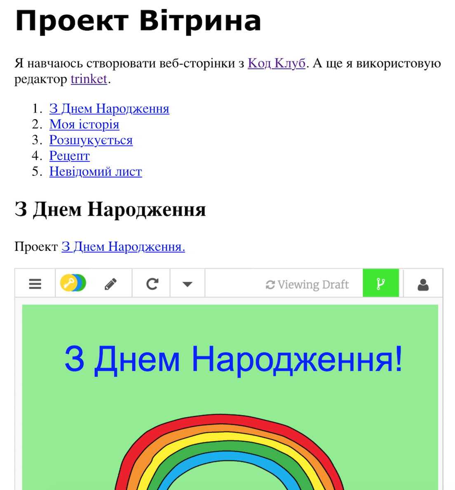

# Крок 1: Додаємо посилання на веб-сторінки {.activity}

Текстові посилання дають можливість переходити на іншу сторінку, зазвичай вони підкреслені.

## Список дій {.check}

+ Відкрийте редактор: <a href="http://jumpto.cc/web-robot" target="_blank">jumpto.cc/web-robot</a>. Якщо ви читаєте це онлайн, то також можете використати версію, яка вбудована нижче. 

  <iframe src="https://trinket.io/embed/html/9ad31460f0" width="100%" height="400" frameborder="0" marginwidth="0" marginheight="0" allowfullscreen>
  </iframe>

+ HTML використувує `<a>` позначки для посилань. 

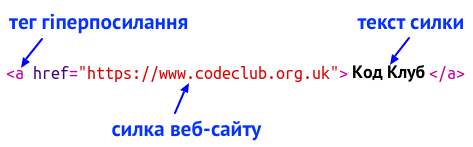

+ Знайди таку позначку `<a>` у своєму проекті. 

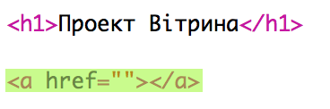

+ Додайте адресу веб-сайту Code Club [`https://www.codeclub.org.uk`](https://www.codeclub.org.uk) і текст посилання:

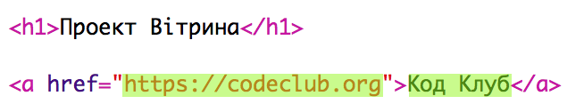

+ Натисніть кнопку "Запустити", щоб протестувати вашу чернетку.

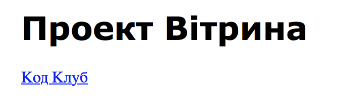

+ Натисніть на посилання Code Club, щоб перевірити свою веб-сторінку. Тепер ваша чернетка має показувати веб-сторінку Code Club: 

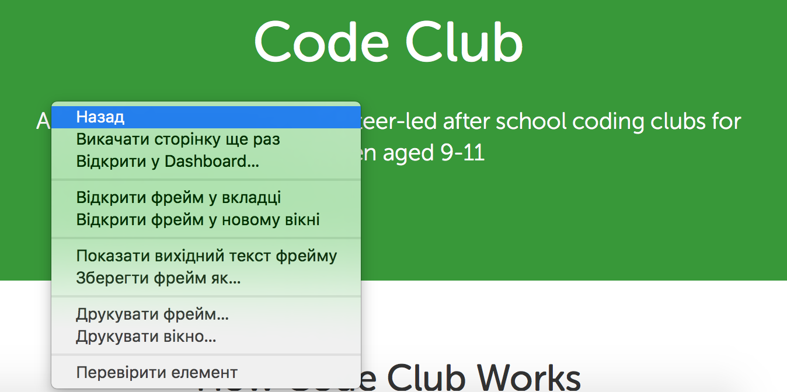

+ Є такі способи повернутися на свою сторінку:
    
    + Знову запустити чернетку,
    
    + Натисніть клавішу "Backspace", або
    
    + Натисніть на праву кнопку миші і виберіть "Назад".

## Список дій {.check}

+ Тепер вставте посилання у речення в абзаці:

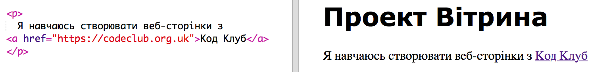

Перевірте вашу сторінку.

## Завдання: Додайте ще одне посилання {.challenge}

Додайте речення з посиланням на веб-сайт, який був корисним при створенні веб-проектів. Наприклад: <https://trinket.io> або <http://colours.neilorangepeel.com>.

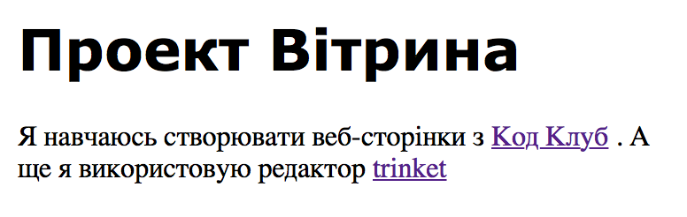

# Зберегти {.activity}

# Крок 2: Посилання на чернетку {.activity}

Ви можете зробити посилання на веб-сторінку через чернетку.

## Список дій {.check}

+ Чи зберегли ви посилання на чернетку "З днем народження"? Якщо так, то відкрийте її в іншому браузері або вікні. В інакшому випадку, відкрийте завершену чернетку- зразок: <https://trinket.io/html/e996dc0380>

+ Натисніть на клавішу "Поділитись" в меню над чернеткою та виберіть посилання:

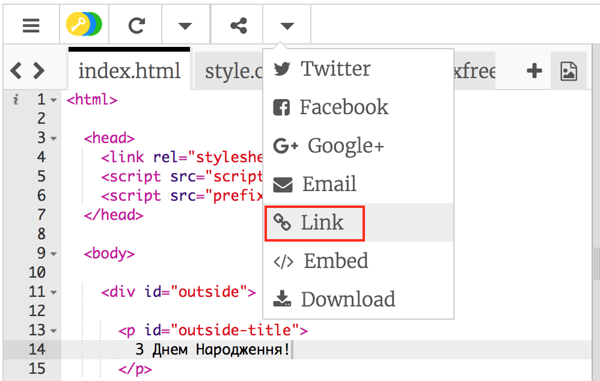

Якщо ви відкрили чернетку зі свого акаунта, тоді шукайте в меню опцію "Поділитись" нижче вашої чернетки замість:

+ Виберіть "Показати код чи результат (дозволити користувачам перехід між ними)" та скопіюйте посилання до чернетки. 

+ Поверніться до своєї чернетки "Проект Вітрина" та додайте `<h2>` заголовок і посилання на проект "З днем народження".

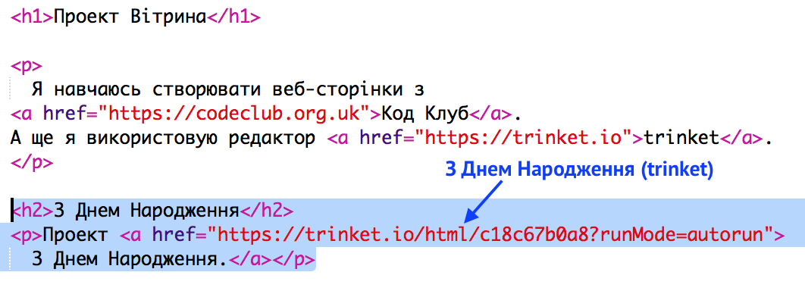

Перевірте свою веб-сторінку, вона повинна мати приблизно такий вигляд:

Натисніть посилання "З днем народження", щоб перевірити, чи ви перейдете до чернетки.

## Збережіть свій проект {.save}

## Завдання: Створіть список ваших проектів {.challenge}

Додайте деякі проекти з інших HTML & та CSS, які ви вже створили в Code Club. Використовуйте `<h2>` заголовки, щоб впорядкувати свої веб-сторінки.

Якщо у вас немає посилань на проекти, які ви вже створили, то використовуйте приклади проектів Code Club:

+ З днем народження: <https://trinket.io/html/e996dc0380>

+ Розкажи історію: <https://trinket.io/html/c8afdef912>

+ Розшукується: <https://trinket.io/html/ebeb56398a>

+ Рецепт: <https://trinket.io/html/c0fd9b40cd>

+ Таємничий лист: <https://trinket.io/html/1d4d4c5ce1>

Ваша готова сторінка повинна мати приблизно такий вигляд:

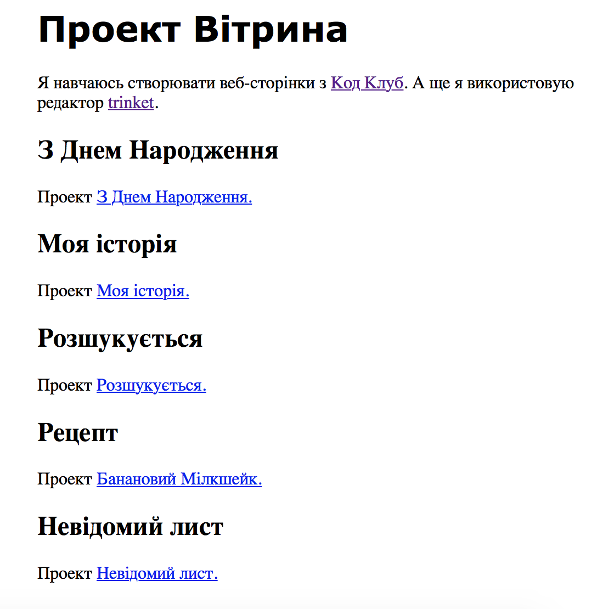

## Збережіть свій проект {.save}

# Крок 3: Вкладені проекти {.activity}

Так само як можна посилатись на чернетки, як на веб сторінки, ми можемо вбудовувати їх у веб сторінки.

## Список дій {.check}

+ Ви можете працювати в режимі повного екрану, адже це збільшить робочий простір:

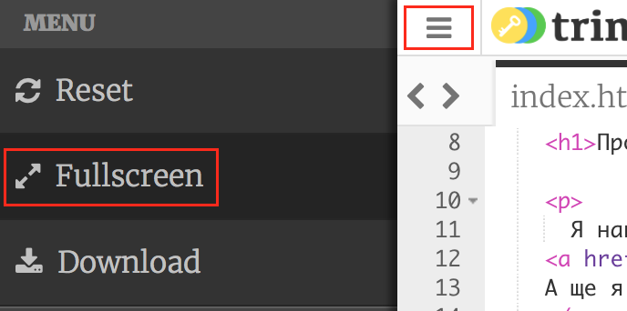

Натисніть Esc, щоб вийти з режиму Повного екрану.

+ Перейдіть на вашу чернетку та натисніть посилання "З днем народження".

+ Далі натисніть на меню чернетки і оберіть **embed**. Якщо ви не в повноекранному режимі, то вам потрібно буде прогортати сторінку. Для цього використовуйте стрілочки вниз та праворуч на клавіатурі.

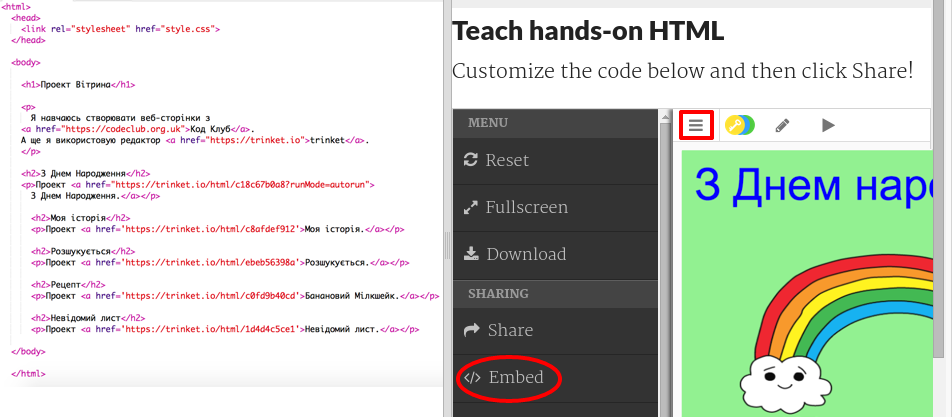

## Список дій {.check}

+ Виберіть "Показати код чи результат (дозволити користувачам перехід між ними)" та **скопіюйте** вставку до чернетки. 

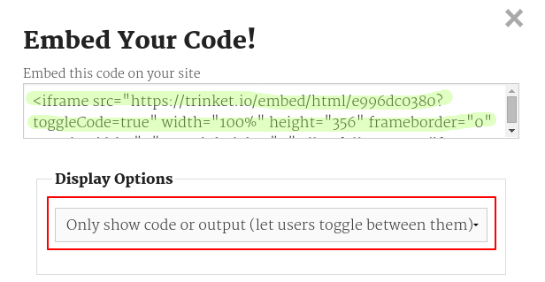

+ Система Trinket створила певну HTML розмітку, яку можна розмістити на веб-сторінці. Вона використовує тег `<iframe>`, який дозволяє вставити все написане на сторінку.

+ Тепер вставте код під посиланням до чернетки "З днем народження":

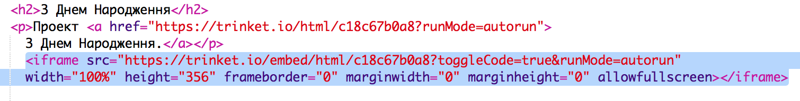

+ Запустіть чернетку, щоб перевірити її. Ви повинні побачити проект "З днем народження" розміщений на сторінці. 

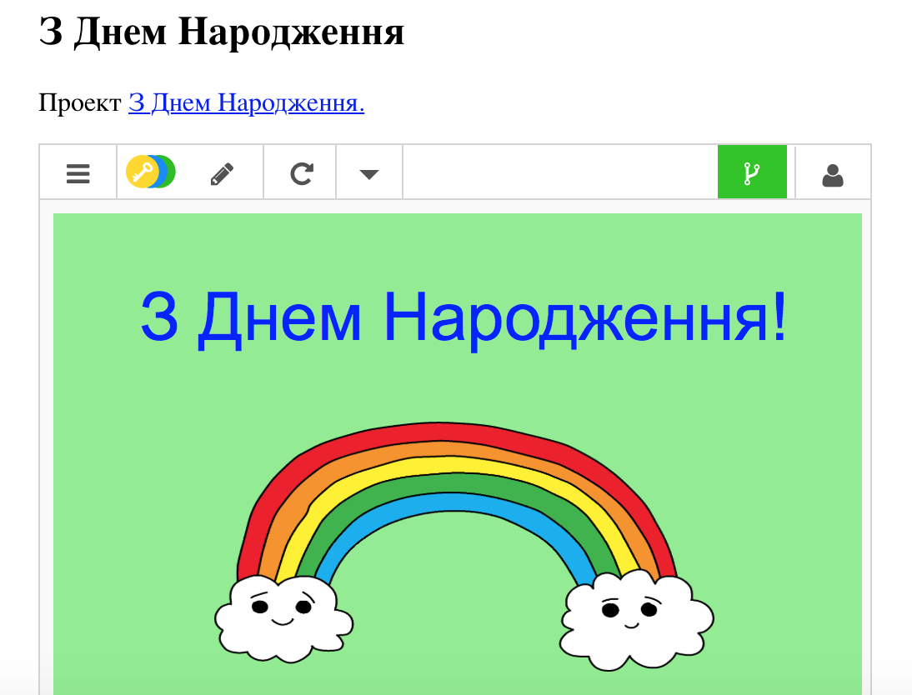

+ Як бачите, низ вашої чернетки не з'явилася на екрані. Це можна виправити, змінивши значення висоти (height) всередині тегу `<iframe>`. 

Налаштуйте значення висоти на **400**. Якщо ви вносили зміни в проект "З днем народження ", то вам слід вибрати інше значення.

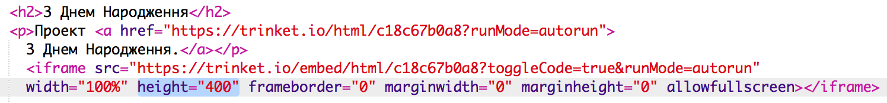

## Збережіть свій проект {.save}

## Завдання: Вкласти більше проектів {.challenge}

Вкладіть більше проектів до своєї Вітрини. Пам'ятайте, що ви легко можете знайти всі чернетки, натискаючи на посилання на веб-сторінці.

# Крок 4: Створіть зміст {.activity}

Давайте додамо зміст, щоб вам було легко знайти кожен проект.

## Список дій {.check}

+ Ми можемо створювати посилання на певну частину веб-сторінки, якщо надамо їм певний ідентифікатор. 

Додайте ідентифікатор (id) до заголовка `<h2>` проекту "З днем народження":

+ Додайте ідентифікатори до кожного проекту і дайте їм короткі назви: історія (story), розшукується (wanted), рецепт (recipe) і лист (letter).

+ Ви можете посилатися на елемент, який має ідентифікатор якщо поставите решітку # перед кожною назвою. На приклад, `#birthday`.

Створіть впорядкований список своїх посилань на проекти. (Про те як створювати впорядковані списки описується в проекті Рецепт.)

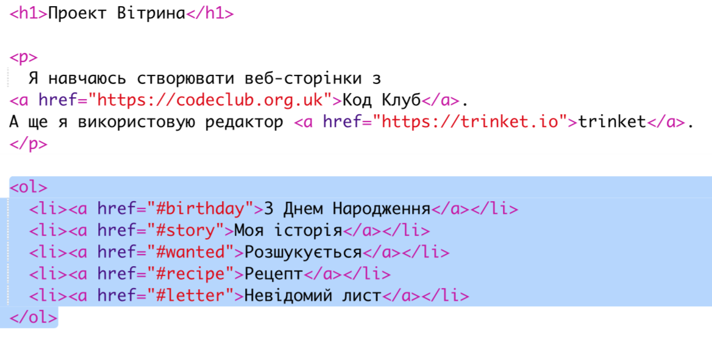

+ Запустіть свій проект і перевірте його, натискаючи на посилання та переходячи на проекти. 

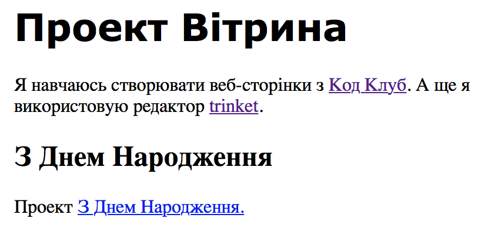

## Збережіть свій проект {.save}

# Крок 5: Повертаємся до початку сторінки {.activity}

## Список дій {.check}

+ Дуже корисно вміти переміщатись назад до верху сторінки. В HTML розмітці є для цього позначка `#Вгору` (#top).

+ Додайте посилання до позначки `#Вгору` після кожного вкладеного проекту на сторінці:

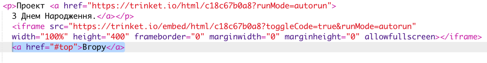

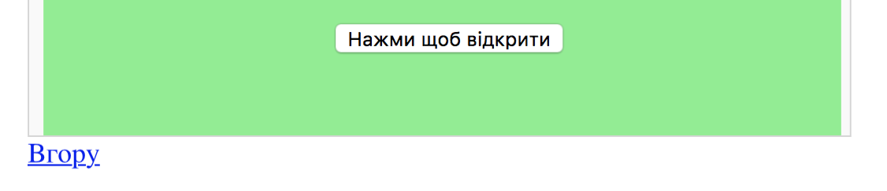

+ Перевірте посилання напискаючи "Вгору", щоб перейти на початок сторінки. 

## Збережіть свій проект {.save}

## Завдання: Покращити вітрину {.challenge}

Використовуйте CSS, щоб зробити сторінку цікавішою. Спробуйте змінити фоновий колір чи шрифти заголовків.

Ви можете додати інформацію про кожен проект і що вам у ньому сподобалося.

## Завдання: Створити нову вітрину {.challenge}

Чернетки не єдине, що ви можете вставити на сторінку. Вкладайте відео, віджети (наприклад погоду) чи Скратч проекти.

Відкрийте чернетку Embed Scratch Example та запустіть її: <https://trinket.io/html/9f7212b8fe>

Перейдіть на сайт Скретч та знайдіть той проект, який вам сподобається найбільше. Це може бути як ваш власний проект, так і будь який інший, який знайдете.

Якщо ви уввійшли в систему Скретч, ви можете натиснути кнопку "Embed" (вкласти) під проектом, щоб отримати HTML код для вкладання проекту.

Якщо ви не уввійшли в систему, то пошукайте номер Скретч проекту в його веб адресі.

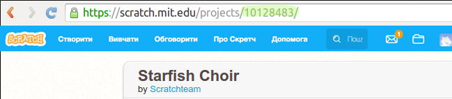

Створіть копію `<iframe>` коду в прикладі Scratch Embed (Вкладення Скретч) і змініть номер проекту на той, який хочете вставити:

## Збережіть свій проект {.save}