---
title: Рецепт
level: HTML & CSS 1
language: uk-UA
embeds: "*.png"
materials: ["Club Leader Resources/*.*","Project Resources/*.*"]
stylesheet: web
...

# Вступ {.intro}

В ході цього проекту ви навчитесь створювати веб-сторінку для свого улюбленого рецепту.

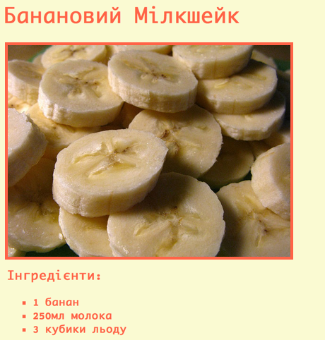

# Крок 1: Оберіть рецепт {.activity}

Перед написанням коду вам слід буде обрати рецепт.

## Список дій {.check}

+ Подумайте, яким рецептом ви би хотіли поділитись зі своїми друзями. Це би міг бути: 
    + Рецепт з Інтернету;
    + Рецепт вашої улюбленої страви;
    + Якийсь власний рецепт!

Приклад, що ви побачите у цьому проекті, буде рецептом бананового коктейлю. Якщо не вдасться знайти власний, можете взяти його.

# Крок 2: Інгредієнти {.activity}

Давайте складемо список інгредієнтів, необхідних для вашого рецепту.

## Список дій {.check}

+ Відкрийте цю чернетку-шаблон: [jumpto.cc/trinket-template](http://jumpto.cc/trinket-template). Якщо ви читаєте це онлайн, то також можете скористатись вбудованою версією цієї чернетки нижче.

  <iframe src="https://trinket.io/embed/html/ef4c882ae6" width="100%" height="400" frameborder="0" marginwidth="0" marginheight="0" allowfullscreen>
  </iframe>

+ Для створення списку інгредієнтів ви побудуєте **невпорядкований список** за допомогою тегу `<ul>`. Перейдіть до 8-го рядка шаблону і додайте цей код HTML, замінивши текст в межах тегу `<h1>` назвою власного рецепту:

    <h1>Банановий молочний коктейль</h1>
    
    <h3>Інгредієнти:</h3>
    
    <ul>
    
    </ul>
    

+ Відкрийте свою веб-сторінку і побачите два заголовки.

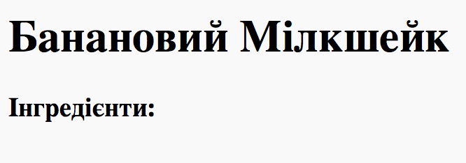

Та списку поки нема, бо ви ще не додали до нього жодного елементу!

+ Наступний крок — додати елементи до свого списку за допомогою тегу `<li>`. Вставте цей код в межах тегу `<ul>`:

    <li>1 банан</li>
    

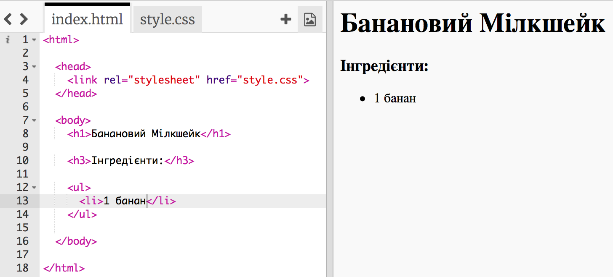

Оскільки ваш список невпорядкований, у ньому нема номерів навпроти елементів, лише маркери.

## Завдання: Більше інгредієнтів {.challenge}

Можете додати більше інгредієнтів до **свого** рецепту?

Ваша веб-сторінка має виглядати якось так:

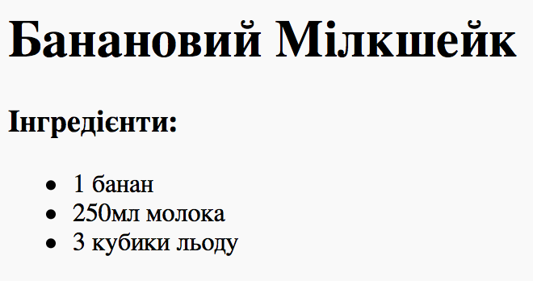

## Збережіть свій проект {.save}

# Крок 3: Спосіб приготування {.activity}

Тепер давайте пояснимо, як же готувати ваші страви.

## Список дій {.check}

+ Ви зробите ще один список для опису способу приготування. Але тепер це буде **впорядкований список**, створений за допомогою тегу `<ol>`.

Впорядкований список є нумерованим. Його слід застосовувати, коли важливий порядок виконання дій.

Вставте цей код під своїм списком інгредієнтів, але так, щоб він був в межах тегу `<body>`:

    <h3>Спосіб приготування:</h3>
    
    <ol>
    
    </ol>
    

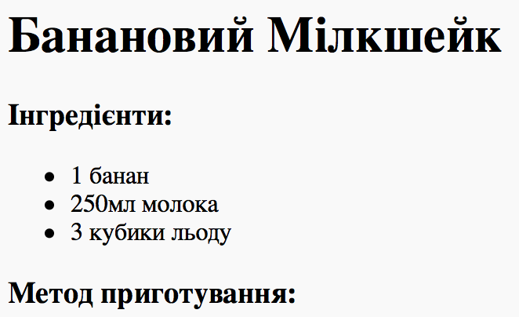

+ Тепер вам лише треба додати елементи до нового впорядкованого списку:

    <li>Очистіть банани від шкірки і покладіть до блендера</li>
    

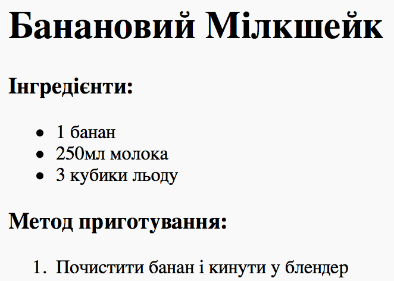

Зверніть увагу, що елементи списку нумеруються автоматично!

## Завдання: Більше кроків {.challenge}

Можете додати усі кроки для приготування **вашої** страви?

Ваш спосіб приготування має виглядати якось так:

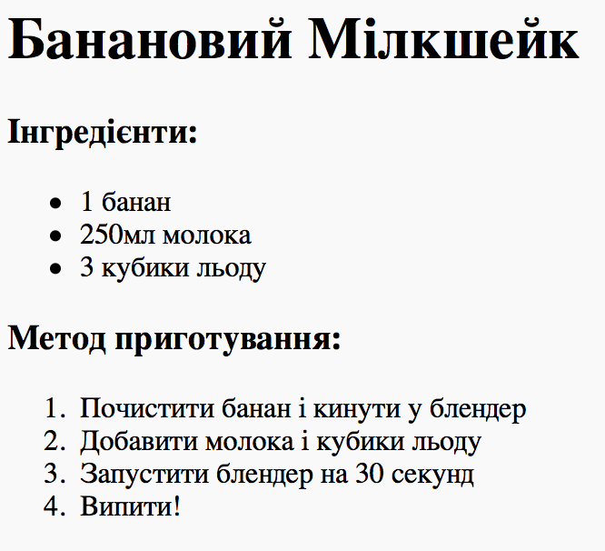

## Збережіть свій проект {.save}

# Крок 4: Кольори! {.activity}

Давайте додамо трохи кольору до веб-сторінки вашого рецепту.

## Список дій {.check}

+ Ви вже знаєте, як додавати на сторінку кольоровий текст. Додайте цей код до свого файлу `style.css`, щоб пофарбувати весь текст у тілі своєї веб-сторінки у синій:

    body {
        color: blue;
    }
    

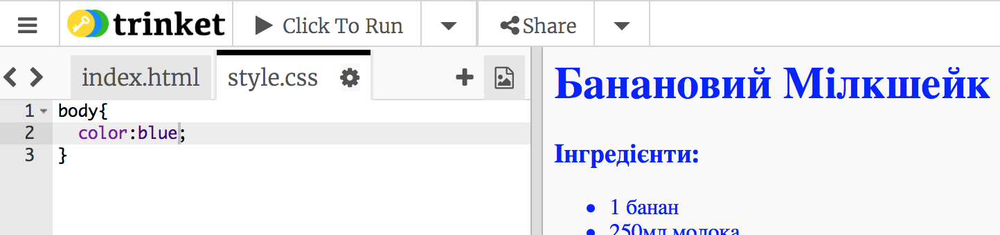

+ Ваш веб-переглядач знає такі кольори, як `blue` (синій), `yellow` (жовтий) та навіть `lightgreen` (салатовий). Та чи знаєте ви, що насправді він знає **назви** більше 500 різних кольорів?

Ось список назв усіх кольорів, якими ви можете скористатись: [jumpto.cc/web-colours](http://jumpto.cc/web-colours). Серед них є такі кольори, як `tomato` (томатний), `firebrick` (цегловий) та `peachpuff` (персиковий).

Змініть колір тексту з `blue` (синього) на `tomato` (томатний).

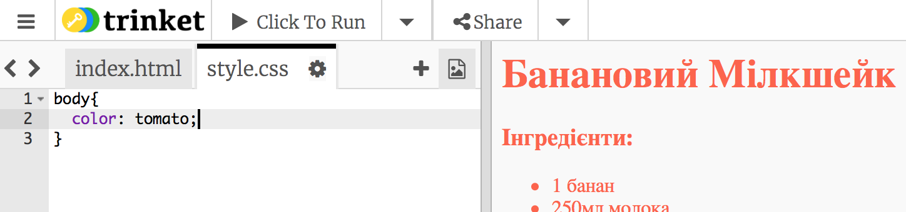

+ Ваш веб-переглядач знає назви 140 кольорів. Однак насправді він розрізняє більше 16 мільйонів кольорів за їх **кодовими позначеннями**!

Як ви, мабуть, знаєте, будь-який колір можна створити шляхом поєднання основних кольорів: червоного, зеленого та синього. Щоб пояснити веб-переглядачу, який колір показувати, вам лишень треба вказати, наскільки насиченим має бути кожен з основних кольорів.

Потрібна насиченість червоного, зеленого та синього вказується числом від `` до `255`. rgb — абревіатура з перших букв англійських назв червоного (**r**ed), зеленого (**g**reen) та синього (**b**lue) кольорів.

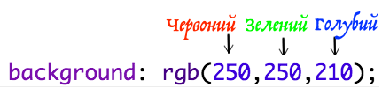

Додайте цей код до CSS для тіла веб-сторінки, щоб зробити тло світло-жовтим:

    background: rgb(250,250,210);
    

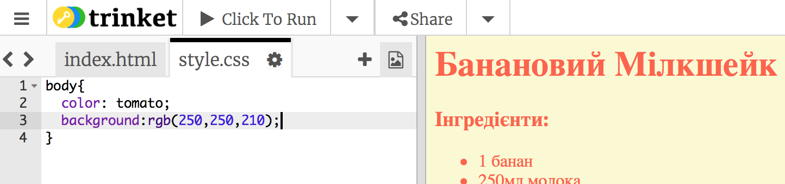

+ Пояснити веб-переглядачу, який колір показувати, також можна за допомогою шістнадцяткового коду (скорочено англійською "**hex code**"). Він працює так само, як і згаданий вище код `rgb()`, тільки шістнадцяткові коди завжди мають починатись `#`, а для позначення насиченості червоного, зеленого та синього в них використовуються шістнадцяткові "цифри" від `00` до `ff`.

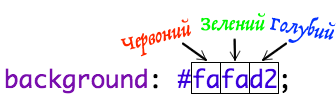

Замініть код `rgb()` у своїх CSS цим шістнадцятковим кодом:

    background: #fafad2;
    

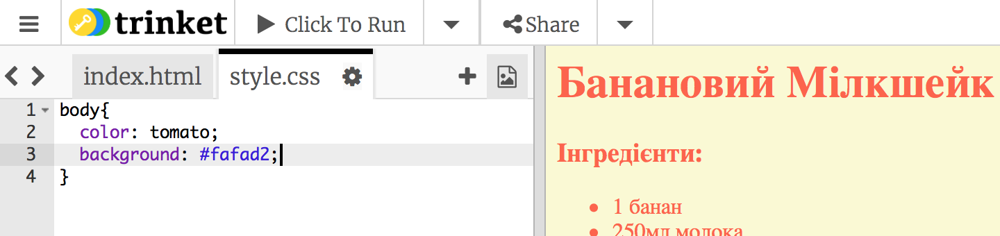

Ви маєте побачити таке ж світло-жовте тло, як і раніше!

## Збережіть свій проект {.save}

# Крок 5: Завершальні штрихи {.activity}

Давайте додамо трохи більше HTML та CSS, щоб покращити вашу веб-сторінку.

## Список дій {.check}

+ Можете додати горизонтальну лінію в кінці свого рецепту за допомогою тегу <hr&gt.

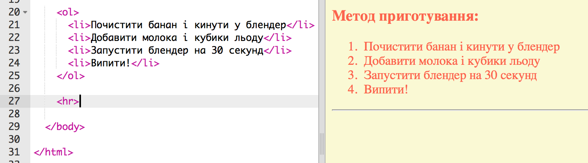

Зверніть увагу, що цей тег не має закриваючого тегу. Як і тег ``.

+ Лінія, яку ви щойно додали, не поєднується з оформленням решти вашої веб-сторінки. Давайте виправимо це, додавши трохи коду CSS:

    hr {
        height: 2px;
        border: none;
        background-color: tomato;
    }
    

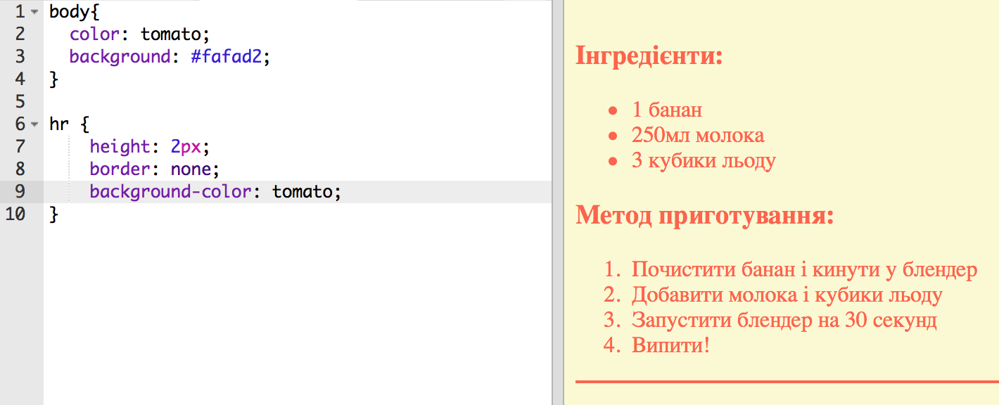

+ За допомогою цього коду CSS ви навіть можете змінити вигляд маркерів списку:

    ul {
        list-style-type: square;
    }
    

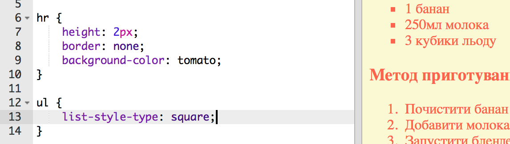

## Завдання: Більше кольорів! {.challenge}

Змініть кольори у своєму коді, використовуючи їх назви, позначення `rgb()` та шістнадцяткові коди. Тут <a href="http://jumpto.cc/web-colours" target="_blank">jumpto.cc/web-colours</a> є список купи кольорів.

Ось кілька прикладів:

+ Червоний можна записати як:
    
    + `red` (червоний, це ж очевидно!)
    + `rgb(255,0,0)` (купа червоного і ні краплі зеленого та синього)
    + `#ff0000`

+ Оливковий можна записати як:
    
    + `olive (оливковий)`
    + `rgb(128, 128, 0)` (трохи червоного та зеленого, синього не треба)
    + `#808000`

Постарайтесь зробити так, щоб кольори відповідали вашому рецепту!

## Збережіть свій проект {.save}

## Завдання: Відгуки {.challenge}

Попросіть кількох друзів залишити відгук про ваш рецепт. Для цього вам доведеться створити ще один список.

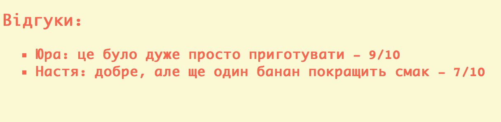

## Збережіть свій проект {.save}

## Завдання: Більше оформлення {.challenge}

Можете додати зображення на свою веб-сторінку? А змінити шрифт? Ось як вона могла б виглядати:

Ось трохи допоміжного коду:

    font-family: Arial / Comic Sans MS / Courier / Impact / Tahoma;
    font-size: 12pt;
    font-weight: bold;
    
    
    

## Збережіть свій проект {.save}