---
title: Наклейки!
level: HTML & CSS 2
language: uk-UA
embeds: "*.png"
materials: ["Club Leader Resources/*.*","Project Resources/*.*"]
stylesheet: web
...

# Передмова {.intro}

У цьому проекті ви створите багато веселих наклейок, які можна використовувати, щоб прикрасити веб-сторінки. Ви вивчите як використовувати градієнти, для того щоб зробити ваші наклейки класними.

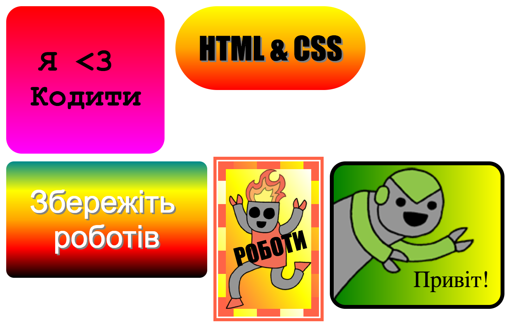

# Крок 1: Створюємо наклейку з допомогою лінійного градієнту {.activity}

Градієнт - це поступова зміна від одного кольору до іншого. Градієнти використовуються, щоб створювати прикольні ефекти. Ви будете використовувати їх, щоб створити наклейки, які потім зможете розмістити на власні веб-сторінки.

+ Відкрийте редактор: <a href="http://jumpto.cc/web-stickers" target="_blank">jumpto.cc/web-stickers</a>. Якщо ви виконуєте завдання онлайн, то можете використовувати вкладену нижче чернетку. 

  <iframe src="https://trinket.io/embed/html/af0ea6fa35" width="100%" height="400" frameborder="0" marginwidth="0" marginheight="0" allowfullscreen>
  </iframe>

+ Зробімо наклейку "Я <3 Програмувати".
    
    Використовуйте тег 
 разом з класом `наклейка` (sticker) та ідентифікатором `програмування` (coding), для того щоб стилізувати наклейку:
    
    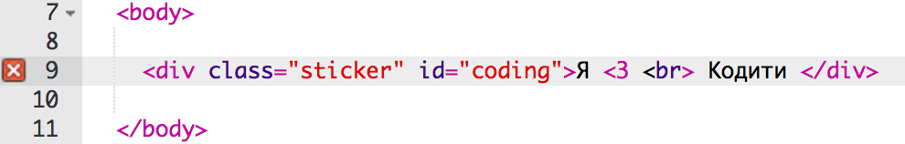

+ Хмм... отримали помилку? Це тому що символи < насправді спеціальні символи в HTML. Замість < потрібно використати спеціальний код `&lt;`.
    
    Поновіть код, використовуючи `&lt;`, щоб помилка зникла.
    
    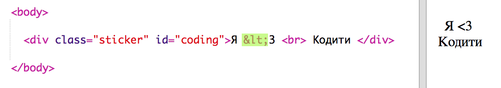
    
    Тег ` ` переновить вас у новий рядок.

+ Тепер зробимо так, щоб наклейка виглядала цікавіше.
    
    Перейдіть до файлу `style.css`. Ви побачите, що там є клас `.sticker`. Він дозволить розмістити схему наклейки на сторінці і відцентрувати все, що написано на наклейці.
    
    Пам'ятайте, що ви додали ідентифікатор `coding` (програмування) до наклейки. Внизу файлу `style.css` додайте наступний код, щоб стилізувати текст:
    
    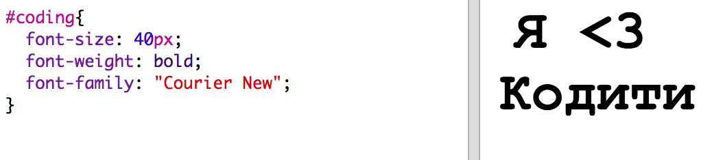

+ Тепер можете додати градієнт до фону наклейки. Лінійний градієнт змінюється від одного кольору до іншого вздовж прямої лінії.
    
    Цей градієнт має змінюватись від червоного вгорі до пурпурового внизу. Додайте код градієнту до вашого стилю `coding`:
    
    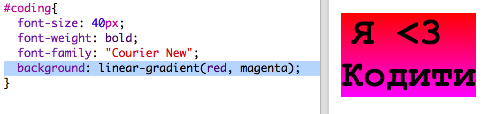

+ Можна покращити результати, якщо додати відступи і заукруглені кути.
    
    Додайте виділений код:
    
    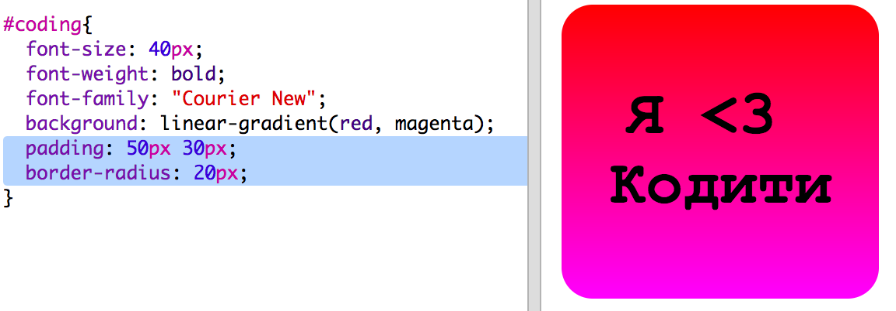
    
    Стиль `padding` додає відступи на 50px вгорі та внизу і 30px зліва і справа.

## Збережіть свій проект {.save}

# Крок 2: Створюємо наклейку з допомогою радіального градієнту {.activity}

Градієнти можуть змінювати колір від центру і до країв, це називається радіальний градієнт.

+ Створімо наклейку з текстом `HTML & CSS.` Символ `&` є ще одним символом, який потребує розшифрування в HTML, його кодом є `&amp;`.
    
    Додайте виділений код, щоб створити нову наклейку:
    
    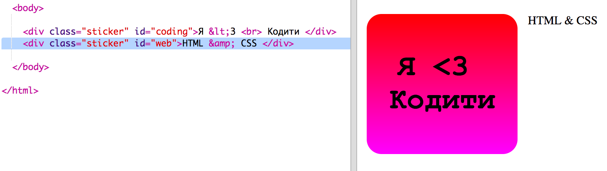

+ Тепер перейдіть у файл `style.css` і додайте стиль для нової наклейки:
    
    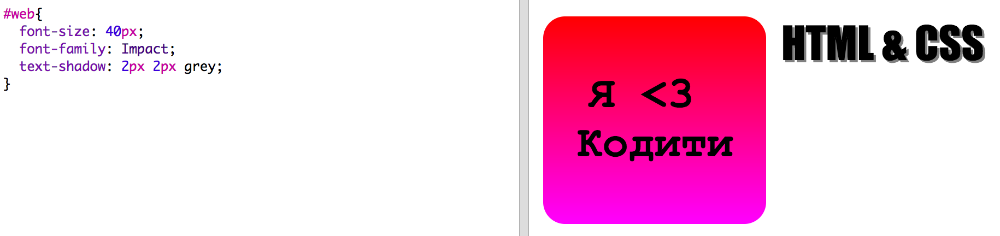
    
    Код `text-shadow` додає тіні, які поширюються на 2px знизу і справа від тексту, що робить текст виділеним.

+ Тепер щодо градієнту. Цього разу використаємо радіальний градієнт. Колір має змінюватись від жовтого в центрі до оранжевого і далі до червоного.
    
    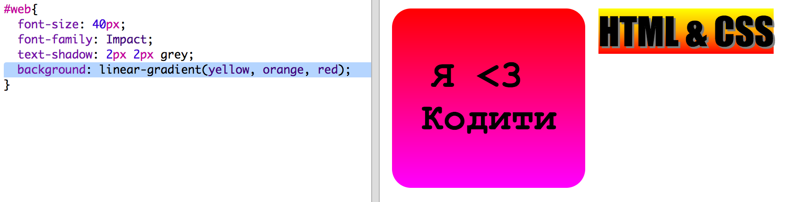
    
    Зверніть увагу, що градієнт маже містити кілька кольорів, не тільки два.

+ Наклейка буде виглядати краще з відступами і заокругленими кутами.
    
    Додайте виділений код:
    
    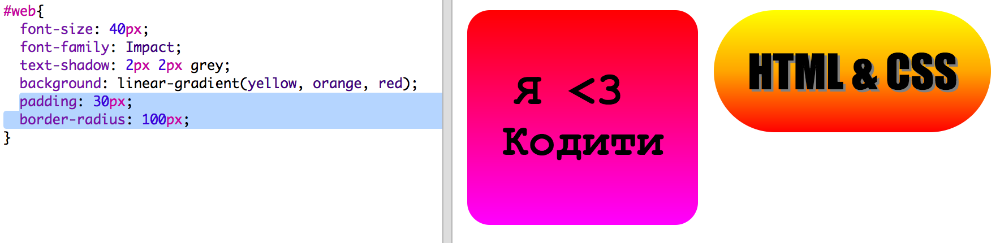

## Збережіть свій проект {.save}

## Завдання: Створіть власну наклейку з градієнтом {.challenge}

Тепер мажте зробити власну наклейку з градієнтом. Спробуйте лінійний і радіальний градієнт, використовуючи різні HTML кольори.

Потрібно буде:

+ Разом з текстом наклейки додайте тег`
` до файлу `index.html` і поставте для тегу клас `sticker`, а також новий ідентифікатор `id`.
+ Виберіть і додайте стиль до ідентифікатора `id` в файлі `style.css`. Можете скопіювати стиль наклейок які ви вже зробили і відредагувати його. 

Ось список назв усіх кольорів, якими ви можете скористатись: [jumpto.cc/web-colours](http://jumpto.cc/web-colours). Серед них є такі кольори, як `tomato` (томатний), `firebrick` (цегловий) та `peachpuff` (персиковий).

Якщо потрібно змінити колір тексту, можете використовувати `color:`.

Ось приклад того, що ви можете зробити з кількома кольорами в лінійному градієнті:

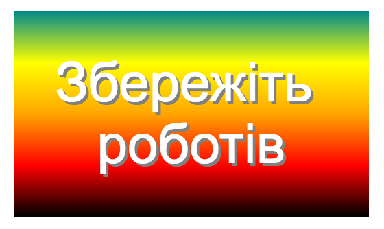

## Збережіть свій проект {.save}

# Крок 3: Створюємо наклейку з картинкою {.activity}

Також можна створити наклейку з градієнтом, використовуючи картинку. Якщо ви використаєте картинку з прозорим фоном, тоді градієнт буде проглядатись.

+ Спочатку, створімо наклейку на якій буде картинка.
    
    У вашому проекті вже є картинка під назвою `purplerobot.png`.
    
    Додайте виділений код до файлу `index.html`:
    
    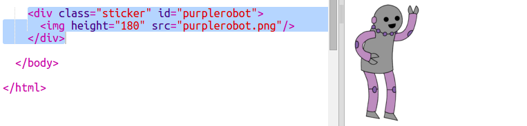
    
    Можете відрегулювати висоту `height`, щоб змінити розміри картинки, ширина зміниться автоматично.

+ Тепер додайте код стилю, щоб створити фон з градієнтом для наклейки з картинкою:
    
    

## Збережіть свій проект {.save}

## Завдання: Створіть власну наклейку з картинкою {.challenge}

Тепер створіть власну наклейку з картинкою і градієнтом.

Потрібно буде:

+ Додайте новий `
` до файлу `index.html` в якому розміщена картинка. 
+ Додайте клас `sticker` і новий ідентифікатор до тегу div.
+ Створіть стиль для нового ідентифікатора з градієнтом і відступами. 

Ваш проект вже містить певну кількість картинок з роботами. Натисність на іконку картинки, щоб подивитись доступні зображення.

Ось приклад наклейки з картинкою і лінійним градієнтом:

## Збережіть свій проект {.save}

# Крок 4: Горизонтальні градієнти {.activity}

Градієнти можуть бути горизонтальні і вертикальні.

+ Створімо ще одну наклейку з картинкою.
    
    Цього разу ми використаємо картинку `greenrobot.png`. Додайте наступний код до файлу `index.html`:
    
    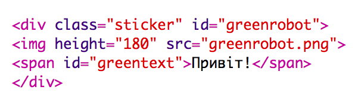

+ Зазвичай лінійний градієнт продовжується зверху до низу, але якщо додати код `to right` (направо), тоді ми зможемо зробити так, щоб гардієнт простягався зліва направо.
    
    Додайте наступний код до файлу `style.css` щоб додати горизонтальний градієнт до нашої наклейки зеленого робота.
    
    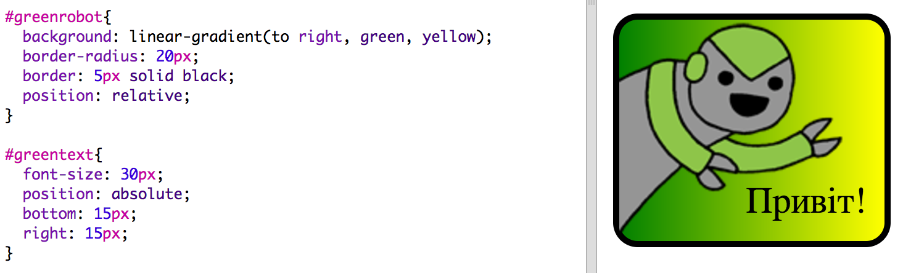
    
    Зверніть увагу, що градієнт простягається від зеленого ліворуч до жовтого праворуч.

+ Цей робот виглядає так, ніби хоче щось сказати. Давайте додамо якийсь текст до наклейки.
    
    Перейдіть до файлу `index.html` і додайте текст "Привіт!" до наклейки з зеленим роботом, поставте код всередині тегу `` з ідентифікатором, щоб можна було його стилізувати:
    
    

+ Текст буде виглядати краще, якщо зробити його більшим і гарно розмістити.
    
    Щоб перемістити текст треба буде додати налаштування `position: relative;` до `#greensticker` і налаштування `position: absolute` до `#greentext`. Це детальніше описано в проекті `Будуємо робота`.
    
    Додайте наступний код до файлу `style.css`:
    
    
    
    Тепер текст "Привіт!" розміщений відносно правого нижнього кута наклейки.

## Збережіть свій проект {.save}

# Крок 5: Діагональні градієнти {.activity}

Ще можна створити діагональні градієнти які змінюються від кута до кута.

+ Додайте наклейку до файлу `index.html` використовуючи картинку `firerobot.png`:
    
    

+ Для діагонального градієнту використовується два напрямки. У прикладі використано "до низу і ліворуч" `to bottom left`.
    
    Додайте наступний стиль до файлу `style.css` щоб надати наклейці робота діагонального градієнту і модну рамку:
    
    
    
    Зверніть увагу, що ви можете використовувати налаштування `outline` щоб створити іншу рамку поза звичайною. Налаштування `outline-offset` робить простір між рамкою і контуром.

+ Додамо до наклейки текст.
    
    Додайте тег ``, що містить текст "РОБОТИ!" до файлу `index.html` і надайте йому ідентифікатор.
    
    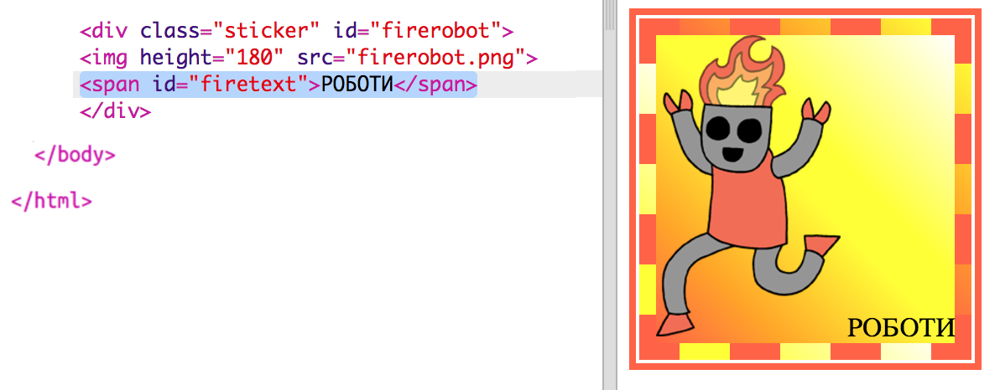

+ Тепер можна розмістити текст додаючи наступні стилі:
    
    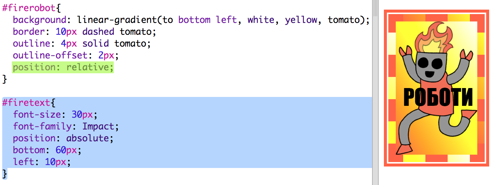

+ І для остаточного ефекту, зробимо так, щоб текст обертався, використаємо налаштування `transform: rotate`.
    
    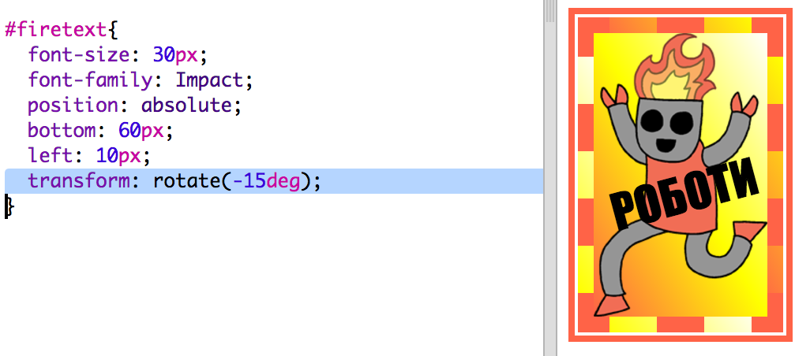
    
    Спробуйте змінити кількість рівнів на яких обертається текст.

## Збережіть свій проект {.save}

## Виклик: Ще більше наклейок {.challenge}

Тепер спробуйте зробити більше наклейок використовуючи різні напрямки градієнтів і додаючи картинки, текст, використовуючи рамки і контури.

Можете скопіювати один з прикладів і змінити його, щоб створити нову наклейку.

Ось приклад, як використовувати діагональний градієнт:

## Збережіть свій проект {.save}