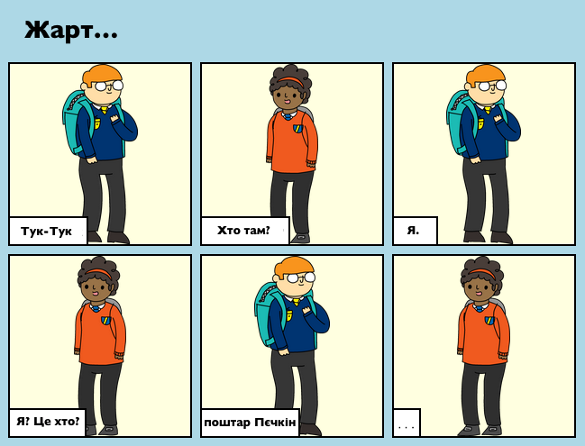
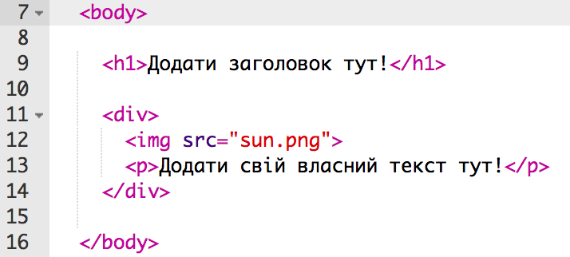
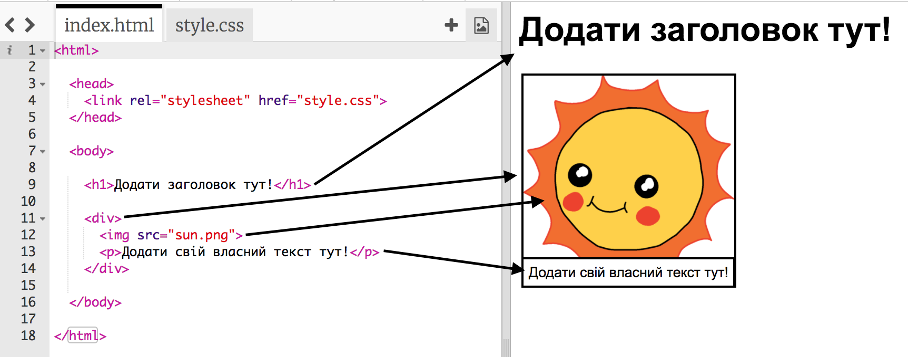
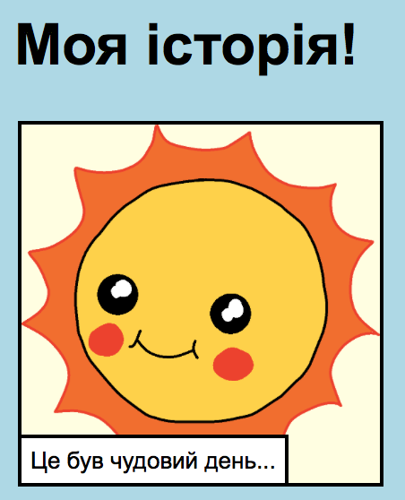
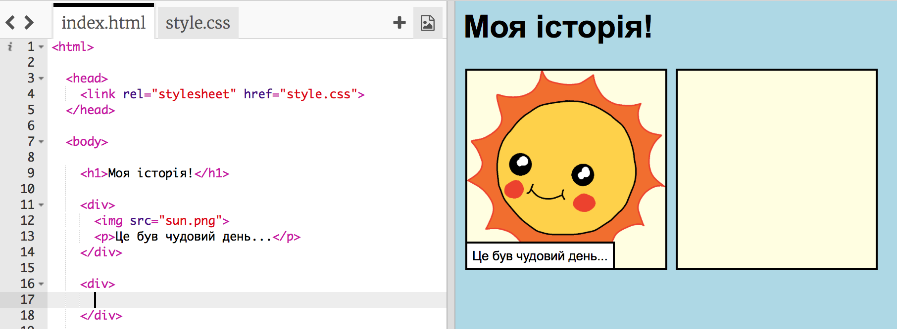
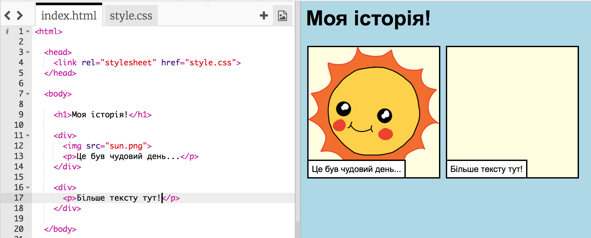
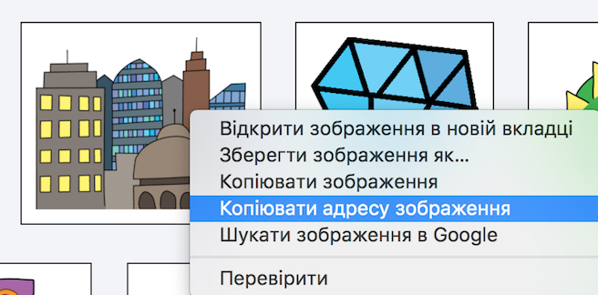
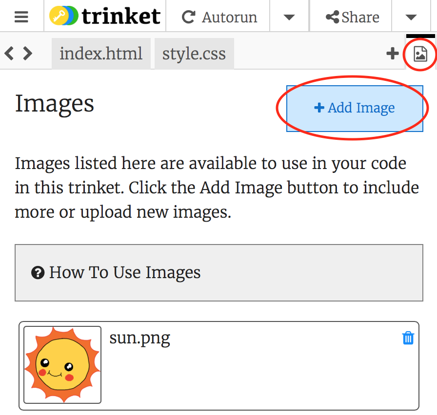
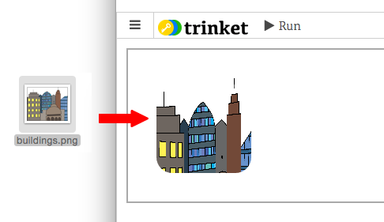

---
title: Розкажіть історію
level: HTML & CSS 1
language: uk-UA
embeds: "*.png"
materials: ["Club Leader Resources/*.*","Project Resources/*.*"]
stylesheet: web
...

# Передмова {.intro}

У цьому проекті ви навчитесь як створити власний веб-сайт, щоб поділитися якоюсь історією, жартом чи віршем.

# Крок 1: Виберіть історію, якою хочете поділитися. {.activity}

Перш ніж ви поченете писати код, потрібно вирішити, яку історію ви хочете розповісти.

## Список дій {.check}

+ Подумайте над темою історії. Це може бути:
    
    + Всім відомий випадок;
    + Розповідь, яку ви придумали.
    + Ситуація, в яку потрапили ви або ті люди, яких ви знаєте.
    
    Це не обов'язково повинна бути розповідь. Ви можете написати жарт, вірш або будь-що інше!

# Крок 2: Відредагуйте свою розповідь. {.activity}

Давайте розпочнемо з редагування вмісту HTML і стилю CSS веб-сторінки з вашою історією.

## Список дій {.check}

+ Відкрийте цю чернетку: <a href="http://jumpto.cc/web-story" target="_blank">jumpto.cc/web-story</a>. Якщо ви читаєте це онлайн, то також можете використати чернетку, вкладену нижче.

  <iframe src="https://trinket.io/embed/html/8083cfebb3" width="100%" height="400" frameborder="0" marginwidth="0" marginheight="0" allowfullscreen>
    </iframe>

+ Можливо, ви пам'ятаєте з проекту 'З днем народження', що вміст веб-сторінки розміщений в `<корпусі>` HTML-документа.
    
    Перейдіть до 7 рядка коду і ви побачите вміст веб-сторінки, який знаходиться всередині тегів `<корпус>` і `</корпус>`.
    
    

+ Чи можете ви сказати, які теги використовуються для створення різних частин веб-сторінки?
    
    
    
    + `<h1>` – це **заголовок**. Для створення заголовків різних розмірів можна використовувати цифри від 1 до 6;
    + `
` є скороченням від слова **поділ** (division) і способом групування матеріалу. На цій веб-сторінці ви будете використовувати його для групування всього матеріалу для кожної частини вашої розповіді;
    + `` – це **зображення**;
    + `
` – це **абзац** тексту.

## Завдання: Зробіть деякі зміни. {.challenge}

Відредагуйте HTML і CSS код, щоб налаштувати свою веб-сторінку.

Ви можете змінювати кольори, що використовуються на веб-сторінці. Також ви можете використовувати такі шрифти, як Arial, Comic Sans MS, Impact і Tahoma.

Якщо вам потрібна допомога, можете скористатися підказками з проекту "З днем народження".

## Збережіть свій проект {.save}

# Крок 3: Розкажіть свою історію. {.activity}

Давайте додамо другу частину вашої історії.

## Список дій {.check}

+ Перейдіть до 17 рядка коду і додайте ще один набір `
` і `
` (перший та останній теги). Це дозволить створити нове поле для наступної частини вашої історії.
    
    

+ Додайте ще однин абзац тексту всередині вашого нового тегу `
`.
    
    

+ Тепер ви можете додати до вашого нового поля зображення, вставивши цей код всередину тегу `
`:
    
        
        
    
    Зверніть увагу, що теги `` трохи відрізняються від інших, оскільки вони не мають кінцевого тегу.

+ Для HTML зображення вам потрібно вказати **джерело** зображення всередині лапок. Давайте знайдемо зображення, щоб додати його до вашої історії.
    
    Перейдіть на <a href="http://jumpto.cc/web-images" target="_blank">jumpto.cc/web-images</a> і знайдіть зображення, яке потрібно додати у вашу історію.

+ Клацніть правою кнопкою миші на зображення і оберіть "Копіювати адресу зображення". URL-адреса є адресою зображення.
    
    

+ Вставте URL між лапками в тезі ``. Ви маєте побачити, що ваше зображення з'явилося!
    
    

+ **Якщо у вас є обліковий запис на Trinket **, можна також завантажити ваші власні зображення на вашу веб-сторінку! Для цього клацніть на піктограму зображення у верхній частині вашого акаунту і натисніть кнопку "Завантажити".
    
    

+ Знайдіть зображення на вашому комп'ютері і перетягніть його у ваш акаунт на Trinket.
    
    

+ Потім ви можете просто додати ім'я нового зображення між лапками в вашому тезі ``, як от:
    
        
        

## Збережіть свій проект {.save}

## Завдання: Продовжуйте в тому ж дусі! {.challenge}

Використовуйте знання, які отримали в цьому проекті, щоб завершити свою розповідь. Ось приклад:

## Збережіть свій проект {.save}