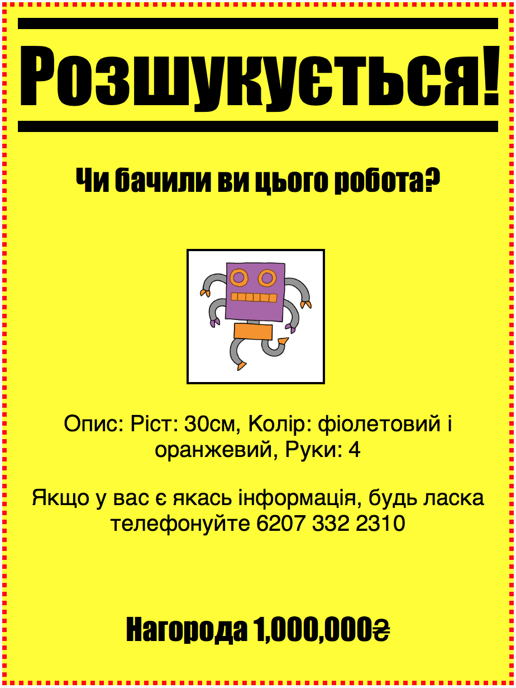
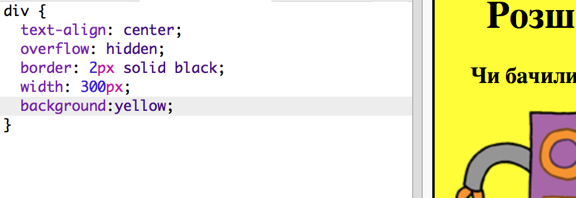
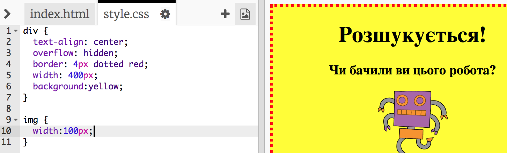
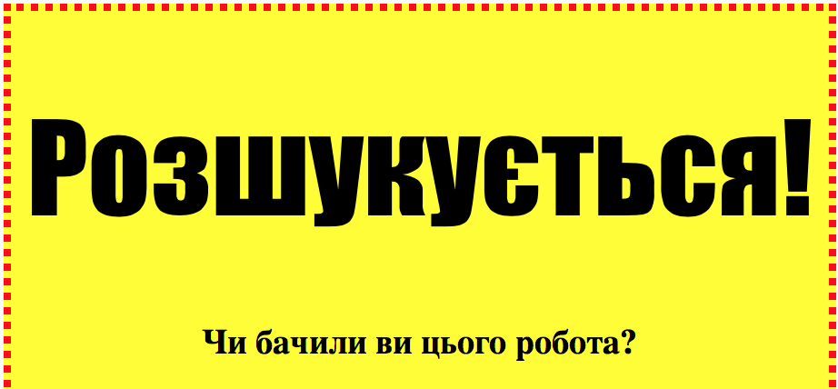
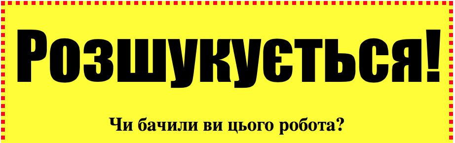

---
title: Розшукується!
level: HTML & CSS 1
language: uk-UA
embeds: "*.png"
materials: ["Club Leader Resources/*.*","Project Resources/*.*"]
stylesheet: web
...

# Передмова {.intro}

У цьому проекті ви навчитесь створювати свій власний плакат.

# Крок1: Стилізація вашого плакату {.activity}

Почнімо з редагування CSS коду для плакату.

## Список дій {.check}

+ Відкрий цю чернетку: <a href="http://jumpto.cc/web-wanted" target="_blank">jumpto.cc/web-wanted</a>. Якщо ти читаєш це онлайн, то ти також можеш використати вбудовану версію цієї чернетки нижче.

  <iframe src="https://trinket.io/embed/html/58318bee1f" width="100%" height="550" frameborder="0" marginwidth="0" marginheight="0" allowfullscreen>
    </iframe>

+ Натисни на вкладку "style.css". Ти помітиш, що там уже є CSS властивості для `div`, який містить різні частинки плакату.
    
        div {
            text-align: center;
            overflow: hidden;
            border: 2px solid black;
            width: 300px;
        }   
        

+ Почнімо зі звернення до властивості `text-align`:
    
        text-align: center;
        
    
    Що станеться, коли ти зміниш слово `center` на `left` чи `right`??

+ Як щодо властивості `border`?
    
        border: 2px solid black;
        
    
    `2px` попередній код означає 2 пікселі. Що станеться коли ти зміниш `2px solid black` на `4px dotted red`??

+ Зміни `width` плакату на `400px`. Що станеться з плакатом?

+ Додаймо трішки CSS щоб становити задній фон плакату. Піди до кінця 5-ої лінійки та натисни повернутися і ти опинишся на новій порожній лінійці.
    
    
    
    Введи наступний код у нову лінійку:
    
        background: yellow;
        
    
    Переконайся що ти вводиш код *саме* так, як показано вище. Ти маєш помітити, що задній фон `
` тепер жовтий.
    
    

## Виклик: Удосконалення вашого плакату {.challenge}

Додай наступні CSS властивості до твого `div` стилю:

    border-radius: 40px;
    

Що робить ця властивість? Що станеться, якщо ти зміниш число у коді вище?

## Збережіть свій проект {.save}

# Крок 2: Стилізація зображень {.activity}

Давай покращимо стиль зображення плакату.

## Список дій {.check}

+ Зараз немає жодних CSS властивостей для твого `` тегу, отож додаймо кілька!
    
    Спершу додай наступний код нижче CSS для твого тегу div:
    
        img {
        
        }
        
    
    

+ Тепер ми можемо додавати CSS властивості для зображень між `{` та `}` фігурними дужками.
    
    Наприклад, додай цей код у фігурні дужки, щоб встановити ширину зображення:
    
        width: 100px;
        
    
    Ти побачиш, що розмір зображення змінився, тож тепер його ширина 100 пікселів.
    
    

+ Ти також можеш додати межу навколо зображення за допомогою цього коду:
    
        border: 1px solid black;
        

+ Ви помітили, що не так багато простору між зображенням і межею?
    
    
    
    Ти можеш це виправити, додавши відступ навколо зображення:
    
        padding: 10px;
        
    
    Відступ - це простір між вмістом (у цьому випадку зображенням) і його межею.
    
    
    
    Що, на твою думку, станеться, якщо змінити відступ до `50px`??

## Виклик: Вдосконалення твого зображення {.challenge}

Можеш задати своєму зображенню колір заднього фону? Чи округлу межу?

## Збережіть свій проект {.save}

# Крок 3: Стилізація заголовків {.activity.new-page}

Давай покращимо стиль заголовка `<h1>`.

## Список дій {.check}

+ Додай наступний код нижче CSS коду твого зображення:
    
        h1 {
        
        }
        
    
    Сюди ти додаватимеш CSS властивості для твого основного заголовка `<h1>`.

+ Щоб змінити шрифт твоїх заголовків `<h1>`, додай наступний код у фігурні дужки:
    
        font-family: Impact;
        

+ Ти також можеш змінити розмір заголовка:
    
        font-size: 50pt;
        

+ Чи помітили ви великий простір між заголовком `<h1>` та всім, що знаходиться навколо нього?
    
    
    
    Це через поля навколо заголовку. Поле - це простір між елементом (в цьому випадку заголовком) та всім, що знаходиться навколо нього.
    
    За допомогою цього коду, ти можеш зробити поля меншими:
    
        margin: 10px;
        
    
    

+ Також ти можеш підкреслити свій заголовок:
    
        text-decoration: underline;
        

## Виклик: Зроби свій плакат класним! {.challenge}

Додай більше CSS коду, щоб стилізувати свої параграфи та заголовки `<h3>`.

Тут список кількох CSS властивостей, які ти можеш використати:

    color: black;
    background: white;
    font-family: Arial / Comic Sans MS / Courier / Impact / Tahoma;
    font-size: 12pt;
    font-weight: bold;
    text-decoration: underline overline line-through;
    margin: 10px;
    padding: 10px;
    width: 100px;
    height: 100px;
    

## Збережіть свій проект {.save}

## Виклик: Зроби рекламу події! {.challenge}

Чи можеш ти зробити плакат заходу, що відбувається у твоїй школі? Це могла б бути гра, спортивна подія, або навіть плакат, що рекламує твій Клуб Коду!

## Збережіть свій проект {.save}