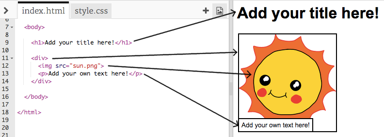

---
title: 讲一个故事
level: HTML & CSS 1
language: zh-CN
embeds: "*.png"
materials: ["Club Leader Resources/*.*","Project Resources/*.*"]
stylesheet: web
...

# 简介 { .intro}

在这个项目里面，你将学习到如何建立自己的网页来讲一个故事，笑话或者诗歌。


# 步骤一：选一个要讲的故事 { .activity}

在你开始编码前，你需要决定要讲什么故事。

## 任务清单 { .check}

+ 想一想你要讲的故事。它可以是：
	+ 一个有名的故事;
	+ 一个你自己编的故事;
	+ 发生在你或者你知道的某个人身上的故事.

	它甚至可以不是一个故事。可以是一个笑话，一首诗歌或者其他任何你想要表达的东西。

# Step 2: 编辑你的故事 { .activity}

让我们从编辑网页HTML内容和CSS风格开始。

## 任务清单 { .check}

+ 打开这个小注释: <a href="http://jumpto.cc/web-story" target="_blank">jumpto.cc/web-story</a>. 如果你是在在线阅读，你可以使用下面的嵌入式版本。

<div class="trinket">
	<iframe src="https://trinket.io/embed/html/8083cfebb3" width="100%" height="400" frameborder="0" marginwidth="0" marginheight="0" allowfullscreen>
	</iframe>
</div>

+ 你可能还记得在“生日快乐”项目中，网页内容主要存在HTML文件的body中。

	当你移动到第七行代码，你可以看到网页内容，位于<body>和</body>的标签内。

	

+ 你可以指出来哪些标签时用来制作网页的不同部分吗？

	

	+ `<h1>` 是一个__heading__. 你可以使用数字1到6来制作不同尺寸的头条。
	+ `<div>` 是__division__的缩写, 同时也是把内容组织在一起的一种方式。在这个网页里面, 你将使用它来把你故事的每一个部分的全部内容组织起来;
	+ `` 是一个__image__;
	+ `<p>` 是一个__paragraph__的文字.

##挑战：做一些改变 {.challenge}
编辑HTML和CSS代码来定制化你的网页。


你可以改变网页上所用的颜色, 同时你也可以使用诸如以下的字体<span style="font-family: Arial;">Arial</span>, <span style="font-family: Comic Sans MS;">Comic Sans MS</span>, <span style="font-family: Impact;">Impact</span> and <span style="font-family: Tahoma;">Tahoma</span>.

如果你需要更多帮助，你可以从“生日快乐”项目中得到一些帮助。

## 保存你的故事 {.save}

# 步骤三: 讲述你的故事 { .activity}

让我们在你的故事上加上第二个部分

## 任务清单 { .check}

+ 找到第十七行代码, 同时加入另外一组`<div>`和`</div>`. 这将为你故事的下一部分制作一个新盒子。

	

+ 在你的新<div>标签内插入一段文字

	

+ 最后，你可以通过在你的<div>标签内加入以下代码在你的新盒子上加入一张新图片：

	```
	
	```

	注意这个标签根别的标签有些不同，它们并没有结束标签。 

+ 对HTML图片来说, 你需要在对话符号内加入图片的__source__. 让我们找一张图片加入到你的故事中吧。

	移动到<a href="http://jumpto.cc/web-images" target="_blank">jumpto.cc/web-images</a>, 并找到一张你想要加入到你的故事中的图片。

+ 右击图片, 然后点击“复制图片URL”. URL就是图片的地址。

	

+ 在你的标签对话部分，粘贴图片URL。 你应该可以看到你的图片出现啦!

	

+ __如果你有一个Trinket账户__, 你也可以把你的图片上传到你的网站! 为了做到这个，请单击你Trinket顶部的图像标签然后点击“上传”。

	

+ 在你的电脑上找到你的图片，然后把它拖到你的Trinket。

	

+ 这样你可以如下所示，在你的标签中的对话部分加入你新图片的名字。

	```
	
	```

## 保存你的项目 {.save}

##挑战：继续前进! {.challenge}
使用你在这个项目中学习到的东西来完成你故事的讲述。这里是一个例子：


## 保存你的项目 {.save}
